<div align="center">
  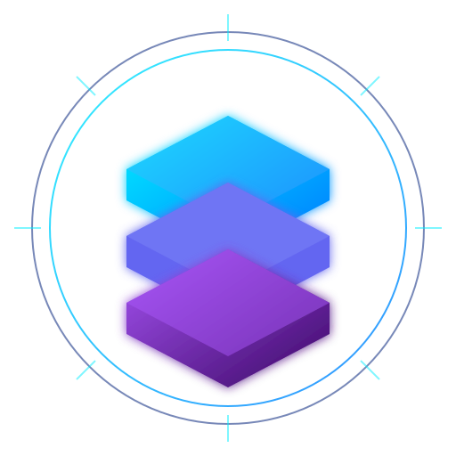

  # EvoFlux

  ### The local-first desktop workspace for AI agent teams.

  Give EvoFlux an outcome. A lead agent plans the work, brings in specialists,
  uses the right tools, and verifies the result — while you stay in control.

  **Cowork and software engineering. Any model. Your machine.**

  [](LICENSE)
  [](desktop/)
  [](pyproject.toml)
  [](web/package.json)
  [](desktop/)
  [](#bring-your-own-model)

  **[Download EvoFlux](#download)** ·
  [Product tour](#product-tour) ·
  [Quick start](#quick-start) ·
  [How it works](#agent-working-model) ·
  [Architecture](#architecture) ·
  [Capabilities](#core-capabilities)
</div>

<br />

<p align="center">
  <a href="documents/images/showcase/coding-workspace.png">
    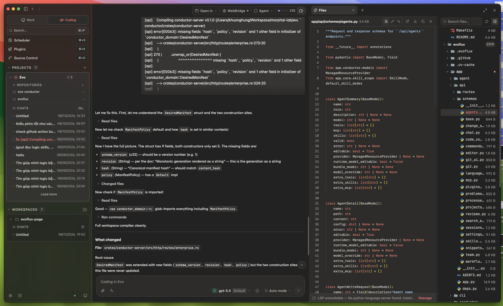
  </a>
</p>

<p align="center"><sub>Plan with the team, inspect the implementation, and navigate the repository without leaving the workspace.</sub></p>

> [!NOTE]
> Since **30 June 2026**, fixes, optimizations, and new EvoFlux features have been developed and delivered using **EvoFlux Coding mode**. The agents build, review, and ship themselves.

---

## Why EvoFlux

| **Delegate outcomes** | **Keep the whole job together** | **Choose every model** | **Own the execution** |
|---|---|---|---|
| A lead coordinates focused specialists and verifies their handoffs. | Chat, files, terminal, browser, memory, git, and previews live in one workspace. | Mix providers, models, reasoning levels, skills, and tools per agent. | Local runtime, scoped access, outbound redaction, and inspectable history. |

---

## Product tour

### One app, two specialized modes

One desktop app. One harness. Two different kinds of work.

| | **Work** | **Coding** |
|---|---|---|
| Product role | Cowork | Software engineering workspace |
| Workspace | Temporary sandbox | Persistent repo or multi-repo project |
| Best for | Research, documents, data, browser work, quick scripts | Build, test, refactor, review, git operations |
| Default specialists | Executor, Explorer, Consultant, Debate | Coder, Explorer, Architect, Debate |
| Verification | Artifact and tool-result review | Tests, diffs, code context, git |

**Work** is a fast execution sandbox for research, documents, data, browser tasks, files, and quick scripts. Start with a request instead of a repository.

**Coding** opens one or more real repositories and keeps them available across sessions. Agents can understand the codebase, edit and test code, review diffs, and use the complete git surface.

<table>
  <tr>
    <td width="50%"><a href="documents/images/showcase/work-mode.png">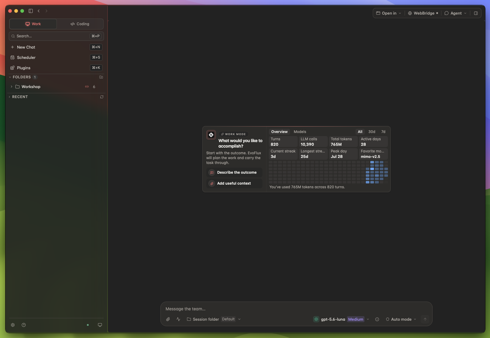</a></td>
    <td width="50%"><a href="documents/images/showcase/workspace-tools.png">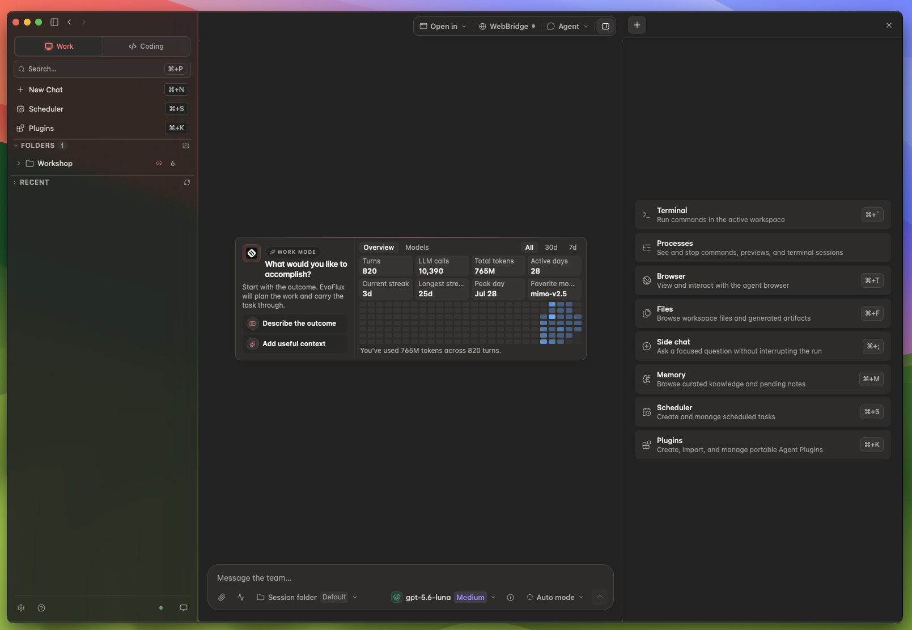</a></td>
  </tr>
  <tr>
    <td><strong>Start with the outcome</strong><br /><sub>Drop into Work and describe what you want accomplished.</sub></td>
    <td><strong>Bring every tool into view</strong><br /><sub>Open terminal, processes, browser, files, side chat, memory, and scheduler beside the conversation.</sub></td>
  </tr>
</table>

### Assemble the right team and models

Create role-focused agent teams, then tune the model and capabilities of every member independently. EvoFlux ships with 19 provider integrations, including direct APIs, subscription OAuth, cloud platforms, local runtimes, and model routers.

<table>
  <tr>
    <td width="50%"><a href="documents/images/showcase/agent-teams.png">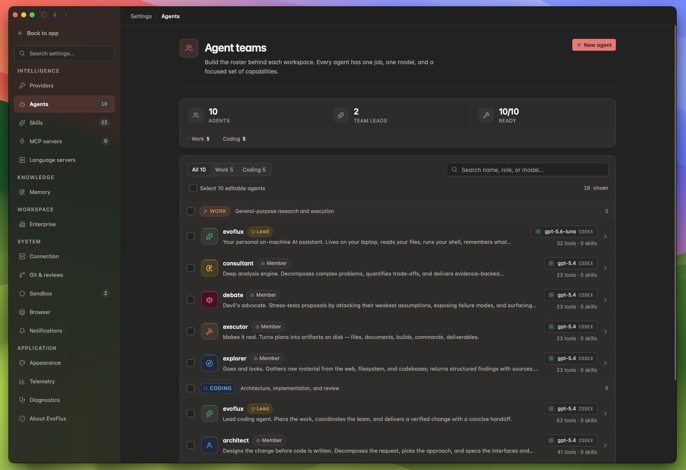</a></td>
    <td width="50%"><a href="documents/images/showcase/model-providers.png">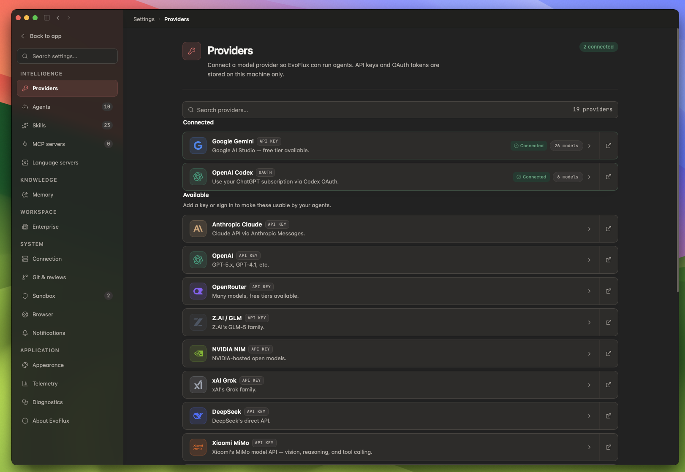</a></td>
  </tr>
  <tr>
    <td><strong>Lead-and-specialists</strong><br /><sub>Give each agent one role, one model, and a focused capability set.</sub></td>
    <td><strong>Bring your own model</strong><br /><sub>Connect hosted, subscription, routed, cloud, or local providers from one catalog.</sub></td>
  </tr>
</table>

### Understand the codebase, not just matching text

EvoFlux indexes symbols and relationships across every repository in a Coding project. Explore the graph visually, trace callers and dependencies, and pair structural context with repository-aware language servers.

<p align="center">
  <a href="documents/images/showcase/code-graph.png">
    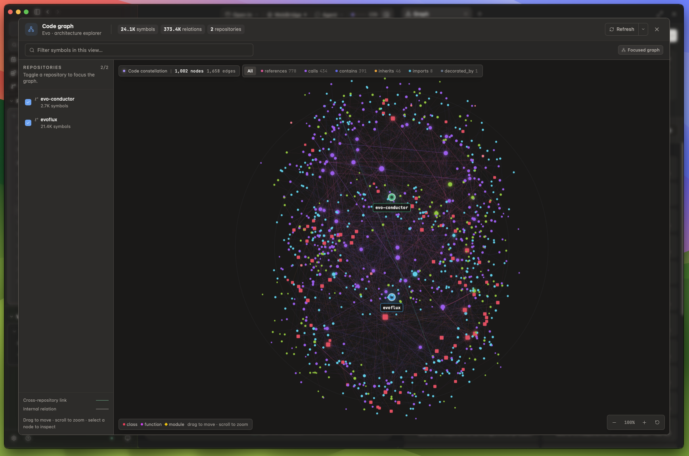
  </a>
</p>

### Local control is part of the product

Language servers provide semantic feedback in the active project. Sandbox controls scope filesystem and process access, mask or block sensitive outbound data, and keep execution boundaries visible rather than hidden behind the agent.

<table>
  <tr>
    <td width="50%"><a href="documents/images/showcase/language-servers.png">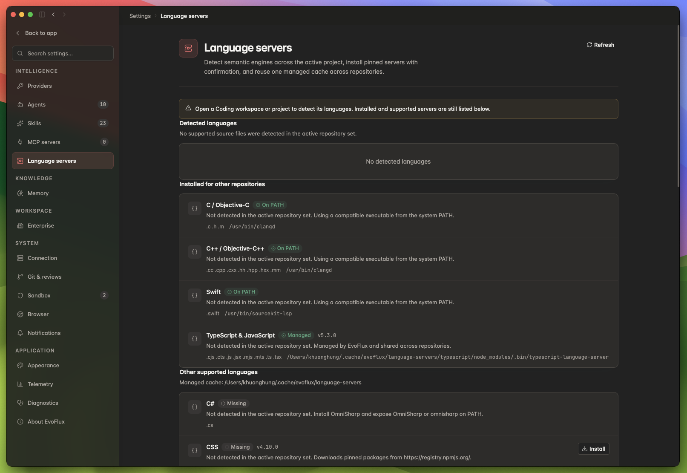</a></td>
    <td width="50%"><a href="documents/images/showcase/sandbox-controls.png">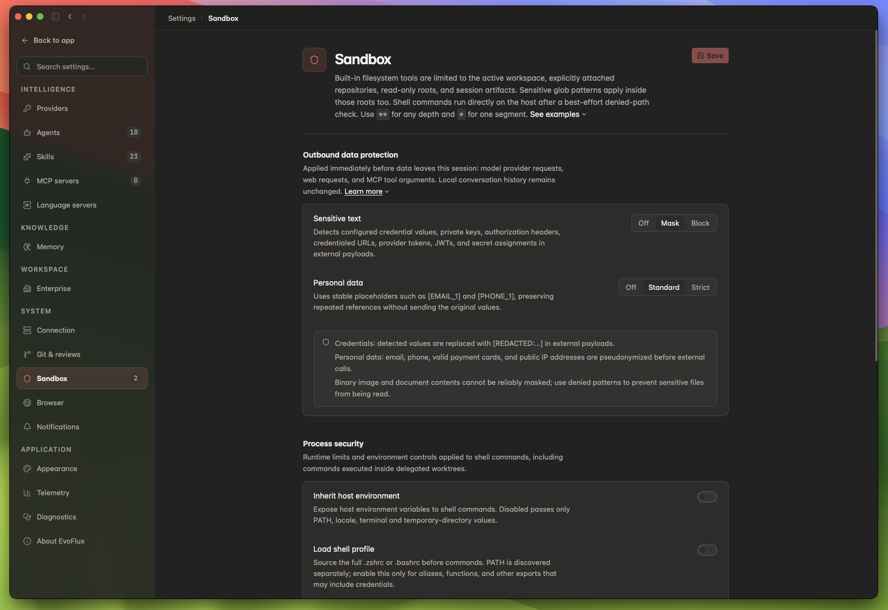</a></td>
  </tr>
  <tr>
    <td><strong>Semantic feedback</strong><br /><sub>Detect project languages and reuse managed or system language servers.</sub></td>
    <td><strong>Explicit boundaries</strong><br /><sub>Control outbound data, host environment access, shell behavior, and denied paths.</sub></td>
  </tr>
</table>

---

## Download

Current stable release: **[EvoFlux v0.0.6](https://github.com/evoelsewhere/evoflux/releases/tag/v0.0.6)**

| Platform | Package | SHA-256 |
|---|---|---|
| macOS · Apple Silicon | [Download DMG](https://github.com/evoelsewhere/evoflux/releases/download/v0.0.6/EvoFlux_0.0.6_aarch64.dmg) | [Checksum](https://github.com/evoelsewhere/evoflux/releases/download/v0.0.6/evoflux-macos-apple-silicon-SHA256SUMS.txt) |
| macOS · Intel | [Download DMG](https://github.com/evoelsewhere/evoflux/releases/download/v0.0.6/EvoFlux_0.0.6_x64.dmg) | [Checksum](https://github.com/evoelsewhere/evoflux/releases/download/v0.0.6/evoflux-macos-intel-SHA256SUMS.txt) |
| Windows · x64 | [Download installer](https://github.com/evoelsewhere/evoflux/releases/download/v0.0.6/EvoFlux_0.0.6_x64-setup.exe) | [Checksum](https://github.com/evoelsewhere/evoflux/releases/download/v0.0.6/evoflux-windows-x64-SHA256SUMS.txt) |

Linux x64 DEB packaging is enabled for the next tagged release. Install a
downloaded package with `sudo apt install ./EvoFlux_*_amd64.deb`; updates use
the same package-managed flow instead of replacing dpkg-owned files in place.

The desktop packages include the native Python sidecar. The optional WebBridge
browser companion is distributed separately and can be installed from the
WebBridge panel in EvoFlux.

> [!NOTE]
> The v0.0.6 macOS packages use an ad-hoc signature and the Windows installer
> is unsigned because production signing credentials are not yet configured.

---

## Quick Start

### Install the desktop app

Choose the package for your platform in [Download](#download), install it, and
launch EvoFlux. The packaged app includes its Python sidecar.

Updater-aware builds check the latest GitHub Release after startup. You can
also run a manual signed update check from **Settings > About**, the application
menu, or the tray menu. The first updater-aware release must be installed
manually once; later releases can update in place.

On first launch:

1. Connect an LLM provider.
2. Start a Work session or open a repository for Coding.
3. Choose the model, reasoning level, skills, tools, and permissions for each agent.

### Run the desktop app from source

Requirements: Python 3.12+, [uv](https://docs.astral.sh/uv/), [Bun](https://bun.sh/), Rust, [Tauri CLI](https://v2.tauri.app/start/prerequisites/), and the Tauri prerequisites for your operating system.

```sh
git clone https://github.com/evoelsewhere/evoflux.git
cd evoflux

uv sync
cd web && bun install && cd ..

# Choose browser development — local API + React development server
make dev-web

# Or choose desktop development — local API + React + Tauri desktop shell
make dev-desktop
```

`make dev` remains an alias for `make dev-web`. `localhost:5173` is the internal frontend development server used by Tauri during development. EvoFlux is shipped and positioned as a **desktop product**, not a standalone web app.

---

## Agent working model

EvoFlux operates under a **lead-and-specialists** model. Each request is analyzed by the Lead Agent to determine scope and complexity.

- A simple task stays with the Lead.
- A complex task is broken into well-defined subtasks with explicit goals, outputs, and constraints.
- Specialists activate on demand, work in parallel, and exchange results through a shared mailbox.
- The Lead evaluates handoffs and evidence, requests rework when needed, and synthesizes the final response.

<p align="center">
  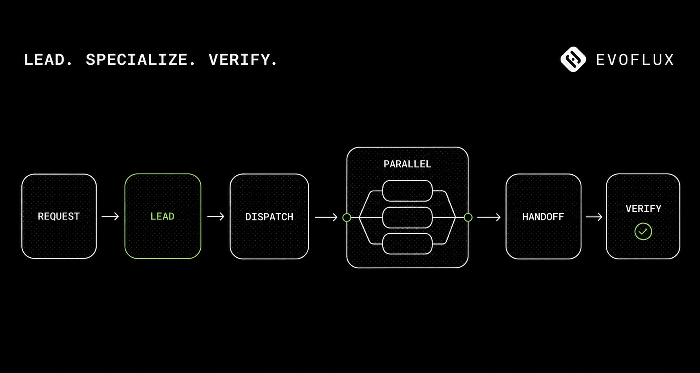
</p>

### Configurable per agent

| Configuration | Why it matters |
|---|---|
| **LLM model** | Use a fast model for routine execution and a stronger reasoning model for architecture or review |
| **Thinking level** | Tune latency and reasoning depth by role and model capability |
| **Skills and tools** | Add agent-specific capabilities or disable code-owned defaults with explicit opt-outs |
| **Permissions and access scope** | Limit what an agent can read, write, execute, or approve |

The result is higher parallel capacity, less context noise, the right model for each job, verified delivery, and an execution history that can be inspected instead of trusted blindly.

Agent Markdown is the user-owned override surface. Runtime and Settings compile
the same effective config from the mode profile plus frontmatter additions and
`tools_opt_out`; reads and validation never materialise
configuration files. See
[`documents/architecture/application-harness.md`](documents/architecture/application-harness.md).

---

## Architecture

EvoFlux is desktop-only:

`Tauri Desktop → React UI → local FastAPI sidecar → local state / model providers`

The production app launches a local sidecar through an ephemeral port and token handshake. The React interface, agent runtime, repository-local code indexes, memory engine, scheduler, permissions, and MCP client all run on the user's machine.

<p align="center">
  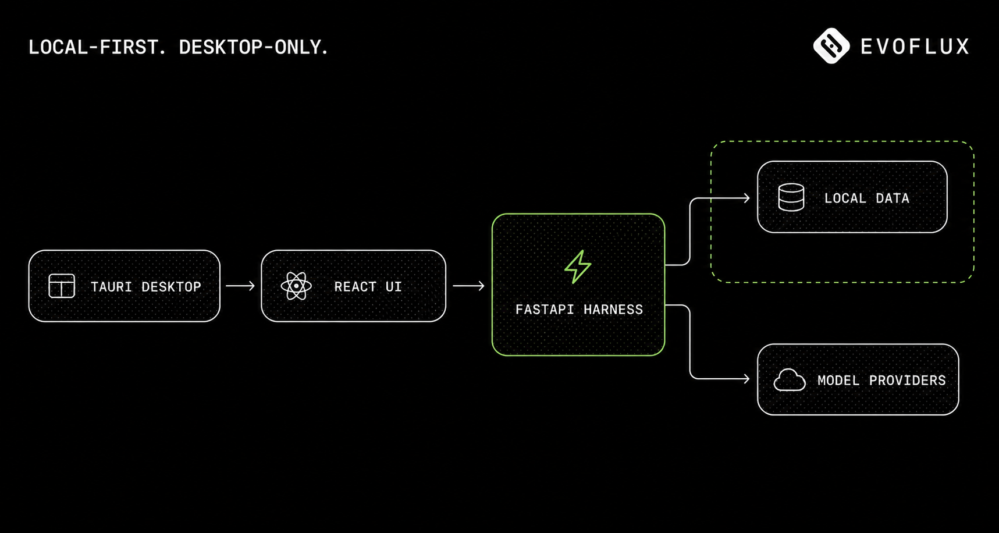
</p>

### What makes it a harness

A language model generates reasoning. The harness turns that reasoning into controlled action:

<p align="center">
  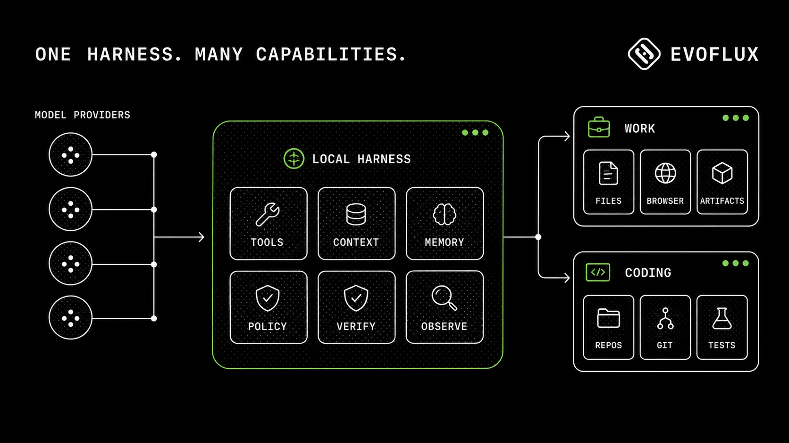
</p>

| Layer | Responsibility |
|---|---|
| **1. Tool orchestration** | Shell, filesystem, git, browser automation, MCP, and agent-to-agent actions |
| **2. Guardrails** | Permissions, policies, approvals, filesystem sandboxing, command checks |
| **3. Context and memory** | Workspace state, sessions, code indexes, compaction, knowledge wiki |
| **4. Verification loops** | Test, compare, review, debate, reject, rework, and evidence |
| **5. Observability** | Streaming events, telemetry, logs, metrics, diagnostics, and audit history |

The model is replaceable. The harness — context, action, policy, verification, and state — is the product.

---

## Core capabilities

### Multi-agent teams

Agents are Markdown files with YAML frontmatter (`name`, `role`, `model`, `thinking_level`), making teams readable, diffable, and versionable. A team has one Lead and any number of on-demand members. Multiple instances of the same blueprint can work in parallel without becoming always-on background processes.

### Durable Goal mode

Start an autonomous objective in any mode with `/goal <objective>`. Goal state,
elapsed time, token usage, and an optional token budget survive reconnects and
app restarts. The team continues through hidden internal turns until the Lead
records completion, the budget pauses execution, the user pauses it, or the
same concrete blocker is reported three turns in a row. Goal mode never expands
the session's permissions or sandbox scope.

Use `/goal` to inspect status, `/goal:budget <tokens|none>` to change the budget,
and `/goal:pause`, `/goal:resume`, or `/goal:stop` to control the objective.

### Repository-local code context

EvoFlux ships a repository-local code index based on stable source keys and desired-state reconciliation. The implementation is part of the application and adds no indexing framework dependency. Twenty-five tree-sitter parsers cover Python, TypeScript/TSX, JavaScript, Go, Rust, Java, C#, C, C++, Swift, Kotlin, PHP, Ruby, Scala, Dart, Objective-C, Lua, Luau, R, Pascal, Svelte, Vue, Astro, and Liquid.

Each repository owns a managed SQLite target in the EvoFlux cache. A refresh fingerprints source bytes, parser and pipeline implementations, and project settings; parses only additions and changes; removes deleted components; and atomically replaces their committed source snapshot, AST-aware overlapping chunks, local code vectors, symbols, relations, and FTS rows. The vectorizer is implemented with Python's standard library, so the runtime adds no model or vector-database package. Parse failures preserve the last good component and are surfaced in status/query limitations. The application database stores projects and sessions but no code-index or graph data.

Cross-repository links are resolved at query time across only the repositories authorized for the active project. Resolution prefers same-file and lexical definitions, import bindings and module paths, then a unique cross-repository definition. There is no persisted cross-repository guess, resolver tier, background resolver job, or model-facing scope switch.

The model receives one native `code_context` tool:

| Question | Action |
|---|---|
| Find code from a concept or source phrase | `search` |
| Match a syntax shape with metavariables | `grep` |
| Locate a known symbol | `definition` |
| Follow incoming or outgoing calls | `callers` or `callees` |
| Inspect direct or transitive relationships | `references`, `impact`, or `neighborhood` |

The first query normally uses `refresh=true`; immediate follow-ups over the same indexed version can use `refresh=false`. Structural results are static evidence, so runtime-only behavior still requires tests, logs, LSP, or debugger evidence. The full storage, query, ambiguity, and tool contract is documented in [`documents/architecture/coding-agent-code-context.md`](documents/architecture/coding-agent-code-context.md).

Coding's repository-local LSP, automatic post-edit feedback, Guarded ChangeSets,
Problems hub, explicit AI editor/Git actions, and Search Everywhere contracts are
documented in [`documents/architecture/coding-semantic-intelligence.md`](documents/architecture/coding-semantic-intelligence.md).

### Memory and Dream

The scheduled or manually triggered **Dream** agent consolidates sessions and notes into an inspectable Markdown wiki: `topics/`, `entities/`, `notes/`, and `imports/`, with `INDEX.md`, an append-only `LOG.md`, source citations, confidence, and related-page metadata.

### Bring your own model

Nineteen provider integrations ship behind one streaming abstraction, including Anthropic, OpenAI, Google Gemini, AWS Bedrock, Ollama, DeepSeek, xAI, Vertex AI, and GitHub Copilot. Models can be selected independently for each agent.

### Skills and MCP

Twenty-nine built-in skills cover mode-scoped Work and Coding workflows, specialized artifacts/design, EvoFlux configuration/installers, portable plugin development, and provider-neutral PR lifecycle operations. Work and Coding each expose one implicit router; broad specialists are explicit-only so they do not compete on every request. Custom skills can be created, edited, diagnosed, and filtered as Work, Coding, or Both in Settings. A bounded 2%/8K metadata catalog is always available for model-driven selection, while `SKILL.md` bodies and bundle resources load only after exact activation. EvoFlux is also an MCP client for stdio, HTTP, and SSE servers; connected tools inherit the same permission rules as native tools.

The built-in **Plugin Center** implements the portable [Agent Plugins 1.0](https://agent-plugins.org/) core. It can scaffold, validate, import, developer-link, pack, update, enable, disable, and uninstall local plugins containing immediate-child Agent Skills and isolated stdio or Streamable HTTP MCP servers. `.evoplugin` is a deterministic ZIP distribution wrapper; the unpacked package remains standards-compatible through root `plugin.json` and optional `mcp.json`.

<p align="center">
  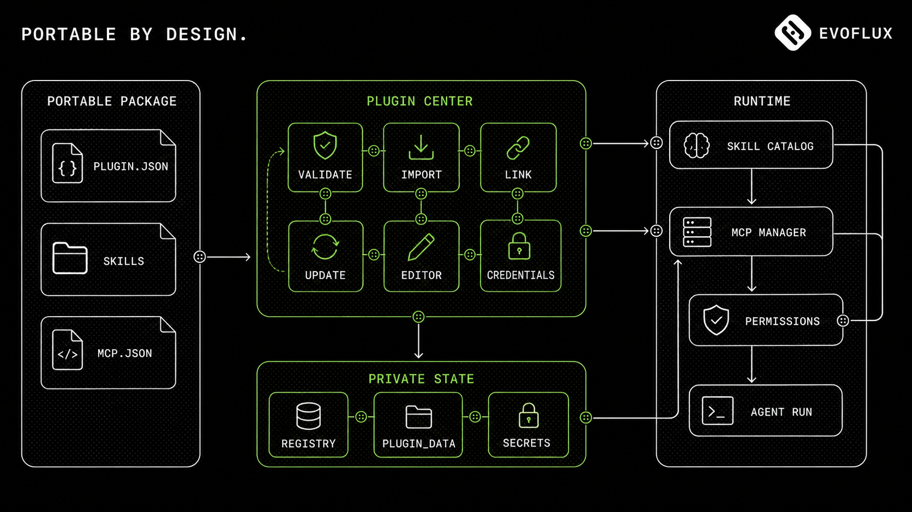
</p>

Plugin packages remain portable content bundles: they contribute Skills and MCP server declarations, while EvoFlux owns validation, lifecycle, permissions, credentials, installation data, and runtime status. New imports remain disabled until the user reviews executable commands, remote hosts, environment-field names, and capabilities. Plugin MCP servers run in an isolated manager instead of being merged into the user's global MCP configuration. See the [Agent Plugin setup guide](documents/guides/agent-plugins.md) to use a package and the [portable Agent Plugin architecture](documents/architecture/agent-plugins.md) for the package contract, runtime boundaries, storage model, and failure isolation rules.

### Permissions and sandboxing

Wildcard `(tool, pattern) → allow | deny | ask` rules use last-match-wins evaluation. The denylist filesystem sandbox protects EvoFlux state and cache directories, rejects symlinks into blocked roots, and tokenizes shell commands for denied-path checks.

### Git and session UX

Coding mode exposes diff review, commits, branches, merge, rebase, cherry-pick, stash, and worktrees to agents and the source-control UI. Long sessions support prompt navigation, revert/undo boundaries, context compaction, four-pane Split view, and a unified Monitor view.

---

## WebBridge

WebBridge is an external browser companion for the EvoFlux desktop app — not a web version of EvoFlux.

It connects an agent to the user's real Chrome or Edge session through a persistent, policy-checked relay. Control flows from the desktop agent to the browser over CDP; selections, page context, and human handoff flow back to the desktop session.

<p align="center">
  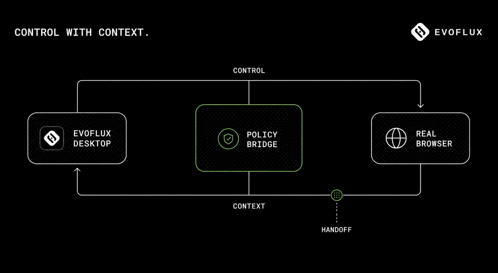
</p>

| Capability | What it does |
|---|---|
| **Secure connection** | Pairs the browser extension with scoped credentials, uses one-time session tickets, enforces domain policies, and maintains a complete audit trail. |
| **Safe context sharing** | Lets users intentionally share a selection, link, or page while sanitizing metadata, preserving provenance, and treating browser content as untrusted input. |
| **Live collaboration** | Streams the agent session into the browser side panel, supports questions and element selection, and allows seamless control handoff between the user and agent. |
| **Teach and monitor** | Records meaningful browser actions without capturing raw keystrokes, redacts sensitive fields, creates reviewable workflows, and requires confirmation before monitored results are shared. |

Pairings, tickets, tab bindings, and Teach drafts are persisted through Alembic migrations. Revoking a pairing closes the live relay and invalidates outstanding tickets. Installation and connection status are managed from the WebBridge panel in EvoFlux.

### Beyond the real-browser bridge

EvoFlux also includes direct control of its persistent in-app browser, PDF/HTML intake through `markitdown`, read-only DOCX/XLSX/PPTX workspace previews, cron-driven agent prompts, OpenTelemetry, Prometheus, and DuckDB-backed observability summaries.

---

## How EvoFlux compares

<details>
  <summary><strong>Compare deployment, models, memory, code intelligence, and browser integration</strong></summary>
  <br />

  | | **EvoFlux** | Claude Code | Cursor | Devin | OpenAI Codex | OpenHands |
  |---|---|---|---|---|---|---|
  | Interface | **Desktop app** | CLI, IDE, desktop, web | VS Code fork | Cloud + desktop + CLI | CLI, cloud, IDE | Web, CLI, API |
  | Deployment | **Local, self-hosted** | Local + optional cloud | Local IDE + cloud agents | Cloud/VPC + local desktop | Local + cloud sandbox | Self-hosted or cloud |
  | Open source | **Apache-2.0** | No | No | No | CLI only | MIT |
  | Bring your own model | **19 providers** | Partial proxy setups | Partial BYOK | Provider choice | OpenAI only | Any model |
  | Non-project cowork | **Work** | Ad hoc | No | Limited | No | Yes |
  | Multi-agent | Lead + on-demand specialists + mailbox | Subagents and teams | Agent fleets + worktrees | Sub-Devins | Up to six subagents | Parallel delegation |
  | Code understanding | Structural graph, 25 parsers, cross-repo | Search + optional LSP | Embedding search | Codebase Q&A | Repo-aware loop | Agent-computer interface |
  | Persistent memory | Inspectable wiki + Dream | Markdown + auto-memory | Project Memories | Org knowledge base | `AGENTS.md` + session memory | Condenser + skills |
  | Real-browser bridge | **WebBridge, two-way** | No | No | No | No | No |
  | Pricing | Free; pay model costs | Subscription or API | Subscription | Subscription + usage | ChatGPT or API | Free self-hosted / paid cloud |

  EvoFlux leans into local ownership, model choice, inspectable memory, general cowork, and structural code intelligence. Commercial products lead in vendor-specific coding models, cloud infrastructure for long unattended runs, and editor-native maturity.

  <sub>Competitor information reflects publicly reported product capabilities and pricing around mid-2026 and may change.</sub>
</details>

---

## Tech stack

| Layer | Technology |
|---|---|
| Desktop | Tauri v2, Rust, bundled Python sidecar |
| Frontend | React 19, TypeScript 5.9, Vite 7, Tailwind CSS v4, Zustand, TanStack Query and Router |
| Backend | Python 3.12+, FastAPI, SQLModel, Alembic |
| Streaming | Server-Sent Events through `sse-starlette`; one feed per session |
| Data | SQLite WAL or PostgreSQL/MySQL; Markdown knowledge wiki |
| Code intelligence | `tree-sitter`, `tree-sitter-language-pack`, SQLite FTS5 |
| Observability | OpenTelemetry, Prometheus, DuckDB-backed aggregation |

## Project layout

```text
app/        Local FastAPI sidecar — agents, code context, memory, scheduler, MCP
web/        React interface embedded by the Tauri desktop app
desktop/    Tauri v2 shell and Python sidecar packaging
seed/       Work and Coding blueprints, skills, and config
tests/      Backend and frontend tests
documents/  Design notes, analyses, and README media
```

## Contributing

Issues and pull requests are welcome. Keep changes focused and include the smallest relevant test run. Please report vulnerabilities privately through GitHub Security Advisories.

## License

EvoFlux is released under the [Apache License 2.0](LICENSE).

<div align="center">
  <br />
  <strong>Your models. Your machine. One desktop harness.</strong>
  <br /><br />
  <a href="#quick-start">Start with EvoFlux ↑</a>
</div>
