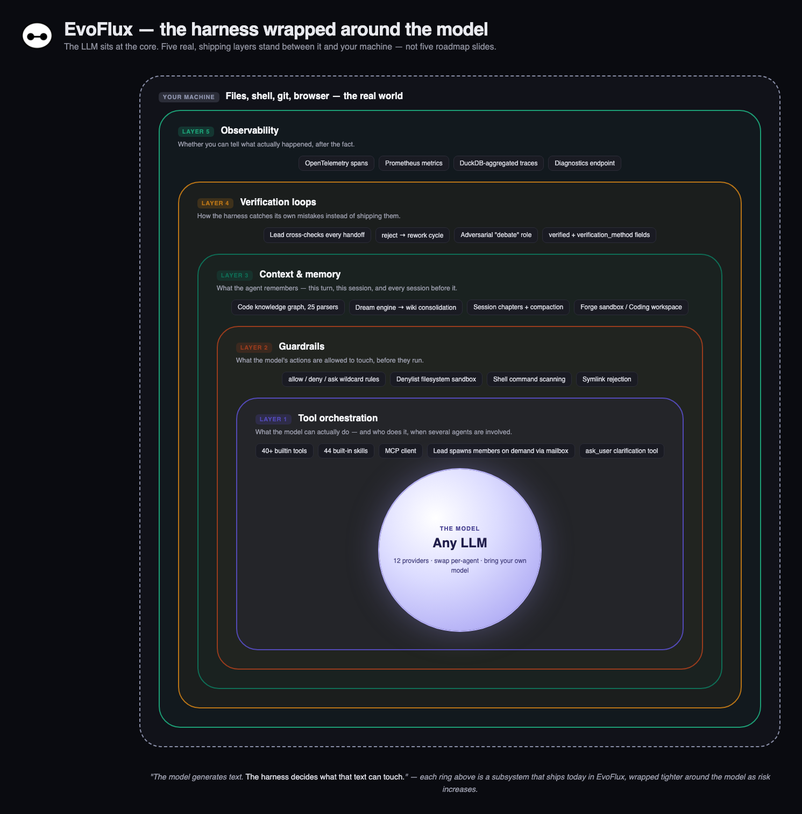
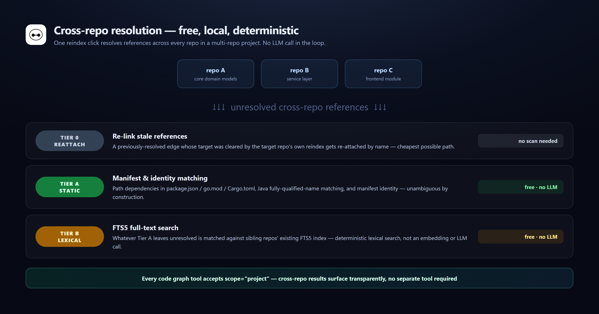

<div align="center">
  

  # EvoFlux

  **A complete, self-hosted agent harness — not a chatbot wrapper around an LLM.**

  Multi-agent teams, a real code knowledge graph, persistent wiki memory, any LLM you choose, and a native desktop app — all running on your machine.

  [](LICENSE)
  [](pyproject.toml)
  [](web/package.json)
  [](desktop/)
  [](app/)
  [](#bring-your-own-model)

  [Quick Start](#quick-start) · [The Harness](#evoflux-as-an-agent-harness) · [Forge & Coding](#one-app-two-modes-forge-and-coding) · [Architecture](#architecture) · [Comparison](#how-evoflux-compares)

</div>

> **Note — from 30 June 2026 onwards:** All fixes, optimizations, and new features shipped to EvoFlux are developed and delivered using **EvoFlux Coding mode**. The agents build, review, and ship themselves.

---

## What is EvoFlux?

A **harness**, in the vocabulary the AI-agent field settled on through 2025–2026, is everything that sits between a language model and the real world: the code, configuration, and execution logic that decides what the model can see, what it's allowed to touch, how it recovers from its own mistakes, and whether anyone can tell what it actually did. The model generates text; the harness is what turns that text into safe, useful, repeatable action. It's also the reason the same underlying model performs differently in different products — harness quality has been shown to move a coding agent from the bottom of a benchmark leaderboard to the top five without touching the model at all.

EvoFlux is a harness built to that standard, shipped as software you run yourself: a FastAPI backend orchestrating role-based multi-agent teams that spawn members on demand from a shared mailbox rather than run them as always-on background loops, a tree-sitter-powered code knowledge graph, a memory engine that consolidates conversations into a long-term wiki, and a React 19 UI wrapped in a real Tauri desktop shell — Apache-2.0, with any LLM provider a config away.

## EvoFlux as an agent harness

Every capability below maps to a subsystem that ships today, not a roadmap slide.



## One app, two modes: Forge and Coding

Most agent products assume every conversation is about a codebase. EvoFlux doesn't: it splits into two modes at the top level, each with its own workspace model and its own agent roster.

| | **Forge** | **Coding** |
|---|---|---|
| Workspace | A fresh, disposable sandbox created per session — no project required | Your actual repo (or a multi-repo project) on disk, opened by path |
| Built for | One-off tasks: research, writing, prototyping a script, running a command, working with a document | Sustained work in a codebase you keep coming back to |
| Default team | `lead` + `consultant` + `executor` + `explorer` + `debate` | `lead` + `architect` + `coder` + `explorer` + `debate` |
| Extra tooling | — | Git (diff, commit, branch, merge, rebase, worktrees), the code knowledge graph, multi-repo project focus, a live file tree |
| Session lifetime | Ephemeral — gone when the session ends | Persistent — reopen the same workspace weeks later |

Both modes share the same lead-and-mailbox core, the same streaming UI, the same permission model. Ask Forge to "explain this codebase" or "fix a bug" and it will — the distinction isn't what kind of task, it's whether the work needs a permanent, git-aware workspace or a scratch space that disappears when you're done.

---

## Architecture


### How a multi-agent turn actually runs

There's no single "do everything" prompt. The lead decides when a task benefits from parallel work and spawns member instances that run concurrently, each dropping results into a shared mailbox the lead reads back from — the same event stream powers the UI's live Split and Monitor views.


---

## Feature deep-dive

### Multi-agent teams
Agents are defined as plain Markdown files with YAML frontmatter (`name`, `role`, `model`, `temperature`, `thinking_level`) — human-readable, diffable, and versionable. A team has exactly one lead and any number of members; members aren't background loops, they're activated on demand when a message lands in their mailbox and go back to idle when done, so running three copies of the same blueprint in parallel (`executor#1`, `executor#2`, `executor#3`) is three mailbox activations, not three always-on processes.

### Code knowledge graph
25 tree-sitter-backed parsers cover Python, TypeScript/TSX, JavaScript, Go, Rust, Java, C#, C, C++, Swift, Kotlin, PHP, Ruby, Scala, Dart, Objective-C, Lua, Luau, R, Pascal, Svelte, Vue, Astro, and Liquid. Indexing extracts symbols (functions, classes, methods, fields) and typed edges (`calls`, `inherits`, `implements`, `imports`, `references`), only linking a reference when it resolves unambiguously. Agents query the graph through seven tools — `code_overview`, `code_search`, `code_symbol`, `code_references`, `code_neighbors`, `code_map`, `code_path` — that return symbol references instead of file bodies, so navigating a codebase costs a fraction of the tokens reading it would. Full reindexes run as batched, event-loop-friendly writes so the UI stays responsive while a large repo indexes in the background.

#### Cross-repo, multi-project graphs
A `CodingProject` can span several repositories, and every code graph tool accepts `scope="project"` to search, inspect, or path-find across all of them transparently — no separate cross-repo tool required. Resolving a reference that crosses a repo boundary runs through three tiers, cheapest first, entirely on-device:



The project view in the UI renders the result two ways: a force-directed **spatial graph** clustering symbols by repo with cross-repo edges drawn between them, and a **matrix** heatmap of resolved/unresolved/rejected reference counts per repo pair — both live-updating as a reindex + resolution pass runs.

#### Calling the graph without burning your context
Because these tools are designed to be cheap, it's easy to accidentally call the expensive variant of a query that has a cheap equivalent. In practice, on a real multi-repo Java codebase, the difference between the deliberate call order below and the naive one is roughly an order of magnitude in tokens:


| Anti-pattern | Tokens wasted | Use instead |
|---|---|---|
| `code_symbol("Patient")` on a widely-used class | ~2,000 | `code_search("Patient", limit=1)` — ~125 tokens |
| `code_neighbors("ConceptServiceImpl")` with no `edge_kind` | ~2,000 | add `edge_kind="calls"` — ~75 tokens |
| `code_references("Patient", limit=30)` | ~1,250 | `limit=3` — ~750 tokens |
| `code_map(budget=50)` | ~2,000 | `code_map(budget=10)` — ~400 tokens |
| Calling `code_symbol` before `code_search` | a wasted round-trip, or a miss | always search first |

| Question | Cheaper tool | More expensive tool | Savings |
|---|---|---|---|
| Does this symbol exist, and where? | `code_search` (~125 tok) | `code_symbol` on a popular hit (~2,000 tok) | ~16x |
| Who calls symbol X — just a count? | `code_symbol` → its built-in "called by (N)" (~100 tok) | `code_references(limit=3)` (~750 tok) | ~7.5x |
| What methods does class X have? | `code_search("X.", kind="method", limit=10)` (~500 tok) | `code_neighbors("X")` unfiltered (~2,000 tok) | ~4x |
| What does X call? | `code_neighbors("X.method", edge_kind="calls")` (~75 tok) | the same call without `edge_kind` (~300 tok) | ~4x |

### Memory and the Dream engine
A scheduled (or manually triggered) "Dream" agent reads unprocessed sessions and notes and consolidates them into a structured wiki — `topics/`, `entities/`, `notes/`, `imports/`, with an `INDEX.md` table of contents and an append-only `LOG.md` activity trail. Every page carries YAML frontmatter (sources, confidence, related pages) so memory stays inspectable and editable — not an opaque vector blob you have to trust blindly.

### Bring your own model
Twelve provider integrations ship in the box — Anthropic, OpenAI, Google Gemini, AWS Bedrock, Ollama, DeepSeek, xAI, Vertex AI, GitHub Copilot, and more — behind one streaming abstraction. Pick a different model per agent: a fast, cheap model for the executor, a stronger reasoning model for the architect or lead.

### Skills and MCP
44 built-in skills cover research, security review, TDD, debugging, CI/CD, documentation, browser testing, and more, invocable by name. For anything not built in, EvoFlux is an MCP client — point it at any stdio, HTTP, or SSE MCP server and its tools become available to every agent, gated by the same permission rules as native tools.

### Permissions and sandboxing
Tool calls are gated by wildcard `(tool, pattern) → allow | deny | ask` rules with last-match-wins evaluation. The filesystem sandbox is a denylist, not an allowlist: EvoFlux's own data, state, and cache directories are blocked, symlinks into denied roots are rejected, and shell commands are tokenized and scanned for denied paths.

### Git and source control
A full git surface — diff review, commit, branch create/delete/checkout, merge, rebase, cherry-pick, stash, and worktree management — exposed both as agent tools and as a source-control panel in the UI, with conflicts surfaced as structured, resolvable diffs.

### Session UX
Long sessions get chapters (agent-markable dividers with a live table of contents), revert/undo with a movable boundary, and automatic context compaction. Split view tiles up to four agent panes with resize and reorder; Monitor view gives a mission-control strip of every agent's status plus a unified activity feed.

### Beyond coding
A headless-Chromium browser-automation tool (navigate, click, fill, extract, screenshot, live CDP screencasting) ships built in — no external Playwright server to run. Document intake handles PDF, DOCX, and HTML via `markitdown`. Observability is OpenTelemetry and Prometheus, aggregated through DuckDB into UI-friendly summaries. A cron scheduler fires prompts at agents on a schedule, reusing the exact same chat pipeline a human message would use.

---

## How EvoFlux compares

The AI coding agent market moved fast through 2025–2026: in a Feb 2026 survey of 906 engineers, Claude Code was named the most-loved AI coding tool by 46% of respondents versus 19% for Cursor; Devin dropped from $500/mo to $20/mo, later broadening into a $0–200+/mo tiered lineup, and absorbed Windsurf into "Devin Desktop" in June 2026; and OpenAI's Codex now spans CLI, cloud, and IDE surfaces on one Rust-based harness. Almost all of them share two traits: you're on their model roadmap, on their terms, and they assume a project already exists.

| | **EvoFlux** | Claude Code | Cursor | Devin / Devin Desktop | OpenAI Codex | OpenHands |
|---|---|---|---|---|---|---|
| Interface | Desktop app, web UI, REST API | CLI, IDE extensions, desktop app, web | IDE (VS Code fork) | Cloud web + Devin Desktop (IDE) + CLI | CLI, cloud, IDE ext. | Web UI, CLI, headless/API |
| Deployment | Self-hosted, on your machine | Local + optional Anthropic-hosted cloud | Local IDE + cloud agents (VMs) | Cloud-hosted (SaaS/VPC) + local via Desktop | Local + cloud sandbox | Self-hosted (OSS) or OpenHands Cloud |
| Open source | Yes, Apache-2.0 | No | No | No | CLI only, Apache-2.0 | Yes, MIT |
| Bring your own model | Yes, 12 providers | Partial, unofficial proxy setups only | Partial — BYOK for Chat only, not Agent | Partial — choice of OpenAI/Claude/Gemini | No, OpenAI only | Yes, any model |
| Non-project mode | Yes — Forge mode, no repo required | Partial — ad hoc via CLI piping, no dedicated mode | No | No (narrow data-analysis exception) | No | Yes |
| Multi-agent | Lead + on-demand members, typed mailbox | Subagents + background/parallel agent teams | Agents Window + async subagent fleets + worktrees | Parent-spawned sub-Devins + fleet management | Up to 6 subagents | Sub-agent delegation for parallel subtasks |
| Code understanding | Structural code graph, 25 parsers, cross-repo resolution | Codebase search; optional opt-in LSP plugin | Embedding-based semantic search, not LSP | "Ask Devin" codebase Q&A | Repo-aware agent loop | Agent-Computer Interface |
| Persistent memory | Wiki + Dream consolidation, inspectable markdown | `CLAUDE.md` + auto-saved memory | Per-project Memories + Rules, no cross-project | Org-wide knowledge base + DeepWiki docs | `AGENTS.md` (hierarchical) + session memories | Context condenser + `AGENTS.md`/skills |
| Sandboxing | Denylist filesystem sandbox + wildcard permissions | Permission rules + OS-level sandbox, optional VM | OS-level sandbox + auto-review classifier | Per-session isolated VM/container; VPC option | Seatbelt/Bubblewrap/ACLs by OS; cloud microVM | Docker container |
| Pricing | Free — pay only your own model API costs | ~$17–20/mo (Pro), up to $100–200/mo (Max) or metered API | $0–200+/mo (Hobby to Ultra tiers) | $0–200+/mo per seat, plus usage-based fees | ~$20/mo (ChatGPT Plus) | Free self-hosted; Cloud has free + paid tiers |

*(Competitor figures reflect publicly reported information as of mid-2026, verified via official docs and pricing pages where possible, and may have changed since.)*

**Where EvoFlux leans in:** it isn't chasing a coding benchmark leaderboard — it's a general-purpose, self-hosted harness where coding is one deep mode alongside research, browser automation, scheduled automation, and long-term memory, with no vendor lock-in on the model layer, a real native app, and a mode built for work that doesn't have a project yet. Every other tool above still assumes you'll use its vendor's model as the default path — EvoFlux treats the model as a swappable component.

**Where the commercial players lead:** purpose-built coding models (Cursor's Composer, OpenAI's GPT-5.5), heavily-funded cloud sandbox infrastructure for multi-hour unattended runs, and mature editor-native tooling inherited from full IDE forks (Cursor and Devin Desktop are both built on VS Code).

---

## Quick Start

### Desktop app (recommended)
Download the latest release for your platform (macOS `.dmg`, Windows `.msi`, Linux `.deb`/AppImage) — the app bundles its own Python runtime, so there's nothing else to install.

### CLI / server, one-liner (macOS / Linux)
```sh
curl -LsSf https://raw.githubusercontent.com/khuonghung/evoflux/main/install.sh | sh
evoflux   # first run walks you through provider setup
```

### From source
```sh
git clone https://github.com/khuonghung/evoflux.git
cd evoflux
uv sync                        # Python deps (requires uv)
cd web && bun install && cd .. # frontend deps (requires bun)

make dev                       # backend :8000 (reload) + frontend :5173, together
```

Then open `http://localhost:5173`, connect your first LLM provider (any of the 12 supported), and start chatting in Forge mode — or open a folder to switch to Coding.

---

## Tech stack

| | |
|---|---|
| Backend | Python 3.12+, FastAPI, SQLModel, Alembic, SQLite (WAL) or PostgreSQL/MySQL |
| Streaming | Server-Sent Events (`sse-starlette`) end-to-end, one unified feed per session |
| Code intelligence | `tree-sitter` + `tree-sitter-language-pack`, SQLite FTS5 |
| Agent runtime | Async mailbox-based orchestration, 12 LLM provider integrations |
| Observability | OpenTelemetry, Prometheus, DuckDB-backed aggregation |
| Frontend | React 19, TypeScript 5.9, Vite 7, Tailwind CSS v4, Zustand, TanStack Query & Router |
| Desktop | Tauri v2 (Rust) — macOS, Windows, Linux |

## Project layout

```
app/        FastAPI backend — agent runtime, code graph, dream/wiki, scheduler, MCP client
web/        React 19 + Vite frontend
desktop/    Tauri v2 desktop shell + Python sidecar bundling
seed/       Default agent blueprints (Forge + Coding rosters), skills, and config
tests/      Backend test suite (pytest)
documents/  Design notes, internal analyses, and README image assets
```

## Contributing

Issues and PRs are welcome — see [`CONTRIBUTING.md`](CONTRIBUTING.md) for setup and conventions, [`CODE_OF_CONDUCT.md`](CODE_OF_CONDUCT.md) for community guidelines, and [`SECURITY.md`](SECURITY.md) to report vulnerabilities privately.

## License

Apache License 2.0 — see [`LICENSE`](LICENSE).
