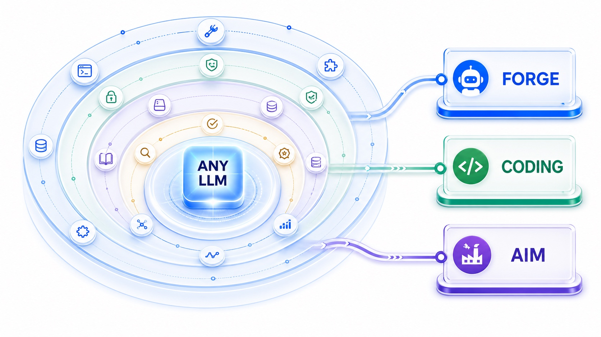
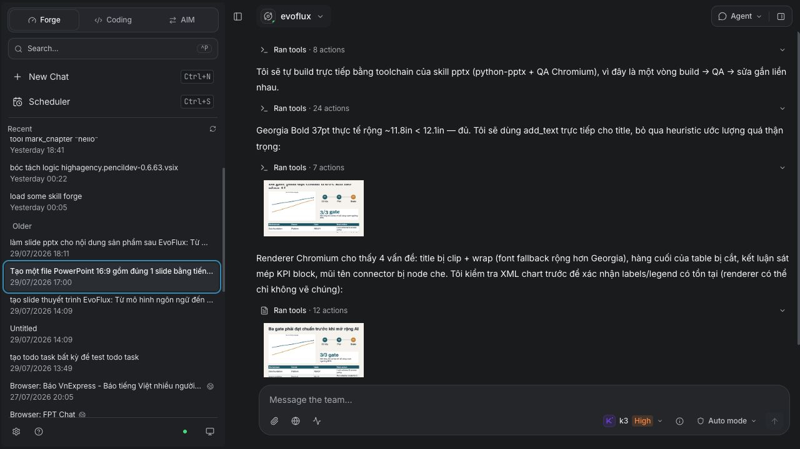
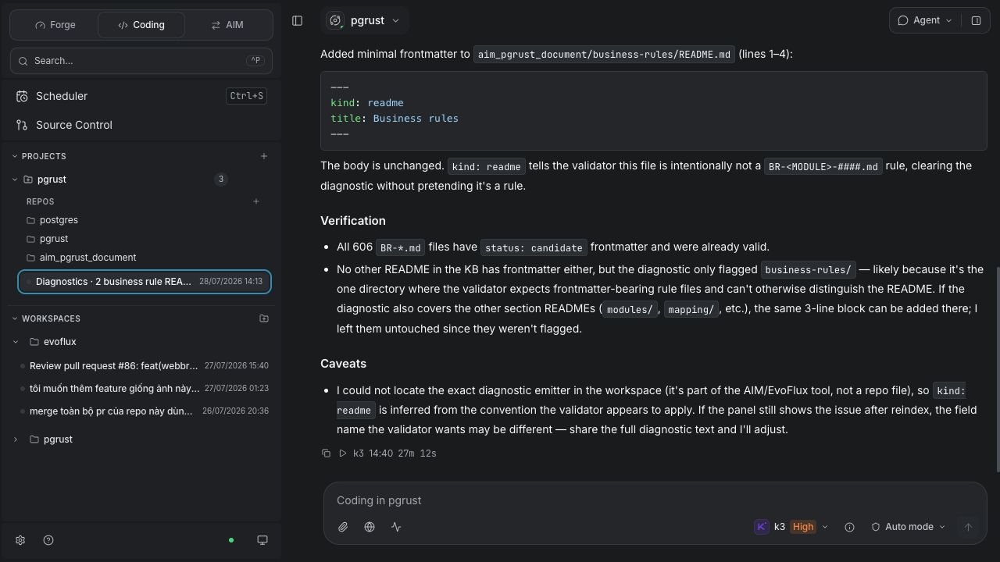
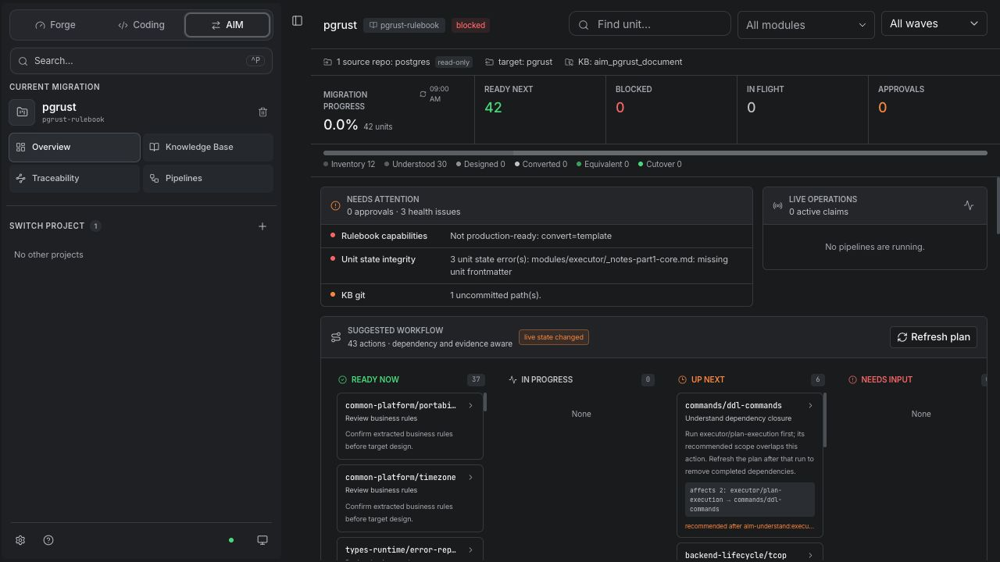
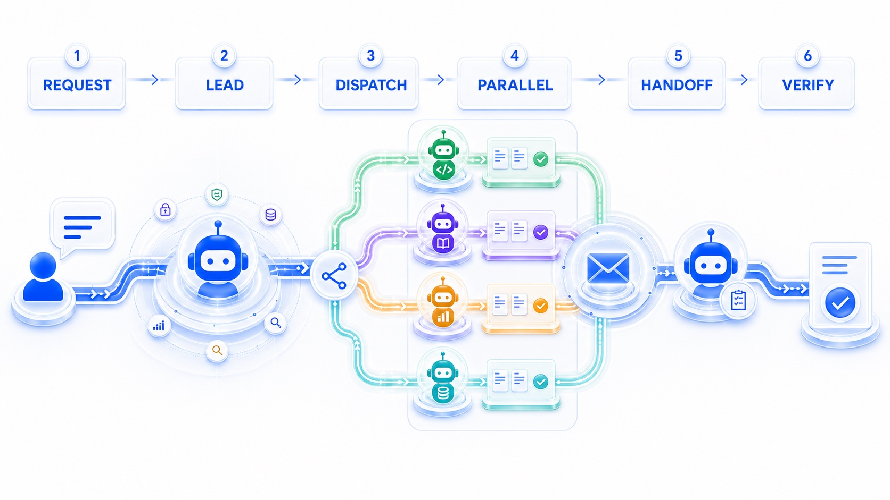
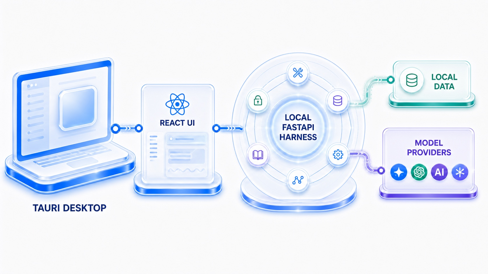
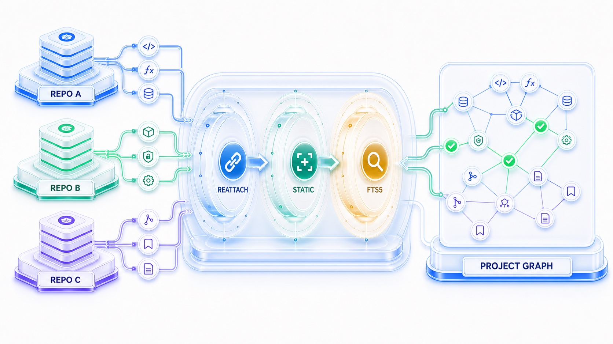
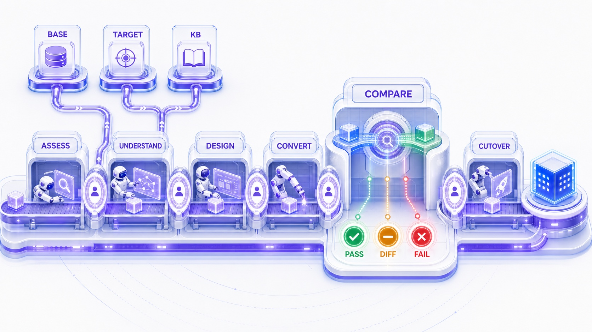
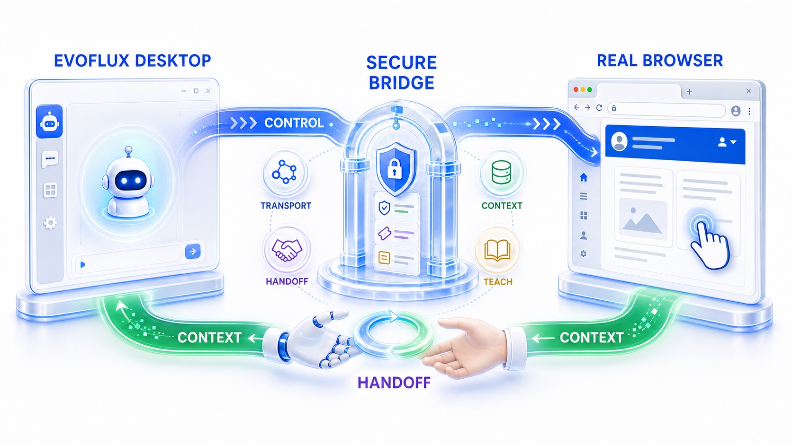

<div align="center">
  

  # EvoFlux

  ### A harness-first desktop workspace for agents that do real work.

  **Lead-and-specialists. Orchestrated. Parallel. Verified.**

  Work for cowork, Coding for software engineering, and AIM for legacy modernization —
  powered by one local-first agent harness and any model you choose.

  [](LICENSE)
  [](desktop/)
  [](pyproject.toml)
  [](web/package.json)
  [](desktop/)
  [](#bring-your-own-model)

  [Three modes](#three-specialized-modes) ·
  [Quick start](#quick-start) ·
  [Working model](#agent-working-model) ·
  [Architecture](#architecture) ·
  [Capabilities](#core-capabilities) ·
  [AIM](#aim-modernization-factory) ·
  [WebBridge](#webbridge)
</div>

<br />

<p align="center">
  
</p>

> [!NOTE]
> Since **30 June 2026**, fixes, optimizations, and new EvoFlux features have been developed and delivered using **EvoFlux Coding mode**. The agents build, review, and ship themselves.

---

## Three specialized modes

One desktop app. One harness. Three different kinds of work.

| | **Work** | **Coding** | **AIM** |
|---|---|---|---|
| Product role | Cowork | Software engineering workspace | AI modernization factory |
| Workspace | Temporary sandbox | Persistent repo or multi-repo project | Legacy base + target + KB repos |
| Best for | Research, documents, data, browser work, quick scripts | Build, test, refactor, review, git operations | Assess, understand, design, convert, compare, cut over |
| Default specialists | Executor, Explorer, Consultant, Debate | Coder, Explorer, Architect, Debate | Archaeology, Architecture, Conversion, Testing, Appraisal, Triage |
| Verification | Artifact and tool-result review | Tests, diffs, code graph, git | Human gates + deterministic equivalence |

### Work · cowork without a repository

Work is the fast execution sandbox. Start with a request instead of a project: research a topic, draft a document, build a slide deck, analyze data, work with files, automate a browser task, or prototype a script.

### Coding · persistent engineering

Coding opens your real repository — or several repositories as one project — and keeps that workspace available across sessions. Agents can navigate the structural code graph, inspect the file tree, edit and test code, review diffs, and use the complete git surface.

### AIM · controlled modernization

AIM turns legacy migration into a governed production line. A flow-first interface manages the application inventory, knowledge base, traceability, pipelines, human approvals, test comparison, and cutover readiness.

<table>
  <tr>
    <td width="33%" align="center"><strong>Work</strong></td>
    <td width="33%" align="center"><strong>Coding</strong></td>
    <td width="33%" align="center"><strong>AIM</strong></td>
  </tr>
  <tr>
    <td><a href="documents/images/showcase/work-mode.jpg"></a></td>
    <td><a href="documents/images/showcase/coding-mode.jpg"></a></td>
    <td><a href="documents/images/showcase/aim-mode.jpg"></a></td>
  </tr>
  <tr>
    <td><sub>PowerPoint build → render → visual QA → correction</sub></td>
    <td><sub>Repository context, tool history, implementation, verification</sub></td>
    <td><sub>Migration health, gates, workflow, waves, and unit queue</sub></td>
  </tr>
</table>

---

## Quick Start

### Install the desktop app

Download the [latest release](https://github.com/khuonghung/evoflux/releases/latest) for macOS (`.dmg`), Windows (`.msi`), or Linux (`.deb` / AppImage). The packaged app includes its Python sidecar.

On first launch:

1. Connect an LLM provider.
2. Start a Work session, open a repository for Coding, or configure an AIM project.
3. Choose the model, reasoning level, skills, tools, and permissions for each agent.

### Run the desktop app from source

Requirements: Python 3.12+, [uv](https://docs.astral.sh/uv/), [Bun](https://bun.sh/), Rust, and the Tauri prerequisites for your operating system.

```sh
git clone https://github.com/khuonghung/evoflux.git
cd evoflux

uv sync
cd web && bun install && cd ..

# Terminal 1 — local API sidecar + React development server
make dev

# Terminal 2 — Tauri desktop shell
make -C desktop dev
```

`localhost:5173` is the internal frontend development server used by Tauri during development. EvoFlux is shipped and positioned as a **desktop product**, not a standalone web app.

---

## Agent working model

EvoFlux operates under a **lead-and-specialists** model. Each request is analyzed by the Lead Agent to determine scope and complexity.

- A simple task stays with the Lead.
- A complex task is broken into well-defined subtasks with explicit goals, outputs, and constraints.
- Specialists activate on demand, work in parallel, and exchange results through a shared mailbox.
- The Lead evaluates handoffs and evidence, requests rework when needed, and synthesizes the final response.

<p align="center">
  
</p>

### Configurable per agent

| Configuration | Why it matters |
|---|---|
| **LLM model** | Use a fast model for routine execution and a stronger reasoning model for architecture or review |
| **Temperature and thinking level** | Tune determinism, exploration, latency, and depth by role |
| **Skills and tools** | Give each specialist the methods and actions required for its job |
| **Permissions and access scope** | Limit what an agent can read, write, execute, or approve |

The result is higher parallel capacity, less context noise, the right model for each job, verified delivery, and an execution history that can be inspected instead of trusted blindly.

---

## Architecture

EvoFlux is desktop-only:

`Tauri Desktop → React UI → local FastAPI sidecar → local state / model providers`

The production app launches a local sidecar through an ephemeral port and token handshake. The React interface, agent runtime, code graph, memory engine, scheduler, permissions, and MCP client all run on the user's machine.

<p align="center">
  
</p>

### What makes it a harness

A language model generates reasoning. The harness turns that reasoning into controlled action:

| Layer | Responsibility |
|---|---|
| **1. Tool orchestration** | Shell, filesystem, git, browser automation, MCP, and agent-to-agent actions |
| **2. Guardrails** | Permissions, policies, approvals, filesystem sandboxing, command checks |
| **3. Context and memory** | Workspace state, sessions, code graph, chapters, compaction, knowledge wiki |
| **4. Verification loops** | Test, compare, review, debate, reject, rework, and evidence |
| **5. Observability** | Streaming events, telemetry, logs, metrics, diagnostics, and audit history |

The model is replaceable. The harness — context, action, policy, verification, and state — is the product.

---

## Core capabilities

### Multi-agent teams

Agents are Markdown files with YAML frontmatter (`name`, `role`, `model`, `thinking_level`), making teams readable, diffable, and versionable. A team has one Lead and any number of on-demand members. Multiple instances of the same blueprint can work in parallel without becoming always-on background processes.

### Structural code knowledge graph

Twenty-five tree-sitter parsers cover Python, TypeScript/TSX, JavaScript, Go, Rust, Java, C#, C, C++, Swift, Kotlin, PHP, Ruby, Scala, Dart, Objective-C, Lua, Luau, R, Pascal, Svelte, Vue, Astro, and Liquid.

Indexing extracts symbols and typed edges — including `calls`, `inherits`, `implements`, `imports`, `references`, `overrides`, `reads`, and `writes` — and links a reference only when it resolves unambiguously. Incremental indexing follows file changes automatically; every graph query also performs a synchronous incremental freshness pass, including while background indexing is paused during an agent run.

#### Cross-repository resolution

A `CodingProject` can contain several repositories. Graph tools automatically use the active repository and its linked project when sibling lookup is needed; there is no model-facing scope argument. Three deterministic resolver tiers reconnect cross-repo references without an LLM call:

1. Reattach a previously resolved edge.
2. Match static manifests, identities, and Java fully qualified names.
3. Search sibling FTS5 indexes for remaining lexical candidates.

<p align="center">
  
</p>

<details>
  <summary><strong>Token-efficient code graph investigation</strong></summary>
  <br />

  Coding mode preloads the `code-graph-navigation` skill for the Lead and every specialist, including custom agents. An agent can explicitly disable that default with `skills_opt_out: [code-graph-navigation]` in its Markdown frontmatter.

  | Question | Current graph tool |
  |---|---|
  | What is indexed and which symbols are central? | `code_overview` |
  | Does this symbol exist, and where? | `code_search` |
  | Who calls/references X, and what does X depend on? | `code_graph` |
  | How are A and B connected? | `code_path` |

  Use graph tools first for indexed identifiers and structural relationships, then verify material findings in live source. Use `grep` for literals, comments, configuration keys, and prose; use LSP, tests, or runtime evidence where static resolution is insufficient.

  The `/metrics` endpoint exposes graph-first versus fallback-first navigation turns, per-tool query count and latency, result-token volume, and estimated file-read/token savings. Saving estimates use a transparent baseline: each unique source location returned by the graph replaces one full-file read, with UTF-8 bytes divided by four as the token estimate.
</details>

### Memory and Dream

The scheduled or manually triggered **Dream** agent consolidates sessions and notes into an inspectable Markdown wiki: `topics/`, `entities/`, `notes/`, and `imports/`, with `INDEX.md`, an append-only `LOG.md`, source citations, confidence, and related-page metadata.

### Bring your own model

Twelve provider integrations ship behind one streaming abstraction, including Anthropic, OpenAI, Google Gemini, AWS Bedrock, Ollama, DeepSeek, xAI, Vertex AI, and GitHub Copilot. Models can be selected independently for each agent.

### Skills and MCP

Fifty built-in skills cover research, security review, TDD, debugging, CI/CD, documentation, browser testing, and migration methodology. EvoFlux is also an MCP client for stdio, HTTP, and SSE servers; connected tools inherit the same permission rules as native tools.

### Permissions and sandboxing

Wildcard `(tool, pattern) → allow | deny | ask` rules use last-match-wins evaluation. The denylist filesystem sandbox protects EvoFlux state and cache directories, rejects symlinks into blocked roots, and tokenizes shell commands for denied-path checks.

### Git and session UX

Coding mode exposes diff review, commits, branches, merge, rebase, cherry-pick, stash, and worktrees to agents and the source-control UI. Long sessions support chapters, a live table of contents, revert/undo boundaries, context compaction, four-pane Split view, and a unified Monitor view.

---

## AIM modernization factory

AIM operates across three repositories:

- **Base source:** the legacy estate, mounted read-only.
- **Target source:** a pre-scaffolded destination architecture.
- **Knowledge-base repo:** the system of record for inventory, understanding, business rules, mappings, evidence, and collaboration.

Seven specialist roles — Lead, Archaeologist, Target Architect, Converter, Appraiser, Test Engineer, and Triage Analyst — move each migration unit through controlled pipelines.

<p align="center">
  
</p>

| Pipeline | Purpose |
|---|---|
| `aim-assess` | Inventory the estate and plan migration waves |
| `aim-understand` | Produce KB documentation and candidate business rules |
| `aim-convert-unit` / `aim-convert-wave` | Implement one unit or a batch into the target |
| `aim-test-compare` | Compare golden-master and target behavior |
| `aim-cutover-check` | Verify readiness and advance the unit phase |

`aim_compare` canonicalizes output using a stack-specific rulebook — encoding, ordering, date and number formats, and other differences that can hide defects — then records `pass`, `fail`, or `acceptable-diff` with a complete report.

Built-in rulebook packs include `cobol-java21`, `vb6-dotnet`, and `java8-java21`; a project's KB repository can override or extend them.

---

## WebBridge

WebBridge is an external browser companion for the EvoFlux desktop app — not a web version of EvoFlux.

It connects an agent to the user's real Chrome or Edge session through a persistent, policy-checked relay. Control flows from the desktop agent to the browser over CDP; selections, page context, and human handoff flow back to the desktop session.

<p align="center">
  
</p>

| Capability | What it does |
|---|---|
| **Secure connection** | Pairs the browser extension with scoped credentials, uses one-time session tickets, enforces domain policies, and maintains a complete audit trail. |
| **Safe context sharing** | Lets users intentionally share a selection, link, or page while sanitizing metadata, preserving provenance, and treating browser content as untrusted input. |
| **Live collaboration** | Streams the agent session into the browser side panel, supports questions and element selection, and allows seamless control handoff between the user and agent. |
| **Teach and monitor** | Records meaningful browser actions without capturing raw keystrokes, redacts sensitive fields, creates reviewable workflows, and requires confirmation before monitored results are shared. |

Pairings, tickets, tab bindings, and Teach drafts are persisted through Alembic migrations. Revoking a pairing closes the live relay and invalidates outstanding tickets. See [`extensions/webbridge/README.md`](extensions/webbridge/README.md) for installation and policy configuration.

### Beyond the real-browser bridge

EvoFlux also includes disposable headless Chromium automation, PDF/DOCX/HTML intake through `markitdown`, cron-driven agent prompts, OpenTelemetry, Prometheus, and DuckDB-backed observability summaries.

---

## How EvoFlux compares

<details>
  <summary><strong>Compare deployment, models, memory, code intelligence, and browser integration</strong></summary>
  <br />

  | | **EvoFlux** | Claude Code | Cursor | Devin | OpenAI Codex | OpenHands |
  |---|---|---|---|---|---|---|
  | Interface | **Desktop app** | CLI, IDE, desktop, web | VS Code fork | Cloud + desktop + CLI | CLI, cloud, IDE | Web, CLI, API |
  | Deployment | **Local, self-hosted** | Local + optional cloud | Local IDE + cloud agents | Cloud/VPC + local desktop | Local + cloud sandbox | Self-hosted or cloud |
  | Open source | **Apache-2.0** | No | No | No | CLI only | MIT |
  | Bring your own model | **12 providers** | Partial proxy setups | Partial BYOK | Provider choice | OpenAI only | Any model |
  | Non-project cowork | **Work** | Ad hoc | No | Limited | No | Yes |
  | Multi-agent | Lead + on-demand specialists + mailbox | Subagents and teams | Agent fleets + worktrees | Sub-Devins | Up to six subagents | Parallel delegation |
  | Code understanding | Structural graph, 25 parsers, cross-repo | Search + optional LSP | Embedding search | Codebase Q&A | Repo-aware loop | Agent-computer interface |
  | Persistent memory | Inspectable wiki + Dream | Markdown + auto-memory | Project Memories | Org knowledge base | `AGENTS.md` + session memory | Condenser + skills |
  | Real-browser bridge | **WebBridge, two-way** | No | No | No | No | No |
  | Pricing | Free; pay model costs | Subscription or API | Subscription | Subscription + usage | ChatGPT or API | Free self-hosted / paid cloud |

  EvoFlux leans into local ownership, model choice, inspectable memory, general cowork, structural code intelligence, and deterministic modernization. Commercial products lead in vendor-specific coding models, cloud infrastructure for long unattended runs, and editor-native maturity.

  <sub>Competitor information reflects publicly reported product capabilities and pricing around mid-2026 and may change.</sub>
</details>

---

## Tech stack

| Layer | Technology |
|---|---|
| Desktop | Tauri v2, Rust, bundled Python sidecar |
| Frontend | React 19, TypeScript 5.9, Vite 7, Tailwind CSS v4, Zustand, TanStack Query and Router |
| Backend | Python 3.12+, FastAPI, SQLModel, Alembic |
| Streaming | Server-Sent Events through `sse-starlette`; one feed per session |
| Data | SQLite WAL or PostgreSQL/MySQL; Markdown knowledge wiki |
| Code intelligence | `tree-sitter`, `tree-sitter-language-pack`, SQLite FTS5 |
| Observability | OpenTelemetry, Prometheus, DuckDB-backed aggregation |

## Project layout

```text
app/        Local FastAPI sidecar — agents, code graph, memory, scheduler, MCP
web/        React interface embedded by the Tauri desktop app
desktop/    Tauri v2 shell and Python sidecar packaging
seed/       Work, Coding, and AIM blueprints, skills, rulebooks, and config
tests/      Backend and frontend tests
documents/  Design notes, analyses, and README media
```

## Contributing

Issues and pull requests are welcome. Keep changes focused and include the smallest relevant test run. Please report vulnerabilities privately through GitHub Security Advisories.

## License

EvoFlux is released under the [Apache License 2.0](LICENSE).

<div align="center">
  <br />
  <strong>Your models. Your machine. One desktop harness.</strong>
  <br /><br />
  <a href="#quick-start">Start with EvoFlux ↑</a>
</div>
