# Visual style library

Use these styles as design systems for HTML/SVG slide sources, not as fixed
templates and not as permission to copy preview content. Keep one visual
identity across a deck while varying layout by slide role.

## How to select and apply a style

1. Start with audience, communication job, evidence type, viewing distance,
   brand constraints, and required editability.
2. If the user names a style, inspect that preview and use it. If direction is
   absent and the choice materially affects the result, shortlist 2–3 styles
   and recommend one; otherwise choose the strongest fit and record why.
3. Derive palette roles, typography character, grid, density, image treatment,
   SVG language, recurring anchors, and 4–5 layout families from the selected
   style plus the actual content.
4. Render one demanding content slide before batching. Check that it captures
   the style without copying the preview's words or exact composition.
5. Keep ordinary copy and simple geometry native. Use SVG vector pictures or
   the visual shell only where the style depends on illustration, texture,
   reconstructed typography, hand-drawn marks, masks, or complex effects.

The library contains 12 styles: three creative/editorial/illustrative, three
hand-drawn/handmade, three enterprise/data/consulting, two academic/education,
and one formal public-sector style.

## Enterprise, data, and consulting

### Clean professional

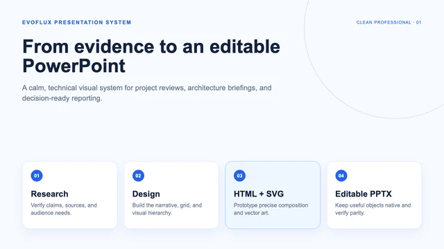

- **Use for:** technical briefings, project reviews, work summaries, promotion
  reviews, and pragmatic evidence-led reporting.
- **Visual DNA:** warm white or pale blue, professional blue and slate,
  restrained amber, crisp sans-serif hierarchy, disciplined grid, medium
  density, clear evidence and takeaway zones.
- **HTML/SVG direction:** align to an 8-pixel rhythm; use native text, shapes,
  timelines, process arrows, and pictures. Keep decorative SVG restrained.
- **Avoid:** marketing-poster drama, random stock imagery, cute stickers,
  repetitive card grids, and unreadably dense tables.

### Data dashboard

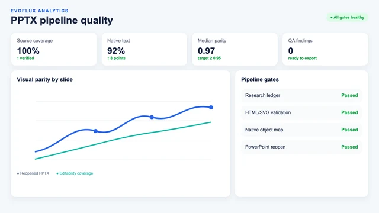

- **Use for:** KPI reviews, operations, analytics, monitoring, and business
  insight presentations where data is the protagonist.
- **Visual DNA:** white or mist-gray canvas, data blue with cyan/green/orange
  semantics, compact sans-serif, KPI hierarchy, precise chart panels, and
  medium-high density with strong grouping.
- **HTML/SVG direction:** prototype in an explicit dashboard grid, but emit
  real charts and tables as native PowerPoint data objects. Use native shapes
  for panels and status marks; use SVG only for non-data icons.
- **Avoid:** invented numbers, dark cyberpunk monitoring walls, tiny labels,
  decorative charts, or replacing editable data with one SVG screenshot.

### Consulting / McKinsey-style

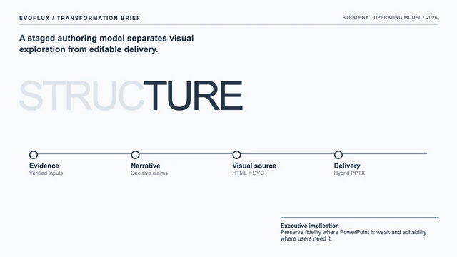

- **Use for:** strategy, transformation, growth, operating models, frameworks,
  roadmaps, matrices, and executive recommendations.
- **Visual DNA:** white or pale cool gray, ink blue-gray, Swiss grid, thin
  rules, micro-labels, one analytical mechanism, strong whitespace, precise
  reading path, and restrained boardroom tone.
- **HTML/SVG direction:** keep claims, modules, matrices, charts, and connectors
  native. Mark custom reconstructed display typography or texture as art when
  PowerPoint cannot reproduce it without drift.
- **Avoid:** claiming an official McKinsey template, generic rounded-card grids,
  handshake icons, heavy navy blocks, orange-by-default accents, or analysis
  with no decisive takeaway.

## Creative, editorial, and illustration

### Creative magazine

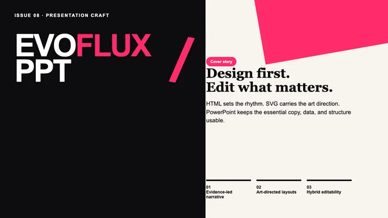

- **Use for:** brand stories, portfolios, cultural events, fashion, creative
  proposals, and launches that need a strong visual memory.
- **Visual DNA:** black/white/gray plus one vivid accent, oversized display
  type, bold asymmetry, cropped imagery, collage tension, thin editorial rules,
  and deliberate alternation between density and whitespace.
- **HTML/SVG direction:** keep straightforward headlines and captions native;
  use the shell for collage edges, halftone, rotated art labels, masks, and
  complex typographic treatments.
- **Avoid:** generic corporate icons, timid symmetry, too many accent colors,
  and sacrificing readability for spectacle.

### E-ink magazine

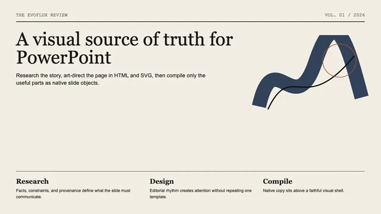

- **Use for:** stage talks, AI/technology narratives, opinion-led presentations,
  and nonfiction storytelling with a strong authorial voice.
- **Visual DNA:** off-white paper or deep ink field, ink black/indigo/forest,
  editorial serif headlines, sans-serif body, monospace metadata, thin rules,
  cropped images, and hero/non-hero pacing.
- **HTML/SVG direction:** emit serif/sans/mono text natively when fonts are
  available; preserve paper grain and ink-flow texture in the shell.
- **Avoid:** dashboard overload, shiny corporate gradients, template cards,
  cute illustration, and dense tables.

### Retro flat illustration

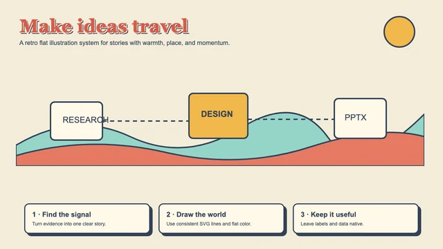

- **Use for:** cultural and city stories, lifestyle, tourism, brand heritage,
  and narrative topics that benefit from a friendly visual world.
- **Visual DNA:** cream paper, dark slate, coral/mint/mustard/burnt-orange
  palette, uniform monoline outlines, flat fills, panoramic scenes, badges, and
  moderate decorative density.
- **HTML/SVG direction:** build self-contained SVG scenes with consistent line
  weight and insert them as vector-picture objects; keep labels and claims as
  native PowerPoint text.
- **Avoid:** photorealism, glossy 3D, neon color, overly detailed linework, and
  decorative type that cannot be read at presentation distance.

## Hand-drawn and handmade

### Hand-drawn technical explainer

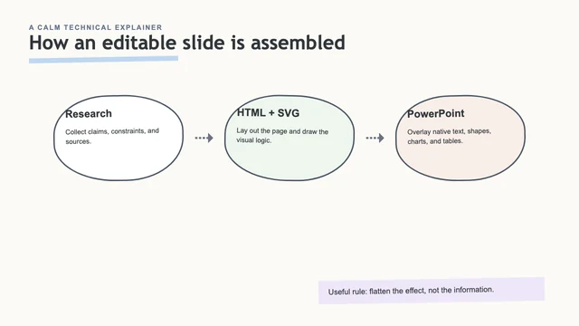

- **Use for:** software/AI concepts, technical articles, mechanism explanations,
  learning cards, and low-pressure teaching of complex ideas.
- **Visual DNA:** near-white paper, thin graphite lines, light hatching,
  restrained pastel markers, one small precise diagram, sparse labels, and
  generous whitespace.
- **HTML/SVG direction:** keep concise labels native; use SVG or shell art for
  sketch lines and hatching. Prefer one concept per slide.
- **Avoid:** yellowed paper, busy whiteboard furniture, large cartoon figures,
  dense handwriting, stickers, and digital dashboard cards.

### Hand-drawn whiteboard

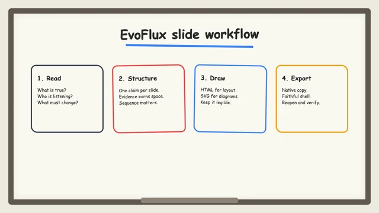

- **Use for:** workshops, training, concept decomposition, brainstorming, and
  friendly technical sharing.
- **Visual DNA:** warm off-white board, black marker, restrained red/blue/orange
  annotations, arrows, boxes, clouds, underlines, sticky notes, and organized
  freeform composition.
- **HTML/SVG direction:** use SVG paths for marker diagrams and native text for
  copy when a reliable handwritten font is available; otherwise disclose font
  substitution or keep stylized lettering in art mode.
- **Avoid:** illegible scrawl, chaotic doodles, childish clutter, photoreal
  people, and polished SaaS UI cards.

### Warm handmade

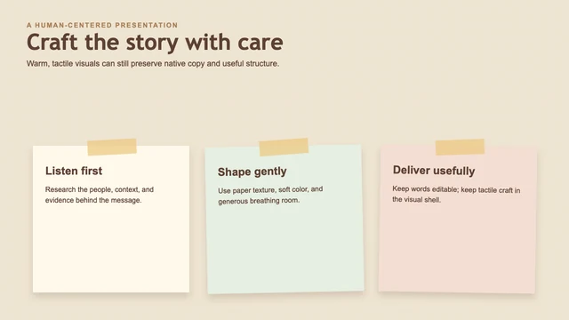

- **Use for:** education, community, culture, nonprofit, personal growth, and
  human-centered stories that need warmth.
- **Visual DNA:** cream paper, warm brown/cocoa, dusty peach/sage/ochre, rounded
  or friendly type, paper cutouts, tape, fibers, watercolor, and soft shadows.
- **HTML/SVG direction:** keep all copy native and place paper fibers, torn
  edges, tape, and watercolor in the shell; use simple SVG cutouts as vector
  pictures when their effects remain compatible.
- **Avoid:** glossy plastic, sharp corporate geometry, harsh black, neon color,
  and overly childish scrapbook clutter.

## Academic and education

### Scientific defense

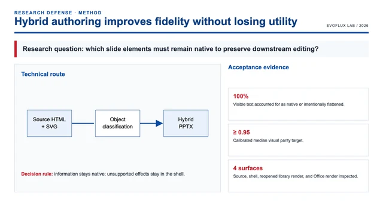

- **Use for:** research proposals, thesis defenses, midterm reviews, lab
  results, grant presentations, and formal scientific reporting.
- **Visual DNA:** clean white/light gray, deep academic blue, restrained red for
  conclusions or risks, dense but aligned evidence, technical routes,
  mechanisms, tables, paper figures, and explicit conclusions.
- **HTML/SVG direction:** preserve real paper figures and experiment imagery;
  build tables/charts natively; use SVG for mechanisms and routes while keeping
  their labels native where practical.
- **Avoid:** sparse marketing hero pages, generic AI art, playful stickers,
  unrelated icons, vague stock photos, and decorative gradients.

### Teaching courseware

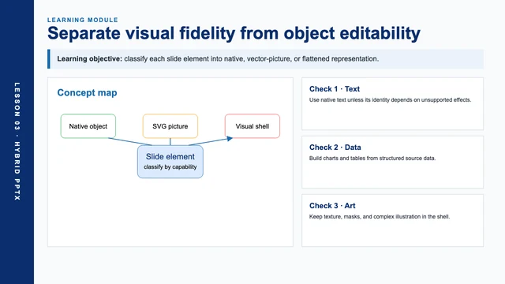

- **Use for:** university lessons, training, public education, concept
  explanation, case analysis, and structured knowledge transfer.
- **Visual DNA:** white or pale cool gray, academic navy and clear blue,
  substantial but grouped content, discipline-appropriate images, diagrams,
  formulas, annotations, comparisons, and clear teaching sequence.
- **HTML/SVG direction:** keep lesson copy, tables, formulas-as-supported-text,
  and charts native; use SVG diagrams and annotated images where they clarify
  the lesson. Split concepts before shrinking text.
- **Avoid:** text-only pages, repetitive three-column cards, generic AI
  imagery, random 3D icons, ornamental layouts, and ungrouped density.

## Formal and public-sector

### Party and government red

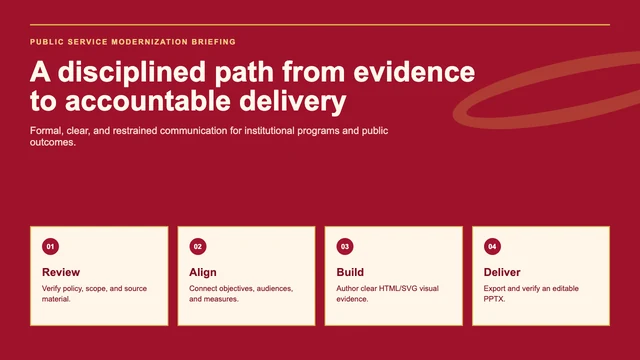

- **Use for:** formal public-sector, state-enterprise, institutional, policy,
  annual-summary, and public-service presentations when culturally appropriate.
- **Visual DNA:** Chinese red, deep red, warm ivory, restrained matte gold,
  strong formal typography, disciplined alignment, medium density, and balanced
  authority without festive decoration.
- **HTML/SVG direction:** keep formal titles, content, charts, and simple
  geometry native; place ribbons, landscapes, architecture, and complex
  gradients in the shell only when they serve the subject.
- **Avoid:** invented or approximate official marks, excessive gold, glossy 3D,
  wedding/festival motifs, unrelated landmarks, and decorative nationalism.
  Use official emblems, flags, seals, logos, or names only from accurate,
  authorized source assets required by the content.

## Preview sources

All bundled preview images are original EvoFlux examples rendered from the
English HTML/CSS/SVG sources under `examples/style-previews/`. The 12-style
taxonomy was selected from the user-provided
[codex-ppt-skill style catalog](https://github.com/ningzimu/codex-ppt-skill/tree/main/assets/style-previews),
but no upstream preview pixels or Chinese copy are included. These examples are
adapted specifically for EvoFlux's hybrid editable-PPTX representation model.
