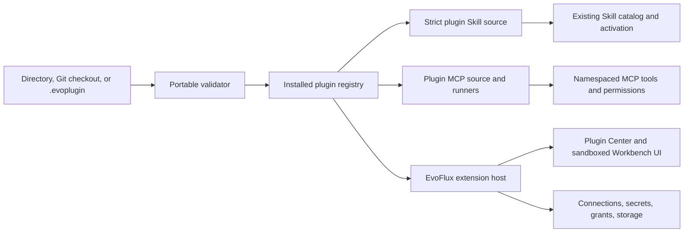

# Agent Plugins v1 adoption for EvoFlux — 2026-08-09

> Status: accepted and implemented for the local portable-core milestone
> Upstream baseline: Agent Plugins Specification `1.0.0`, status `Published`, repository snapshot `bd383552095128f6effe895b9257cfd580a6d179`
> Scope: let EvoFlux create, import, validate, install, enable, and use portable Agent Plugins without giving up EvoFlux-specific UI, permissions, lifecycle, or distribution controls.

## Decision

Adopt Agent Plugins v1 as the **portable core** of the EvoFlux plugin platform. Keep EvoFlux-only product capabilities in one documented reverse-domain client extension.

The resulting package has two layers:

1. **Portable layer** — root `plugin.json`, immediate-child Agent Skills under `skills/`, and optional portable MCP configuration in root `mcp.json`.
2. **EvoFlux layer** — Plugin Center metadata, connection forms, permissions, bundled-Python runtime hints, and signing inventory under an EvoFlux-owned extension namespace.

Keep `.evoplugin` only as an EvoFlux **distribution wrapper** around that directory. It is not a competing manifest format and it is not part of the Agent Plugins standard. After extraction, the installed directory must still be a valid Agent Plugins package that another conforming client can inspect and load.

Do not extend the current `app/agent/plugins/*.py` mechanism into this platform. Those files are trusted in-process legacy hooks and provider adapters; managed Agent Plugins must use separate discovery, lifecycle, and trust boundaries.

## Implemented in EvoFlux

The 2026-08-09 implementation delivers the P0–P3 local vertical slice:

- Agent Plugins 1.0 manifest, package, skill, MCP, path, URL, header, placeholder, and failure-boundary validation;
- an atomic local installation registry under `{DATA_DIR}/agent-plugins`;
- safe directory installs, developer links, bounded ZIP extraction, deterministic `.evoplugin` packing, enable/disable, and uninstall;
- strict immediate-child plugin skill discovery, with project/user/admin precedence above plugins and built-ins below;
- a separate hot-reloaded plugin MCP manager that never writes plugin configuration into global `mcp.json`;
- stdio `PLUGIN_ROOT`/`PLUGIN_DATA`, exact single-pass expansion, cwd containment, and Streamable HTTP redirect suppression for literal headers;
- `/api/plugins`, `evoflux plugin ...`, and a built-in Plugin Center accessible in Work and Coding sidebars;
- conformance, archive-safety, runtime-adaptation, precedence, API-lifecycle, type, lint, and regression tests.

Still deferred to the next product layer: Git/registry import, updates and rollback, publisher signatures, and broader mediated connections/storage. Portable Skills and MCP are usable now; those deferred EvoFlux-specific capabilities are not implied by the current implementation.

## Why this is the right boundary

Agent Plugins v1 intentionally standardizes a small interoperability floor. It covers package identity, fixed component locations, Agent Skills discovery, MCP configuration, path containment, component failure isolation, and `PLUGIN_ROOT`/`PLUGIN_DATA` behavior. It deliberately does **not** standardize archives, registries, installation UX, permissions, signatures, secrets, hooks, custom agents, commands, UI, or updates.

That split matches EvoFlux well:

- EvoFlux already has a mature Agent Skills harness with progressive disclosure, collision diagnostics, resource containment, mode scope, and runtime settings.
- EvoFlux already has a long-lived MCP client with stdio and Streamable HTTP execution, OAuth, health state, tool namespacing, and graceful failure.
- Plugin Center owns the host-managed lifecycle, credentials, runtime status, and diagnostics surfaces.

A custom-only `.evoplugin` manifest would duplicate a new ecosystem standard and prevent direct reuse in VS Code, Cursor, GitHub Copilot, ChatGPT/Codex, and Kiro. A standard-only implementation would leave major EvoFlux product and security needs undefined. The layered model avoids both failures.

## Upstream findings

### Published v1 package contract

The smallest valid package is a directory containing:

```text
my-plugin/
└── plugin.json
```

A useful package can add:

```text
my-plugin/
├── plugin.json
├── skills/
│   └── summarize/
│       ├── SKILL.md
│       ├── scripts/
│       ├── references/
│       └── assets/
├── mcp.json
└── com.example.client/
    └── client-owned files
```

Normative points that matter for EvoFlux:

- `plugin.json` is required, closed, and selected by its canonical `$schema` identifier. A client must use locally supported rules and must not download a schema while loading a plugin.
- Unknown root manifest fields are reported and ignored but are not fatal. A non-object `extensions` value is also reported and ignored. Other manifest violations reject the entire plugin.
- A plugin name is 1–64 lowercase ASCII letters, digits, hyphens, or periods; it starts and ends alphanumeric and cannot contain `--` or `..`.
- Skills are discovered only from **immediate children** of `skills/` containing a regular `SKILL.md`. Discovery is not recursive.
- `mcp.json` has canonical fields `$schema` and `mcpServers`. Each server declares `type: stdio`, `streamable-http`, or legacy `sse`.
- Invalid `mcp.json` disables MCP only for that plugin. An invalid server entry disables only that server. A failed connection must not disable valid skills or other servers.
- Every plugin-supplied path must resolve inside the filesystem-resolved plugin root. Symlinks or equivalent filesystem links that escape the root must be rejected at the narrowest applicable boundary.
- Stdio commands are one executable token. A command is either a bare executable name or a plugin-relative path beginning `./`; it is never a shell command string.
- Stdio defaults its working directory to the plugin root. An explicit `cwd` can be plugin-relative, `${PLUGIN_ROOT}`-rooted, or `${PLUGIN_DATA}`-rooted and must remain contained after resolution.
- EvoFlux must provide absolute `PLUGIN_ROOT` and a dedicated, writable, update-persistent `PLUGIN_DATA` directory to every plugin stdio subprocess.
- Placeholder expansion is single-pass and limited to exact `${PLUGIN_ROOT}` and `${PLUGIN_DATA}` occurrences in `args`, `env` values, and `cwd`. It does not apply to `command`, remote URLs, or headers.
- Non-loopback remote MCP endpoints require HTTPS. URLs cannot contain user information or fragments. Literal header values are visible package data, not a secret mechanism.
- Clients may implement only Skills or only MCP initially and still adopt incrementally. A client claiming full MCP support must support at least one of stdio or Streamable HTTP; legacy SSE is optional.

### What v1 explicitly leaves to EvoFlux

| Concern | Agent Plugins v1 | EvoFlux owner |
|---|---|---|
| Directory package and manifest | Standardized | Portable loader |
| Agent Skills and MCP config | Standardized | Existing skill/MCP runtimes through adapters |
| Archive such as `.evoplugin` | Not defined | Installer and packer |
| Registry, Git import, update | Not defined | Plugin Center and CLI |
| Permissions and approval UX | Not defined | EvoFlux permission/grant model |
| Signatures and provenance | Not defined | EvoFlux distribution metadata |
| Secrets and credential references | Not defined | Host secret store and OAuth flow |
| UI, commands, hooks, agents, LSP | Not portable v1 components | EvoFlux client extension or compatibility layer |
| Plugin dependencies | Not defined | Deferred |
| Audit event schema | Not defined | EvoFlux observability |

The upstream `FUTURE_CONSIDERATIONS.md` lists permissions, provenance, secrets, enterprise policy, audit trails, dependencies, and validation tooling as possible future work. EvoFlux should not wait for those versions, but its client extension should be versioned so fields can later converge or be retired cleanly.

### Ecosystem signal

The official compatible-client catalog currently lists VS Code, Cursor, GitHub Copilot, ChatGPT/Codex, and Kiro. All five advertise Skills and MCP support; ChatGPT/Codex lists stdio and Streamable HTTP, while the other listed clients also advertise legacy SSE. This is enough adoption to prefer interoperability over a separate portable-core format.

## Current EvoFlux fit and gaps

| Area | Current EvoFlux | Fit | Required change |
|---|---|---|---|
| Agent Skills | Typed metadata-only discovery, progressive activation, resource reader, collision/mode diagnostics | Strong | Add a strict plugin-root discovery mode: immediate children only and no root-escaping links. |
| Skill roots | Project, user, compatibility, admin, and built-in roots | Partial | Inject roots from enabled plugin installations without copying skills into the user skill directory. |
| MCP config | Global `{CONFIG_DIR}/mcp.json` with `{servers: ...}` and native `transport` variants | Shape mismatch | Parse portable plugin `mcp.json` separately and adapt it in memory; never rewrite it into the global file. |
| MCP stdio runtime | Long-lived isolated runners, token-array spawn, graceful failures | Strong base | Add `cwd`, package-root command resolution, exact placeholder expansion, and `PLUGIN_ROOT`/`PLUGIN_DATA`. |
| MCP HTTP runtime | Streamable HTTP, headers, OAuth, health state | Partial | Add standard URL/header validation and ensure configured headers are not forwarded across origins. |
| Legacy plugins | Trusted single-file Python imported in the FastAPI process | Wrong trust model | Keep as “Legacy hooks/providers”; do not expose as managed Agent Plugins. |
| Install lifecycle | No managed portable plugin registry | Missing | Add staged install/link/enable/disable/uninstall and per-component diagnostics. |
| Package security | Existing proposal covers archive limits, checksums, signatures, rollback | Strong plan | Rebase it on root `plugin.json` instead of custom `manifest.json`. |

### Skill-loader incompatibility to avoid

`app/agent/skills/discovery.py` currently searches nested skill directories to depth six for EvoFlux and legacy compatibility roots. Agent Plugins requires only immediate children of a plugin's `skills/` directory. Reusing the recursive walk unchanged would make EvoFlux non-conformant and could expose nested resources as unintended skills.

Add a dedicated `discover_plugin_skill_records()` path that:

- lists only immediate child directories;
- accepts exactly `SKILL.md` regular files;
- applies the existing Agent Skills validator and runtime settings overlay;
- validates every resolved path against the package root;
- records the installation ID and plugin source in `SkillRecord` provenance;
- feeds records into the existing collision and mode-selection system.

Recommended precedence is existing project/user roots first, administrator policy roots next, enabled installed plugins next, and built-ins last. The exact order must be deterministic and visible in diagnostics. A plugin skill must never silently overwrite a user-authored skill.

### MCP adapter differences

| Portable field | Current native field | Adapter behavior |
|---|---|---|
| `mcpServers` | `servers` | Keep separate source registries; do not merge files. |
| `type: "stdio"` | `transport: "stdio"` | Convert in memory after portable validation. |
| `type: "streamable-http"` | `transport: "http"` | Convert in memory; preserve the declared transport in diagnostics. |
| `type: "sse"` | No distinct current runner | Skip with an “unsupported transport” diagnostic in v1; SSE is optional. |
| `cwd` | Missing | Add to the launch definition and enforce root/data containment. |
| `${PLUGIN_ROOT}` / `${PLUGIN_DATA}` | General environment reference expansion | Use a separate exact, single-pass plugin expander; do not apply the global secret resolver. |
| Standard `env` | Native `env` plus broad process PATH handling | Overlay a sanitized client base, then force reserved variables after plugin values. |
| Literal remote headers | Native headers can resolve `${ENV}` secrets | Do not run portable headers through `resolve_secret_refs`; OAuth/secrets remain client-managed. |

The existing `MCPManager` watches one global config and keys runners by server name. Plugin servers need a source-aware identity such as `(installation_id, server_name)` and tool names qualified by installation/plugin identity. Extract the runner primitive or add a separate `PluginMCPManager`; do not serialize plugin servers into the user's global `mcp.json` because that loses package ownership, update behavior, `PLUGIN_DATA`, and failure isolation.

## Recommended package layout

The EvoFlux extension namespace must be based on a domain the project controls. `org.evoelsewhere.evoflux` is used below as a proposal and must be confirmed before publishing; do not claim an unowned namespace.

```text
evoflux-jira/
├── plugin.json
├── skills/
│   └── jira-research/
│       ├── SKILL.md
│       └── references/
├── mcp.json                         # optional portable MCP
├── org.evoelsewhere.evoflux/
│   ├── ui/
│   │   └── index.html
│   ├── backend/
│   │   ├── main.py
│   │   └── vendor/
│   └── distribution/
│       ├── checksums.json
│       └── signature.ed25519
├── README.md
└── LICENSE
```

Portable manifest:

```json
{
  "$schema": "https://agent-plugins.org/schemas/1.0.0/plugin.schema.json",
  "name": "evoflux-jira",
  "version": "1.0.0",
  "description": "Jira task workflows and tools.",
  "repository": "https://github.com/evoelsewhere/plugins",
  "license": "Apache-2.0",
  "keywords": ["jira", "tasks"],
  "extensions": {
    "org.evoelsewhere.evoflux": {
      "apiVersion": "1.0",
      "runtime": {
        "type": "bundled-python-mcp",
        "entrypoint": "backend/main.py"
      },
      "permissions": [],
      "contributes": {
        "workbench": [],
        "settings": [],
        "commands": [],
        "connectionTypes": [],
        "agentTools": []
      }
    }
  }
}
```

The relative `entrypoint` above is interpreted inside the matching extension directory by EvoFlux; it is not a portable Agent Plugins path field. The EvoFlux extension schema must define and validate that rule.

Portable MCP, when the author can supply a genuinely runnable cross-client server:

```json
{
  "$schema": "https://agent-plugins.org/schemas/1.0.0/mcp.schema.json",
  "mcpServers": {
    "jira": {
      "type": "stdio",
      "command": "./bin/jira-server",
      "args": ["--data", "${PLUGIN_DATA}/jira"],
      "cwd": "${PLUGIN_ROOT}"
    }
  }
}
```

Do not duplicate one backend declaration in both `mcp.json` and the EvoFlux extension unless one is canonical and the other is generated. A plugin that relies on EvoFlux's bundled Python may expose only portable Skills to other clients; its EvoFlux UI/backend remains a valid client extension, not falsely advertised as a portable MCP server.

## Architecture in EvoFlux



### New backend boundary

Use a new package instead of overloading the legacy loader:

```text
app/plugin_platform/
├── portable/
│   ├── models.py
│   ├── loader.py
│   ├── paths.py
│   ├── diagnostics.py
│   └── schemas/1.0.0/
│       ├── plugin.schema.json
│       └── mcp.schema.json
├── registry.py
├── installer.py
├── manager.py
├── mcp_adapter.py
├── permissions.py
├── distribution.py
└── evoflux_extension.py
```

Important rules:

- Vendor the canonical schemas by version. `$schema` selects local code and local schema files; loading never performs network I/O.
- Model diagnostics and failure boundaries explicitly. Do not reduce load state to one `valid: bool` because the spec distinguishes fatal manifest errors, invalid component types, invalid skills, invalid MCP entries, unsupported transports, and runtime connection failures.
- Keep an installation UUID as the security and storage key. Portable `name` is not a publisher-qualified globally unique identifier, and `version` is optional.
- Derive `PLUGIN_DATA` from installation UUID, not from an untrusted name. Preserve it across version updates and delete it only on an explicit “remove data” uninstall.
- Treat an absent `skills/` or `mcp.json` as valid. A manifest-only plugin can install successfully with zero active components.
- An invalid EvoFlux extension disables only EvoFlux-specific contributions unless the portable manifest itself is invalid.
- Never import third-party Python or JavaScript into the FastAPI/React host processes.

Suggested installed paths:

```text
{DATA_DIR}/agent-plugins/installed/<installation-id>/<version-or-digest>/
{DATA_DIR}/agent-plugins/data/<installation-id>/
{CACHE_DIR}/agent-plugins/staging/<random-id>/
```

### Registry identity and collision policy

Store at least:

- installation UUID;
- portable name and optional declared version;
- source type and normalized source reference;
- active package root and content digest;
- enabled state;
- manifest, component, extension, and runtime diagnostics;
- signature/provenance state outside the portable manifest contract;
- granted permissions keyed to the exact package digest.

For an MVP, reject an update when source identity does not match the installed source, even if `name` matches. Require explicit side-by-side install or replacement approval. Never treat `name + version` as proof of publisher identity.

MCP server names are scoped to an installation. Agent-visible tool names should remain deterministic and collision-safe, for example:

```text
plugin_<normalized-plugin-name>_<short-installation-id>_<server>_<tool>
```

Skill names are defined by Agent Skills and are not automatically namespaced. Keep current collision diagnostics, place user-authored roots above installed plugins, and expose the exact winning/shadowed variant in Plugin Center and Settings. The first implementation should not silently change precedence based on filesystem iteration order.

## User workflows

### Create

Recommended CLI:

```text
evoflux plugin init <name> --template portable
evoflux plugin validate <directory-or-package>
evoflux plugin pack <directory>
evoflux plugin inspect <directory-or-package>
```

Templates have explicit portability promises:

- `portable`: `plugin.json` plus Skills and/or a portable MCP definition; no EvoFlux extension required.

The validator must emit a component inventory and diagnostics grouped by manifest, each skill, each MCP server, EvoFlux extension, distribution, and security review. It must describe portability per component rather than overstate package compatibility.

### Import and install

Ship sources in this order:

1. **Developer link to a local directory** — read-only package root, explicit trust warning, live reload, no copy. This satisfies the standard's minimum directory-loading model and speeds authoring.
2. **Install a local directory** — validate, copy to staging, content-hash, permission review, atomic activate.
3. **Install local `.evoplugin`** — safely extract a ZIP whose archive root contains `plugin.json`; apply current archive limits, checksum, signature, staging, and rollback plan.
4. **Import an HTTPS Git repository** — later, clone without submodules into staging, pin the resolved commit, validate the selected plugin subdirectory, and show source/commit plus executable components before approval.
5. **Signed registry/update flow** — after publisher keys, revocation, permission diff, side-by-side health check, and rollback exist.

Do not implement arbitrary URL-to-archive installation in the first release. It expands redirect, size, content-type, provenance, and update risks without improving core standard conformance.

### Enable and use

Enabling is component-aware:

1. Portable manifest must be valid.
2. Valid skills join the catalog immediately; invalid siblings remain diagnosed and skipped.
3. MCP requires a separate execution/remote-connection approval showing commands, args, cwd, environment key names, URLs, and literal headers. Credentials are collected through host OAuth/secret UX, never copied from portable headers.
4. Valid approved servers start independently. One failure does not disable other servers or Skills.
5. EvoFlux credential and MCP-capability extensions activate only after extension validation.
6. Disabling removes plugin Skill roots, stops owned MCP runners, and invalidates runtime catalogs without deleting package or data.

Agent access stays explicit. Installation or enablement makes tools available for selection, but it must not silently grant every plugin tool to every agent. Reuse agent `mcp:`/tool configuration and the existing permission engine, extended with installation-aware identities.

## Retained platform decisions

- Plugin Center owns lifecycle, editor, credentials, and runtime-status surfaces;
- subprocess backend isolation and honest “trusted desktop code” warning;
- installation-scoped data, declared credentials, permission mediation, and diagnostics;
- safe archive extraction, deterministic packing, staged install, identity-preserving managed update, and explicit uninstall data policy;
- no third-party FastAPI routes, SQLModel/Alembic models, React imports, or in-process Python imports;

Change these parts:

| Existing proposal | Revised decision |
|---|---|
| Root `manifest.json` with `schemaVersion`, `id`, runtime, UI, permissions, and contributions | Root standard `plugin.json`; EvoFlux fields live under one versioned `extensions` namespace. |
| `.evoplugin` is the plugin contract | `.evoplugin` is only a deterministic ZIP distribution of a valid plugin directory. |
| Backend always declared by custom runtime manifest | Prefer portable `mcp.json` when genuinely runnable across clients; otherwise declare EvoFlux bundled runtime honestly in the client extension. |
| Skills implied as a custom contribution | Skills remain at the standard fixed `skills/` location and feed the existing harness. |
| Custom SDK starts from a blank package format | SDK scaffolds and validates the standard core first, then adds the EvoFlux namespace. |

## Delivery plan

### P0 — standard contract and terminology

- Confirm the reverse-domain namespace from a domain the project controls.
- Vendor upstream `1.0.0` schemas and pin normative fixtures.
- Add `portable` models, diagnostic/failure-boundary types, and path-containment helpers.
- Rename product-facing references to current `.py` plugins as “Legacy hooks/providers”.
- Update the existing Plugin Platform plan and Jira package examples to the layered format.

Exit: the upstream example package and adversarial manifest/path fixtures validate without executing components.

### P1 — skills-only directory client

- Add installed/developer-linked package registry with local directory source.
- Implement strict immediate-child plugin Skill discovery and provenance.
- Merge enabled plugin Skill records into the existing catalog with deterministic precedence.
- Add API/CLI `inspect`, `link`, `install-directory`, `enable`, `disable`, and `uninstall` for Skills.
- Surface component diagnostics in the existing Skills UI or a minimal Plugin Center list.

Exit: EvoFlux can load the upstream example plugin from a directory, activate its skill, disable it, and pass the applicable Agent Plugins conformance checklist. Do not yet claim MCP component support.

### P2 — portable MCP runtime

- Implement portable `mcp.json` parser with top-level and per-server failure boundaries.
- Add source-aware plugin MCP runners and tool namespacing.
- Implement command/cwd resolution, exact placeholders, `PLUGIN_ROOT`, persistent `PLUGIN_DATA`, sanitized base env, URL/header rules, and redirect-origin protection.
- Support stdio and Streamable HTTP. Report legacy SSE as unsupported without failing other components.
- Add approval, per-agent wiring, runtime status, retry, and shutdown behavior.

Exit: mixed Skills+MCP packages continue loading valid components when one skill, server entry, or server process fails.

### P3 — package creation and local distribution

- Scaffold the portable Skill/MCP template.
- Add validate/inspect/pack commands using the same host validator.
- Rebase `.evoplugin` archive, checksum, signature-state, staged install, and rollback on root `plugin.json`.
- Build Plugin Center Installed/Local install/Developer views and permission review.

Exit: a third party can create, pack, inspect, install, enable, disable, and uninstall a plugin without editing EvoFlux core.

### P4 — provenance, Git import, and rollback

- Add pinned Git import without submodules.
- Add signed registry metadata, publisher keys/revocation, update permission diff, side-by-side health check, and rollback.
- Add exportable redacted diagnostics and lifecycle audit events.

Exit: third-party distribution is safe enough to enable beyond local packages.

## Conformance and security test matrix

Minimum fixtures:

- upstream canonical example;
- manifest-only plugin;
- unknown manifest root field: diagnostic, field ignored, plugin continues;
- non-object `extensions`: diagnostic, field ignored, plugin continues;
- any other manifest schema violation: entire plugin rejected;
- missing `skills/` and `mcp.json`: no error;
- `skills` wrong filesystem kind: only Skills invalid;
- immediate valid and nested non-discoverable `SKILL.md` files;
- invalid skill beside valid skill;
- root-escaping manifest, Skill, command, cwd, resource, symlink, junction, and case-fold path cases;
- invalid/mismatched `mcp.json`: MCP disabled, Skills remain;
- one invalid server beside valid servers;
- unsupported `sse` beside stdio/Streamable HTTP;
- stdio bare command and `./` command, never shell parsing;
- default cwd, each valid cwd form, and post-expansion traversal attempts;
- exact single-pass placeholders, unknown placeholders left literal, and reserved env-key rejection;
- non-loopback HTTP rejection, loopback HTTP acceptance, URL user-info/fragment rejection;
- duplicate case-insensitive headers and cross-origin redirect header stripping;
- subprocess receives only intended environment plus forced `PLUGIN_ROOT`/`PLUGIN_DATA`;
- persistent data across update and optional deletion on uninstall;
- Skill and MCP name collisions across plugins;
- disabled plugin contributes no Skills, tools, or running process;
- no schema network request during load;
- malformed EvoFlux extension does not suppress valid portable components.

## Open decisions with recommended defaults

| Decision | Recommended default |
|---|---|
| EvoFlux extension namespace | Use a reverse-domain identifier based on a verified controlled domain; confirm before schema publication. |
| First conformance milestone | Skills-only directory client, then add MCP. |
| Portable MCP transports | Stdio and Streamable HTTP; skip legacy SSE with diagnostics. |
| Local package format | Keep `.evoplugin`, but define it as ZIP distribution, not the portable contract. |
| Plugin identity | Installation UUID + source/provenance; never trust portable name as publisher identity. |
| Plugin skill precedence | User/project/admin skills above installed plugins; built-ins below. Keep diagnostics visible. |
| Tool access | Explicit per-agent selection and existing permission checks; no install-time global grant. |
| Git import | HTTPS, pinned commit, no submodules, staged review; not in the first milestone. |
| Fullstack portability claim | Claim portability only for components actually represented by valid Skills/portable MCP. |
| Schema evolution | Dispatch by canonical `$schema`; never fetch schemas during loading. |

## Sources

- [Agent Plugins home](https://agent-plugins.org/)
- [Agent Plugins Specification 1.0.0](https://agent-plugins.org/specification)
- [Client implementation guide](https://agent-plugins.org/client-implementers)
- [Compatible clients](https://agent-plugins.org/compatible-clients)
- [Specification repository](https://github.com/agentplugins/agent-plugins-spec)
- [Canonical example and migration guide](https://github.com/agentplugins/agent-plugins-example)
- [Agent Skills specification](https://agentskills.io/specification)
- [Model Context Protocol specification](https://modelcontextprotocol.io/specification)

## Final recommendation

The local portable-core sequence is now complete: validation, Skills, plugin-owned MCP, `.evoplugin`, lifecycle API/CLI, and Plugin Center ship as one tested vertical slice. Keep that core stable and conformance-focused.

The next investment should focus on Git/registry import, signed provenance, explicit permission review, health-gated rollback, broader mediated connections/storage, and audit export before enabling broad third-party distribution. Plugin packages should continue contributing portable Skills and MCP servers while Plugin Center remains host-owned.
