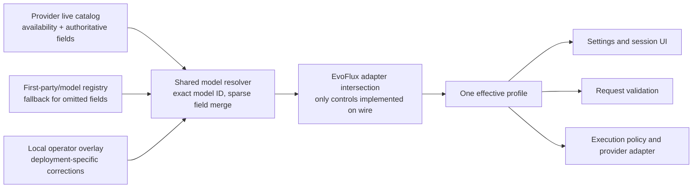

# Provider model capability flow

Model availability, model capability, and EvoFlux adapter support are different
facts. A control is selectable only when all three agree.

## Rules

1. Never infer vision, tools, or reasoning from a provider prefix or a model
   name. Unknown means unavailable in the UI and denied by safety gates.
2. Provider-live fields override fallback metadata field by field. Missing live
   fields do not erase known static facts.
3. `models.dev` is a fallback catalog, not a provider contract. It is especially
   useful when an official `/models` API returns IDs only.
4. A model capability is not automatically an EvoFlux capability. Bedrock
   models may support reasoning, for example, but named effort stays hidden
   until the Bedrock adapter translates it.
5. `Default` means omit the override and let the provider choose. `None` is
   shown only when the provider has a real off value; it is not a universal
   alias for Default.
6. Validation, automatic execution policy, the agent editor, and the session
   composer consume the same effective levels. No global reasoning enum is
   allowed.

## Source precedence

| Priority | Source | Use |
|---|---|---|
| 1 | Provider live catalog | Availability, modalities, context/output limits, tools, reasoning contract, invocation interfaces |
| 2 | Bundled first-party profile and refreshed `models.dev` | Fields absent from basic provider catalogs |
| 3 | Safe defaults | Text output only; optional capabilities disabled |

The user overlay participates in the static fallback layer and can correct
deployment-specific data. Provider-live facts remain authoritative for the
current connection.

## Provider contracts implemented

| Provider | Discovery authority | Reasoning wire behavior |
|---|---|---|
| Codex | ChatGPT Codex model catalog | Exact live `supported_reasoning_levels` |
| OpenRouter | Rich `/api/v1/models` response | `reasoning.effort`; `reasoning.enabled=false` for Off |
| Gemini / Vertex | Google model list + first-party generation docs | Gemini 3 uses `thinkingLevel`; Gemini 2.5 Flash/Lite Off uses `thinkingBudget: 0` |
| DeepSeek | Direct model list + first-party thinking-mode profile | `thinking.type` plus `reasoning_effort`; explicit Off sends `disabled` |
| Ollama | Native `/api/tags` and `/api/show` | Native capabilities and context; no invented effort selector |
| Bedrock | `ListFoundationModels` | Live modalities; named reasoning hidden until the Converse adapter supports it |
| Copilot | Live `/models` response | Live `supported_endpoints`; efforts resolved per model, not by whitelist |
| Kimi | Rich model list flags | Live context/modality; static fallback only for omitted effort details |
| FCI | Rich OpenRouter-like model list | Live modalities, limits, tools, and supported parameters |
| OpenAI / Anthropic / Xiaomi / Z.AI | Live availability plus static provider profile | Their list APIs omit some or all control metadata |

## Primary references

- [OpenAI Models API](https://developers.openai.com/api/reference/resources/models/methods/list)
- [Gemini thinking](https://ai.google.dev/gemini-api/docs/thinking)
- [Gemini ThinkingConfig](https://ai.google.dev/api/generate-content#ThinkingConfig)
- [Anthropic effort](https://docs.anthropic.com/en/docs/build-with-claude/effort)
- [OpenRouter reasoning tokens](https://openrouter.ai/docs/guides/best-practices/reasoning-tokens)
- [DeepSeek thinking mode](https://api-docs.deepseek.com/guides/thinking_mode)
- [Ollama show model details](https://docs.ollama.com/api-reference/show-model-details)
- [Amazon Bedrock FoundationModelSummary](https://docs.aws.amazon.com/bedrock/latest/APIReference/API_FoundationModelSummary.html)

