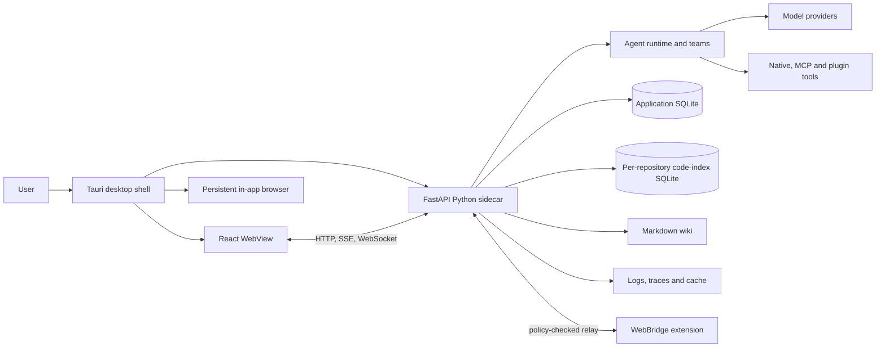
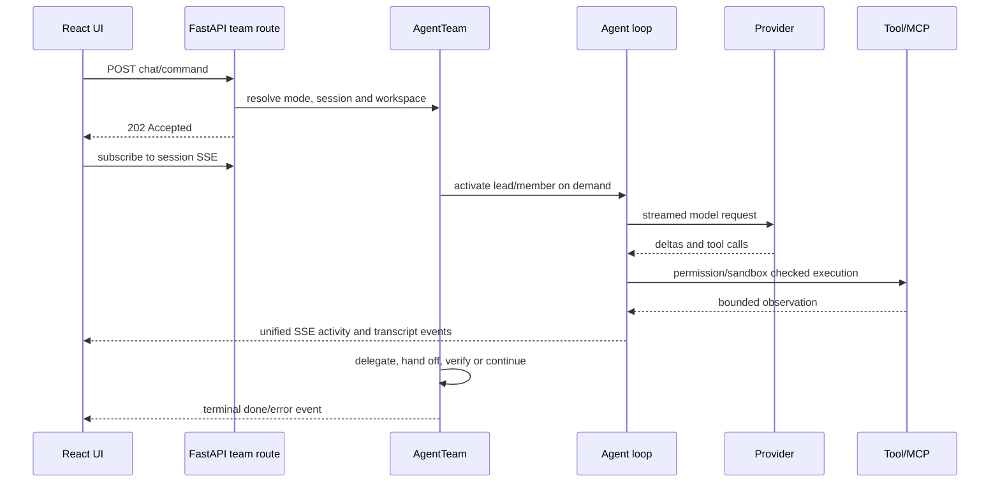

# System overview

EvoFlux is a local-first desktop harness for Work and Coding agent teams. The
production topology has three application processes and several optional local
or remote integrations.

## Process responsibilities

| Process | Owns | Does not own |
|---|---|---|
| Tauri shell | Native windows, sidecar supervision, token handshake, tray, updater, persistent browser, packaging | Agent logic or application persistence |
| React WebView | Navigation, chat/workbench UI, cached server state, streaming projections, Settings | Durable business rules |
| FastAPI sidecar | API, agent loop, teams, tools, persistence, scheduler, workflows, code context, memory, MCP, policy | Native package lifecycle |
| Provider/MCP child processes | Provider requests or configured tool servers | EvoFlux authorization decisions |

## Startup and shutdown

The desktop shell launches the sidecar on loopback using an OS-assigned port.
The sidecar emits an `EVOFLUX_HANDSHAKE` line containing its port, random token,
PID, and version. Tauri waits for `/api/health/live`, injects the backend URL and
token into the WebView, and keeps the sidecar tied to the shell PID.

FastAPI critical startup initializes runtime directories, reconciles orphaned
workflow executions, migrates the production database, seeds the wiki, and
sets up telemetry. MCP, plugin MCP, Conductor, agent validation, Scheduler, and
Dream start as optional background services so the health endpoint becomes
available without waiting for external I/O.

Shutdown stops teams and schedulers, closes MCP runtimes and code indexes,
terminates managed processes/previews/language servers, drains memory-extraction
tasks, disposes database engines, and flushes observability state.

Primary code: `desktop/src-tauri/src/sidecar.rs`, `app/cli/commands/serve.py`,
`app/api/app.py`.

## Request and turn flow

The API acknowledges accepted work before the turn completes. A single
session-keyed in-memory stream carries token deltas, tool activity, agent
status, questions, permissions, plan review, goals, workflows, and completion.
Durable messages and state are stored separately so reconnect can replay the
transcript and then resume live streaming.

## Core boundaries

- **Mode:** Work uses an isolated per-session workspace; Coding authorizes one
  persistent repository or a multi-repository project.
- **Team:** one lead is persistent for the team identity; specialists are
  blueprints instantiated on demand and communicate through a mailbox.
- **Policy:** the model can propose actions, but tool permissions, sandbox
  roots, outbound redaction, workflow approval, and desktop/browser policies
  are enforced by the harness.
- **Storage:** application records stay in the main database; repository index
  data stays in cache-local per-repository databases; user knowledge remains
  inspectable in scoped facts and Markdown wiki files.
- **Integration:** global MCP, plugin MCP, provider adapters, WebBridge, and
  Conductor have separate configuration and lifecycle boundaries.

## Source-of-truth map

| Contract | Owner |
|---|---|
| App assembly and route mounting | `app/api/app.py` |
| Agent loop | `app/agent/agent_loop/` |
| Lead/specialist orchestration | `app/agent/mode/team/` |
| Session/team lifecycle | `app/services/team_manager.py`, `app/services/chat_service.py` |
| Frontend composition | `web/src/routes/work.tsx`, `web/src/components/TeamChatView/` |
| Data schema | `app/models/`, `app/migrations/versions/` |
| Desktop lifecycle | `desktop/src-tauri/src/` |
| Runtime configuration | `app/core/config.py`, `app/core/runtime_settings.py` |
| Current feature inventory | [`../features/README.md`](../features/README.md) |
