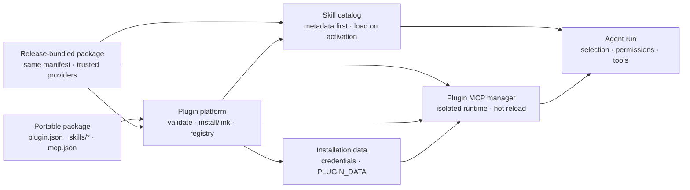

# Portable and bundled Agent Plugins in EvoFlux

EvoFlux implements the local portable core of [Agent Plugins 1.0](https://agent-plugins.org/specification). Managed Agent Plugins are separate from trusted legacy Python hooks in `app/agent/plugins`. EvoFlux releases may also bundle immutable first-party packages that use the same manifest and Skill discovery contract.

<p align="center">
  
</p>

## Architecture overview



| Boundary | Owner | Contract |
|---|---|---|
| Portable package | Plugin author | Root `plugin.json`, immediate-child Skills, and optional `mcp.json` |
| Bundled package | EvoFlux release | Immutable first-party Skills plus narrowly declared native providers |
| Control plane | EvoFlux | Validation, install/link/update, registry, enable state, editor, credentials, and status |
| Skill runtime | EvoFlux Skill catalog | Metadata is indexed eagerly; instructions and resources load only after activation |
| MCP runtime | Plugin MCP manager | Servers are reconciled per installation and never merged into global `mcp.json` |
| Private state | EvoFlux host | Credentials and `PLUGIN_DATA` live outside the package and survive in-place updates |
| Tool access | Agent runtime | Same-installation activation and explicit selection still pass through normal permissions |

Plugin Center is host-owned UI. A package cannot inject custom frontend code,
settings pages, or credential screens; it contributes only portable Skills and
MCP server declarations. Bundled providers likewise return host-defined data,
drivers, or routers and cannot inject a plugin-owned frontend. The optional
EvoFlux extensions below declare data that the host renders and enforces.

The bundled Documents package preserves the historical `builtin` settings IDs
for its `docx`, `xlsx`, `pptx`, and `pdf` Skills. Existing mode and invocation
overrides therefore survive the core-to-plugin migration even though catalog
provenance now reports the stable bundled-plugin installation ID.

## Package contract

```text
example-plugin/
├── plugin.json
├── skills/
│   └── release-audit/
│       ├── SKILL.md
│       ├── scripts/
│       └── references/
└── mcp.json
```

`plugin.json` must target `https://agent-plugins.org/schemas/1.0.0/plugin.schema.json`. Skills are discovered only from immediate child directories of `skills/`. `mcp.json` is optional and may contain stdio, Streamable HTTP, or legacy SSE entries; EvoFlux executes stdio and Streamable HTTP and reports/skips SSE.

An `.evoplugin` file is a deterministic ZIP wrapper around this directory. It adds no alternate manifest or runtime semantics.

## User workflows

Open **Plugins** beneath Scheduler in either Work or Coding mode. Plugin Center supports:

- import a local `.evoplugin` or ZIP;
- link an unpacked development directory without copying it;
- validate a directory without installing it;
- scaffold a plugin with optional starter Skill and MCP server files;
- open a plugin in the built-in workspace editor to browse, create, edit, save,
  and delete package files;
- configure installation-scoped credentials declared by the plugin;
- review executable commands, remote hosts, environment-field names, and
  capabilities before enabling a newly imported plugin;
- enable, disable, pack, update a managed installation in place, and uninstall
  an installation.

Equivalent CLI commands:

```bash
evoflux plugin create ./my-plugin --name my-plugin --skill release-audit
evoflux plugin inspect ./my-plugin
evoflux plugin link ./my-plugin
evoflux plugin pack ./my-plugin
evoflux plugin install ./my-plugin-unversioned.evoplugin
evoflux plugin update <installation-id> ./my-plugin-v2.evoplugin
evoflux plugin list
evoflux plugin show <installation-id>
evoflux plugin disable <installation-id>
evoflux plugin enable <installation-id>
evoflux plugin uninstall <installation-id>
```

Release-bundled packages appear in the same list with `source_type: builtin`
and stable deterministic IDs. They update with EvoFlux and are always enabled.
Their editor, pack, update, enable/disable, and uninstall capabilities are
false in the API, so clients do not infer lifecycle permissions from a source
label. Both the API and installer reject create destinations and pack outputs
inside the release-bundled package tree.

The lifecycle API is mounted at `/api/plugins`; its OpenAPI schema is the source of truth for request and response fields.

Imports and developer links default to disabled. Static inspection builds the
trust review without starting a server and never includes environment or header
values. Plugin Center requires an explicit **Trust and enable** action. The CLI
also installs disabled by default; use `plugin show` to inspect the `trust`
record before `plugin enable`. `--enabled` exists for deliberate non-interactive
automation.

## Runtime and precedence

Plugin Skills join the normal metadata-only catalog and load progressively through the existing Skill tool. Precedence is:

1. project, user, and administrator roots;
2. enabled installed and linked Agent Plugin installations;
3. release-bundled Agent Plugins;
4. core EvoFlux built-in Skills.

Plugin MCP configuration is adapted in memory into a separate manager. It is
never copied to or merged into the user's global `{CONFIG_DIR}/mcp.json`.
Runtime servers appear in **Settings → MCP servers** with a `plugin` badge and
can be selected in an agent's `mcp` configuration. Loading a Skill contributed
by a plugin also grants and activates the ready MCP tools from that same
installation for the current run. Installation alone does not grant every
agent every tool, and calls remain subject to the normal permission pipeline.

For stdio servers, EvoFlux creates a persistent installation-scoped data directory and injects absolute `PLUGIN_ROOT` and `PLUGIN_DATA`. Only those exact placeholders are expanded, once, in `args`, `env` values, and `cwd`. Remote configured headers remain literal, and redirects are disabled to avoid forwarding them to a different origin.

## Trusted bundled-provider extension

`org.evoelsewhere.evoflux.builtin` is a private release contract, not a
portable Agent Plugins capability. It lets a package below
`app/agent/builtin_plugins/` declare host-defined provider entrypoints such as
artifact drivers, document previews, or a narrowly scoped API router. The
loader requires every Python module to stay inside the matching bundled package
namespace and never interprets this extension on an installed or linked
package.

The first package using this contract is `evoflux.documents`, which owns the
DOCX, XLSX, PPTX, and PDF authoring and preview engines. The generic Artifact
Fabric lifecycle and the shared read-only viewer remain host-owned. See
`documents/architecture/artifact-fabric.md` for the provider and rendering
contracts.

## Credential extension

Agent Plugins 1.0 does not define a credential format. EvoFlux adds the optional
`org.evoelsewhere.evoflux.credentials` extension so a portable plugin can declare a generic setup
form without shipping product-specific UI:

```json
{
  "extensions": {
    "org.evoelsewhere.evoflux.credentials": {
      "fields": [
        {
          "key": "endpoint",
          "label": "Service URL",
          "type": "url",
          "env": "SERVICE_URL",
          "required": true
        },
        {
          "key": "token",
          "label": "API token",
          "type": "secret",
          "env": "SERVICE_API_TOKEN",
          "required": true
        }
      ]
    }
  }
}
```

Supported field types are `text`, `secret`, `url`, and `boolean`. Open
**Plugins → Credentials** on an installed plugin to configure them. Values are
stored outside the portable package in
`data/<installation-id>/credentials.json` with mode `0600`. Secret values are
masked in API responses and injected only into that plugin's stdio MCP process
using the declared environment-variable names. Saving or clearing the form
refreshes the MCP runtime automatically.

The earlier `evoflux.credentials` namespace remains a read-only compatibility
alias. Canonical declarations win when both forms are present.

## MCP capability extension

Plugin MCP servers may declare EvoFlux runtime capabilities without adding
non-standard fields to the portable `mcp.json` schema:

```json
{
  "extensions": {
    "org.evoelsewhere.evoflux.mcp": {
      "servers": {
        "service": {
          "capabilities": ["webbridge-safe"]
        }
      }
    }
  }
}
```

`webbridge-safe` explicitly allows a non-browser MCP server to remain available
inside a WebBridge-tagged conversation. Servers without that capability remain
hidden there so an undeclared MCP browser cannot bypass the selected browser
surface.

The earlier `evoflux.mcp` namespace remains a read-only compatibility alias.
Canonical declarations win when both forms are present.

## Storage

```text
{DATA_DIR}/agent-plugins/
├── registry.json
├── installed/<installation-id>/<version-or-digest>/
└── data/<installation-id>/

{CACHE_DIR}/agent-plugins/staging/
```

Registry writes are atomic. Managed archive extraction rejects traversal, duplicate/case-fold-colliding paths, symlinks, oversized packages, and suspicious compression ratios. Developer links may contain only links that resolve inside the plugin root. Uninstall preserves `PLUGIN_DATA` by default; CLI/API callers can explicitly remove it.

Bundled installations are virtual release metadata and are not written to the
user registry. Registry reads ignore persisted records that claim
`source_type: builtin`, and registry writes reject them. Only managed
installations and their private data live in this tree.

## Failure isolation

- Fatal manifest failures reject the package and prevent component discovery.
- Unknown manifest root fields and a non-object `extensions` value are reported, ignored, and do not reject an otherwise valid package.
- An invalid Skill skips only that Skill.
- Invalid top-level `mcp.json` disables only that plugin's MCP components.
- An invalid or failed MCP server skips only that server.
- Disabling a plugin removes its Skills and reconciles/stops its MCP runners without restarting EvoFlux.

## Product boundary

Agent Plugins 1.0 does not standardize registries, Git install, updates,
signatures, permissions, connections, or storage APIs. EvoFlux's credential and
MCP-capability extensions are deliberately host-mediated. Plugin Center owns
all management, editor, credential, and runtime-status UI; installed and linked
packages contribute portable Skills and MCP servers only. The private native-
provider exception is limited to immutable code shipped in the EvoFlux release
and does not expand the third-party trust boundary.
