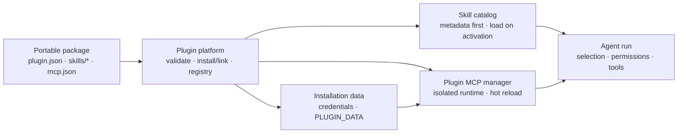

# Portable Agent Plugins in EvoFlux

EvoFlux implements the local portable core of [Agent Plugins 1.0](https://agent-plugins.org/specification). Managed Agent Plugins are separate from trusted legacy Python hooks in `app/agent/plugins`.

<p align="center">
  
</p>

## Architecture overview



| Boundary | Owner | Contract |
|---|---|---|
| Portable package | Plugin author | Root `plugin.json`, immediate-child Skills, and optional `mcp.json` |
| Control plane | EvoFlux | Validation, install/link/update, registry, enable state, editor, credentials, and status |
| Skill runtime | EvoFlux Skill catalog | Metadata is indexed eagerly; instructions and resources load only after activation |
| MCP runtime | Plugin MCP manager | Servers are reconciled per installation and never merged into global `mcp.json` |
| Private state | EvoFlux host | Credentials and `PLUGIN_DATA` live outside the package and survive in-place updates |
| Tool access | Agent runtime | Same-installation activation and explicit selection still pass through normal permissions |

Plugin Center is host-owned UI. A package cannot inject custom frontend code,
settings pages, or credential screens; it contributes only portable Skills and
MCP server declarations. The optional EvoFlux extensions below declare data
that the host renders and enforces.

## Package contract

```text
example-plugin/
├── plugin.json
├── skills/
│   └── release-audit/
│       ├── SKILL.md
│       ├── scripts/
│       └── references/
└── mcp.json
```

`plugin.json` must target `https://agent-plugins.org/schemas/1.0.0/plugin.schema.json`. Skills are discovered only from immediate child directories of `skills/`. `mcp.json` is optional and may contain stdio, Streamable HTTP, or legacy SSE entries; EvoFlux executes stdio and Streamable HTTP and reports/skips SSE.

An `.evoplugin` file is a deterministic ZIP wrapper around this directory. It adds no alternate manifest or runtime semantics.

## User workflows

Open **Plugins** beneath Scheduler in either Work or Coding mode. Plugin Center supports:

- import a local `.evoplugin` or ZIP;
- link an unpacked development directory without copying it;
- validate a directory without installing it;
- scaffold a plugin with optional starter Skill and MCP server files;
- open a plugin in the built-in workspace editor to browse, create, edit, save,
  and delete package files;
- configure installation-scoped credentials declared by the plugin;
- enable, disable, pack, update a managed installation in place, and uninstall
  an installation.

Equivalent CLI commands:

```bash
evoflux plugin create ./my-plugin --name my-plugin --skill release-audit
evoflux plugin inspect ./my-plugin
evoflux plugin link ./my-plugin
evoflux plugin pack ./my-plugin
evoflux plugin install ./my-plugin-unversioned.evoplugin
evoflux plugin update <installation-id> ./my-plugin-v2.evoplugin
evoflux plugin list
evoflux plugin show <installation-id>
evoflux plugin disable <installation-id>
evoflux plugin enable <installation-id>
evoflux plugin uninstall <installation-id>
```

The lifecycle API is mounted at `/api/plugins`; its OpenAPI schema is the source of truth for request and response fields.

## Runtime and precedence

Plugin Skills join the normal metadata-only catalog and load progressively through the existing Skill tool. Precedence is:

1. project, user, and administrator roots;
2. enabled Agent Plugin installations;
3. EvoFlux built-ins.

Plugin MCP configuration is adapted in memory into a separate manager. It is
never copied to or merged into the user's global `{CONFIG_DIR}/mcp.json`.
Runtime servers appear in **Settings → MCP servers** with a `plugin` badge and
can be selected in an agent's `mcp` configuration. Loading a Skill contributed
by a plugin also grants and activates the ready MCP tools from that same
installation for the current run. Installation alone does not grant every
agent every tool, and calls remain subject to the normal permission pipeline.

For stdio servers, EvoFlux creates a persistent installation-scoped data directory and injects absolute `PLUGIN_ROOT` and `PLUGIN_DATA`. Only those exact placeholders are expanded, once, in `args`, `env` values, and `cwd`. Remote configured headers remain literal, and redirects are disabled to avoid forwarding them to a different origin.

## Credential extension

Agent Plugins 1.0 does not define a credential format. EvoFlux adds the optional
`evoflux.credentials` extension so a portable plugin can declare a generic setup
form without shipping product-specific UI:

```json
{
  "extensions": {
    "evoflux.credentials": {
      "fields": [
        {
          "key": "endpoint",
          "label": "Service URL",
          "type": "url",
          "env": "SERVICE_URL",
          "required": true
        },
        {
          "key": "token",
          "label": "API token",
          "type": "secret",
          "env": "SERVICE_API_TOKEN",
          "required": true
        }
      ]
    }
  }
}
```

Supported field types are `text`, `secret`, `url`, and `boolean`. Open
**Plugins → Credentials** on an installed plugin to configure them. Values are
stored outside the portable package in
`data/<installation-id>/credentials.json` with mode `0600`. Secret values are
masked in API responses and injected only into that plugin's stdio MCP process
using the declared environment-variable names. Saving or clearing the form
refreshes the MCP runtime automatically.

## MCP capability extension

Plugin MCP servers may declare EvoFlux runtime capabilities without adding
non-standard fields to the portable `mcp.json` schema:

```json
{
  "extensions": {
    "evoflux.mcp": {
      "servers": {
        "service": {
          "capabilities": ["webbridge-safe"]
        }
      }
    }
  }
}
```

`webbridge-safe` explicitly allows a non-browser MCP server to remain available
inside a WebBridge-tagged conversation. Servers without that capability remain
hidden there so an undeclared MCP browser cannot bypass the selected browser
surface.

## Storage

```text
{DATA_DIR}/agent-plugins/
├── registry.json
├── installed/<installation-id>/<version-or-digest>/
└── data/<installation-id>/

{CACHE_DIR}/agent-plugins/staging/
```

Registry writes are atomic. Managed archive extraction rejects traversal, duplicate/case-fold-colliding paths, symlinks, oversized packages, and suspicious compression ratios. Developer links may contain only links that resolve inside the plugin root. Uninstall preserves `PLUGIN_DATA` by default; CLI/API callers can explicitly remove it.

## Failure isolation

- Fatal manifest failures reject the package and prevent component discovery.
- Unknown manifest root fields and a non-object `extensions` value are reported, ignored, and do not reject an otherwise valid package.
- An invalid Skill skips only that Skill.
- Invalid top-level `mcp.json` disables only that plugin's MCP components.
- An invalid or failed MCP server skips only that server.
- Disabling a plugin removes its Skills and reconciles/stops its MCP runners without restarting EvoFlux.

## Product boundary

Agent Plugins 1.0 does not standardize registries, Git install, updates,
signatures, permissions, connections, or storage APIs. EvoFlux's credential and
MCP-capability extensions are deliberately host-mediated. Plugin Center owns
all management, editor, credential, and runtime-status UI; installed packages
contribute portable Skills and MCP servers only.
