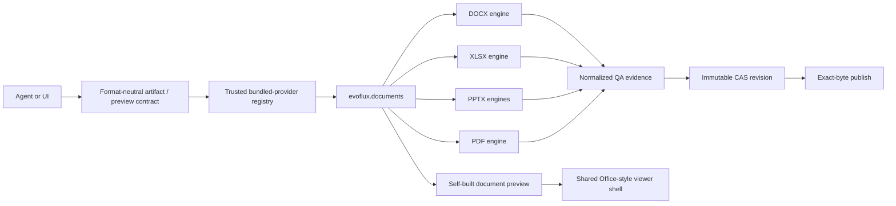

# Plugin-backed Artifact Fabric

Status: active and sole document-authoring architecture.

DOCX, XLSX, PPTX, and PDF are provided by the read-only bundled Agent Plugin
`evoflux.documents`. EvoFlux core owns only the format-neutral control plane:
durable jobs, immutable candidate revisions, normalized QA, content-addressed
storage, and exact-byte publication.

The publication invariant remains:

> `publish` materializes the exact content-addressed bytes that passed QA during
> `preview`; it never runs a format engine again.

## Ownership boundary

| Layer | Owner | Responsibility |
| --- | --- | --- |
| Portable package | `app/agent/builtin_plugins/documents/` | `plugin.json`, DOCX/XLSX/PPTX/PDF Skills, format engines, QA renderers, preview provider, PPTX render bridge |
| Trusted provider adapter | `app/plugin_platform/native.py` | Load private Python entrypoints only from release-bundled plugin roots |
| Artifact control plane | `app/artifacts/` | Jobs, revisions, QA normalization, CAS, exact-byte publish |
| Agent surface | Generic deferred `artifact` tool | Discover active formats and delegate inspect/validate/build/publish |
| Preview control plane | `app/plugin_platform/previews.py` | Select a trusted preview provider by extension |
| Viewer host | `workspace-document-preview.tsx` | One read-only Office-style shell for Work and Coding workspaces |

Installed or linked third-party Agent Plugins cannot use the native-provider
extension. They remain limited to the portable Skills and MCP contract. The
native extension is interpreted only after the package root has been resolved
under `app/agent/builtin_plugins/`, so an imported package cannot request
in-process Python or FastAPI execution.



## Bundled plugin contract

The package is visible in Plugin Center with a stable deterministic ID and
`source_type: builtin`. It uses the normal `plugin.json` and immediate-child
Skill layout:

```text
app/agent/builtin_plugins/documents/
  plugin.json
  skills/
    docx/
    xlsx/
    pptx/
    pdf/
  artifacts/       # ArtifactDriver adapters
  engines/         # format-specific authoring and inspection
  rendering/       # QA/page renderers
  preview.py       # read-only workspace preview provider
  routes.py        # trusted PPTX WebView render bridge
  runtime.py       # lazy native entrypoints
```

Bundled plugins update with EvoFlux. They are always enabled and cannot be
edited, packed, updated, linked, reinstalled, or uninstalled through Plugin
Center, CLI, workspace mutation APIs, or the installer. Their Skills use the
same precedence chain as plugin Skills and retain a stable `plugin:<id>` source.

The plugin declares its Python package set under the private extension and the
matching `documents` optional extra in `pyproject.toml`. Source checkouts keep
that set in the development group; packaged desktop sidecars install the extra
by default. Core startup and Plugin Center do not import those libraries. The
provider imports format engines lazily only when Artifact Fabric is used.
Slim installations can still initialize the registry and query its catalog;
formats report `available: false` plus `required_extra: documents` until the
plugin dependency set is present.

## Artifact lifecycle

The public actions are `catalog`, `inspect`, `validate`, `preview`, `publish`,
`status`, and `cancel`. The catalog is dynamic; core no longer defines a closed
`Literal` of document formats or imports format drivers.


`artifact_jobs`, `artifact_revisions`, and `artifact_reviews` remain in the
host database because they are format-neutral durable control-plane state.
Published migrations are retained. Candidate blobs and evidence remain under:

```text
artifact-fabric/
  blobs/sha256/<prefix>/<full-sha256>
  revisions/<revision-id>/previews/preview-001.png
  work/<job-id>/...
```

## Format engines

### DOCX

The new-document and template lanes create native paragraphs, styles, tables,
images, headers, footers, and fields while preserving unrelated OOXML package
parts for template edits. QA checks package structure and renders semantic page
evidence.

### XLSX

The workbook engine applies typed range, formula, style, validation, table,
chart, merge, freeze, clear, and autofit operations. Formula tokens are scanned
before acceptance and every sheet produces review evidence.

### PPTX

New decks use inert local HTML/CSS rendered by the already-running desktop
WebView. The plugin's broker receives preview and shell PNGs plus bounds for
explicitly editable text/image overlays. The template lane clones slide XML and
relationships directly so masters, layouts, themes, timing, and untouched
objects survive.

Scripts, handlers, frames, network URLs, media, unsafe paths, broken assets,
wrong-size captures, and overflow are rejected. The bridge API is contributed
by the bundled plugin through its trusted router provider instead of living in
the generic Artifact API module.

### PDF

The new lane creates native flow documents; the form lane fills a hash-pinned
inspected AcroForm. Both are structurally parsed and rendered page by page by
the plugin before acceptance.

## Unified document preview

Work and Coding workspaces, plus generated-document attachments in chat, use
the same host component and bundled preview provider for all four formats. The
former EmbedPDF and commercial SpreadJS viewers are removed. EvoFlux owns the
toolbar, navigation rail, search, previous/next controls, fit modes, zoom,
status bar, keyboard behavior, and workbook cell/formula readout.

The provider produces inert, self-contained HTML with a strict CSP and
`data-preview-item` boundaries:

- DOCX: paged-paper document surface;
- PPTX: slide surfaces with slide navigation;
- XLSX: styled grids, formulas, charts, images, and sheet boundaries;
- PDF: plugin-rasterized page surfaces.

The iframe has no script capability. The trusted host may inspect its inert DOM
to implement navigation, search, zoom, and read-only selection. Preview cache
keys include the engine schema, format suffix, exact filename, and source-byte
SHA-256. Identical content with the same filename can reuse output across
workspaces, while a renamed copy receives HTML with the correct title and
same-size in-place edits cannot return stale content. Both session and
coding-workspace routes enforce root containment and symlink escape protection
before invoking a provider.

OOXML packages pass a bounded central-directory preflight before a parser sees
them. Entry count, expanded bytes, per-part bytes, compression ratio, names,
duplicates, encryption, symlinks, macros, ActiveX, OLE, and executable embeds
are rejected at the provider boundary. PDF preview bounds pages, pixels,
raster bytes, and final HTML size. Cache writes are atomic, cache use is LRU
bounded to 96 entries/512 MiB, and separate cache-key locks prevent one large
document from blocking unrelated previews.

This UI follows the Office 365 read-only interaction model; it does not claim
full Word pagination, PowerPoint animation/SmartArt, Excel calculation/pivot,
or Office editing compatibility.

## Extending formats

A new release-bundled format adds an `ArtifactDriver` and optional
`DocumentPreviewProvider` through a trusted plugin entrypoint. It inherits jobs,
CAS integrity, status/cancel, API reads, review evidence, and exact-byte publish
without modifying the core registry. Portable third-party plugins must use MCP
until a separately versioned, sandboxed artifact-provider protocol is defined.
