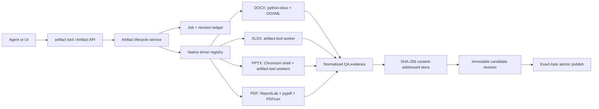
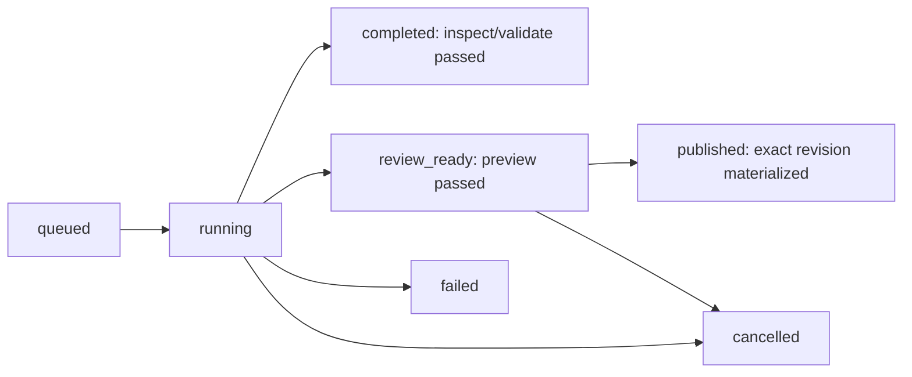

# Artifact Fabric

Status: active and sole document-authoring architecture.

Artifact Fabric gives DOCX, XLSX, PPTX, and PDF one durable lifecycle while
keeping a native schema and engine for each format. The shared control plane
owns jobs, immutable candidate revisions, QA evidence, review, and exact-byte
publication. A client or Desktop connection is not part of the rendering path.

The publication invariant is:

> `publish` materializes the exact content-addressed bytes that passed QA during
> `preview`; it never runs the authoring driver again.

## Impact

| Area | Result | Control |
| --- | --- | --- |
| Agent tools | One deferred `artifact` surface for every built-in format | One lifecycle and one permission boundary |
| Database | Durable jobs, immutable revisions, and review evidence | Additive Alembic revision `00000047` |
| Storage | Candidate bytes live in a SHA-256 content-addressed store | Atomic copy plus pre/post-copy hash checks |
| DOCX | Word-native creation and package-preserving template edits | Package integrity, part hashes, and every-page renders |
| XLSX | Native editable workbook import/create/export | Formula scans, clipping checks, and every-sheet renders |
| PPTX | Fidelity-first, hybrid editable, native, and inherited-template lanes | Chromium reference render, pixel diff, layout evidence, every-slide renders |
| PDF | Native creation and hash-pinned AcroForm filling | Structural parsing and every-page PDFium renders |
| API | Read-only catalog, job, revision, and preview access | No arbitrary server filesystem destination over HTTP |
| Desktop runtime | Pinned Node, artifact-tool, Chromium, LibreOffice, Poppler, and open fonts | Versioned manifest, SHA-256 verification, fail-closed packaging |

## Architecture



Format workers exchange versioned request/response data and return normalized
issues. They do not select published paths or mutate lifecycle records.

## Hermetic document runtime

Desktop releases embed `sidecar/document-runtime` next to Python. Its manifest
pins the target OS/architecture, component versions, component hashes, complete
payload hash, executable/entrypoint paths, and license evidence. Runtime lookup
uses this order: an explicit EvoFlux override, the verified bundled component,
then host `PATH` and the Codex development cache. A packaged desktop therefore
does not depend on software installed on the user's machine.

The bundle contains Node.js, a distribution-authorized artifact-tool package,
headless Chromium, headless LibreOffice, Poppler (`pdftoppm` and `pdfinfo`), and
an OFL-licensed font pack with a relocatable fontconfig file. EvoFlux passes
`FONTCONFIG_FILE`, `SAL_FONTPATH`, and component paths into workers and render
subprocesses. These are application resources, so end users do not need admin
rights or machine-wide installs.

`scripts/build_document_runtime.py` assembles and verifies runtime inputs.
`scripts/build_sidecar.py` stages it into the Tauri resource bundle and refuses
desktop packaging when it is absent. Release CI downloads a platform-specific
archive from a controlled distribution location, verifies its externally stored
SHA-256, verifies the internal manifest, then performs an API diagnostics smoke
test. `artifact-tool` redistribution must be authorized explicitly during
assembly; a developer's Codex cache is never promoted into a product release.

## Lifecycle

The public actions are:

- `catalog`: return lifecycle metadata and native schemas.
- `inspect`: inventory and render an uploaded source or template.
- `validate`: validate a native project and its source lineage.
- `preview`: build once, run QA, and store an immutable candidate revision.
- `publish`: approve and atomically materialize an existing revision.
- `status`: return durable state, QA, provenance, and publication evidence.
- `cancel`: cancel a non-terminal job.

Template workflows pass a completed `inspect_job_id` into later validation or
preview calls. The service reconstructs its durable manifest internally.



A QA failure never creates an accepted revision. A driver that reports success
without candidate bytes fails its contract.

## Persistence and storage

`artifact_jobs` stores request metadata, lifecycle state, result/error data,
and the latest revision pointer. `artifact_revisions` stores immutable content
hash, size, storage key, normalized QA, previews, manifest, provenance, driver
version, and protocol version. `artifact_reviews` records approval evidence and
the published destination/hash.

Large bytes are not stored in SQL:

```text
artifact-fabric/
  blobs/sha256/<prefix>/<full-sha256>
  revisions/<revision-id>/previews/preview-001.png
  work/<job-id>/...
```

CAS writes and publish operations use destination-local temporary files,
verify hash and size, and rename atomically.

## Native drivers

### DOCX

New-document and template-safe OOXML lanes use real Word paragraphs, styles,
tables, images, headers, footers, fields, and direct package edits. Template
lineage and unrelated package parts are preserved.

### XLSX

`@oai/artifact-tool` is the authoring and export engine. Formula-error scans,
numeric/text clipping checks, and render-all-sheet evidence gate acceptance.

### PPTX

The schema-version 2 `new` lane defaults to `fidelity`: bundled headless
Chromium renders a complete static HTML composition at the declared slide size
and artifact-tool embeds it as a full-slide image. `hybrid` layers editable
native objects over a decorative HTML shell and requires a separate complete
HTML reference. The candidate preview is pixel-diffed against that reference;
drift fails QA. `native` remains available for fully editable text, shapes,
images, tables, charts, and speaker notes. Before every worker invocation the
validated Pydantic model is serialized with all defaults, preventing missing
numeric/style fields from becoming JavaScript `undefined` values.

The `template` lane imports, duplicates, and edits inspected source slides
while retaining master, layout, theme, and stable-anchor lineage. No lane
depends on Desktop WebView or a connected client renderer.

### PDF

The `new` lane generates native PDF flow blocks. The `form` lane fills a
hash-pinned, inspected AcroForm source. Both are parsed with pypdf/pdfplumber
and rendered page by page with PDFium. Empty, encrypted, malformed,
unrenderable, or placeholder-containing outputs fail closed.

## Security boundary

The `/api/artifacts` HTTP surface exposes catalog, job listing/status,
immutable revision download, and immutable preview download. It does not
accept server-side publication destinations. The agent tool validates that a
publish output remains inside the primary workspace and has the driver's
required extension.

## Extending formats

A new document family implements `ArtifactDriver`, registers its media type,
extension, schema catalog, inspect/validate/build behavior, and returns
normalized QA evidence. It automatically inherits durable jobs, immutable
revisions, CAS integrity, status/cancel, API reads, and exact-byte publish.
Format-specific content is never forced into a generic intermediate model.
