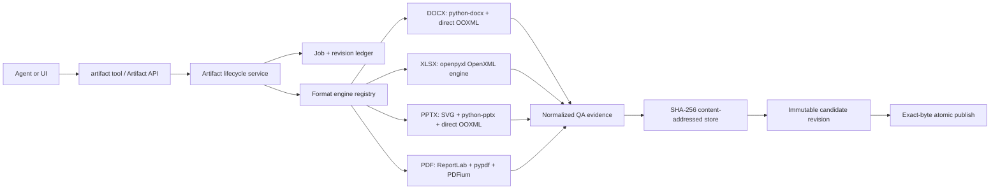
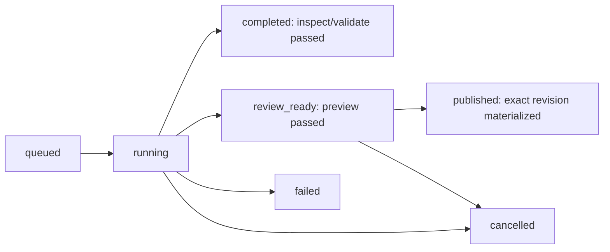

# Artifact Fabric

Status: active and sole document-authoring architecture.

Artifact Fabric gives DOCX, XLSX, PPTX, and PDF one durable lifecycle while
keeping a native schema and engine for each format. The control plane owns
jobs, immutable candidate revisions, QA evidence, review, and exact-byte
publication. Rendering is in-process and does not depend on applications
installed on the host.

The publication invariant is:

> `publish` materializes the exact content-addressed bytes that passed QA during
> `preview`; it never runs the authoring engine again.

## Impact

| Area | Result | Control |
| --- | --- | --- |
| Agent tools | One deferred `artifact` surface for every built-in format | One lifecycle and permission boundary |
| Storage | Candidate bytes live in a SHA-256 content-addressed store | Atomic copy plus pre/post-copy hash checks |
| DOCX | Word-native creation and package-preserving template edits | Package integrity, part hashes, semantic page previews |
| XLSX | Typed OpenXML import/create/export | Formula scan and every-sheet previews |
| PPTX | SVG fidelity, hybrid editable, native, and inherited-template lanes | SVG parity, layout evidence, every-slide previews |
| PDF | Native creation and hash-pinned AcroForm filling | Structural parsing and every-page PDFium previews |
| Desktop | Python sidecar plus wheel dependencies | No separate document-runtime archive or host executables |

## Architecture



Format engines exchange typed Python models and return normalized issues. They
do not select published paths or mutate lifecycle records.

## Portable rendering core

Document preview is part of the Python sidecar:

- DOCX is rendered from paragraphs, tables, styles, and pagination signals in
  its OOXML model.
- XLSX is rendered from workbook cells, dimensions, fills, fonts, and charts.
- PPTX is rendered from slide geometry, text, images, tables, and charts.
- PDF pages are rasterized by `pypdfium2`.
- Static PPTX visual shells are rasterized by `resvg-py`, whose renderer is
  implemented in Rust and distributed as ordinary platform wheels.

No document path launches an office suite, browser, JavaScript worker, or host
PDF command. Release CI builds the same Python sidecar on every target and does
not download a separate document runtime or require URL/SHA secrets.

## Lifecycle

The public actions are `catalog`, `inspect`, `validate`, `preview`, `publish`,
`status`, and `cancel`. Template workflows pass a completed `inspect_job_id`
into validation or preview so the service can reuse its durable manifest.



A QA failure never creates an accepted revision. An engine that reports
success without candidate bytes fails its contract.

## Persistence and storage

`artifact_jobs` stores lifecycle state and request/result metadata.
`artifact_revisions` stores immutable content hash, size, storage key,
normalized QA, previews, manifest, provenance, engine version, and protocol
version. `artifact_reviews` records approval and publication evidence.

```text
artifact-fabric/
  blobs/sha256/<prefix>/<full-sha256>
  revisions/<revision-id>/previews/preview-001.png
  work/<job-id>/...
```

CAS writes and publish operations use destination-local temporary files,
verify hash and size, and rename atomically.

## Native format engines

### DOCX

New-document and template-safe lanes use real Word paragraphs, styles, tables,
images, headers, footers, fields, and direct package edits. Template lineage
and unrelated package parts are preserved.

### XLSX

The OpenXML engine creates or imports an editable workbook and applies typed
range, formula, style, validation, table, chart, merge, freeze, clear, and
autofit operations. Formula tokens are scanned before publication and Excel is
asked to recalculate formulas when the workbook opens.

### PPTX

Schema version 3 supports three new-deck profiles. `fidelity` rasterizes a
complete project-local SVG into one full-slide visual. `hybrid` layers editable
native objects over an SVG shell and pixel-compares the result against a full
reference SVG. `native` creates editable text, shapes, images, tables, charts,
and notes.

The template lane clones slide XML and relationships directly, retaining
masters, layouts, themes, transitions, timing, and untouched objects. It edits
only stable shape IDs emitted during inspection.

### PDF

The `new` lane generates native PDF flow blocks. The `form` lane fills a
hash-pinned inspected AcroForm. Both are parsed structurally and rendered page
by page with PDFium.

## Security boundary

The `/api/artifacts` HTTP surface exposes catalog, job status, immutable
revision download, and immutable preview download. It does not accept arbitrary
server-side publication destinations. The agent tool requires publication to
remain inside the primary workspace with the correct extension.

## Extending formats

A new document family implements the engine contract, registers its media type,
extension, catalog, inspect/validate/build behavior, and returns normalized QA
evidence. It automatically inherits durable jobs, immutable revisions, CAS
integrity, status/cancel, API reads, and exact-byte publication.
