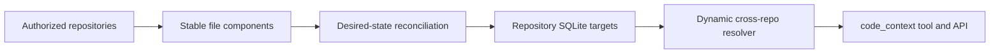

# Coding Agent Code-Context Architecture

## Contract

EvoFlux owns its indexing runtime. Stable source keys, desired-state
reconciliation, AST-aware chunking, managed targets, local vector queries, and
structural by-example matching are implemented directly in this repository.
No external indexing framework or CLI is imported at runtime.

The design has three boundaries:

1. Repository source is reconciled into one repository-local SQLite target.
2. Cross-repository relationships are resolved dynamically over the authorized
   repository set; they are never persisted in the application database.
3. Agents and API clients use one `code_context` query contract.

## Repository target

Every canonical repository root maps to a stable cache directory and a
`code-context.sqlite3` database. The application database remains responsible
for projects and sessions only. It contains no source chunks, symbols,
relations, FTS tables, ambiguous references, resolver state, or index jobs.

A source file is a keyed component. Its fingerprint includes the source bytes,
parser implementation, processing pipeline, and project settings. Refresh computes a deterministic
add/update/delete/unchanged plan, parses only changed components, and replaces
all rows owned by a component in one transaction. Deleted components cascade to
their chunks, symbols, and relations. A parse failure records an error without
destroying the last successful component.

Full and incremental rebuilds execute in one spawned worker process rather
than the API process's thread pool. Repository targets use WAL, so API queries
continue reading the last committed snapshot while parser/hash/reconciliation
work consumes CPU in isolation. Lightweight committed-index queries remain in
a bounded thread executor. See
[`sqlite-concurrency.md`](sqlite-concurrency.md) for the application/read/write
boundary and latency acceptance contract.

The target contains:

| Table | Purpose |
|---|---|
| `source_files` | Component key, fingerprint, parser identity, graph capability, and committed source snapshot |
| `source_chunks` | AST-aware, overlapping source units with local float32 vectors |
| `code_symbols` | Definitions with stable IDs and qualified names |
| `code_relations` | Calls, imports, inheritance, references, reads, writes, and related evidence |
| `source_chunks_fts` | FTS5 projection combined with local vector ranking |
| `index_errors` | Current component failures without invalidating last-good data |

## Query model

`code_context` exposes a closed action set:

| Action | Input | Result |
|---|---|---|
| `search` | Natural language, identifier, or source phrase | Hybrid local-vector and FTS source chunks |
| `grep` | By-example code pattern with metavariables | AST-grounded structural matches |
| `definition` | Exact symbol | Definition evidence |
| `callers` | Exact symbol | Incoming call relationships |
| `callees` | Exact symbol | Outgoing call relationships |
| `references` | Exact symbol | Incoming structural relationships |
| `impact` | Exact symbol and bounded depth | Transitive inbound relationships |
| `neighborhood` | Exact symbol and bounded depth | Bounded bidirectional relationships |

Structural patterns use `\NAME` for one syntax node and `\(ARGS*\)` for a
sequence. Candidates come from the committed source snapshot, then tree-sitter
validates their node shape and rejects comments and literal contents. Search,
grep, definitions, and callsite windows therefore never mix an indexed version
with newer working-tree bytes. Matching runs natively in the application and
does not invoke an indexing subprocess.

The upstream implementation can call a dense embedding model and use
`sqlite-vec`. EvoFlux preserves that vector-at-index/vector-at-query design with
a deterministic code-aware feature-hashing vectorizer written in the standard
library, then blends cosine similarity with FTS5 ranking. This avoids a hidden
model download, network requirement, native extension, or new dependency while
retaining fuzzy identifier/subtoken ranking. Parser-supported files also produce
symbols and relations; the remaining supported formats are indexed as
search-only text.

The first query in a turn normally sets `refresh=true`. An immediate follow-up
over the returned repository version may set `refresh=false`. There is no
filesystem-watcher freshness protocol or detached index job.

## Cross-repository resolution

The active repository plus its project siblings form the authorized scope.
Each target stores only relationships extracted from its own source. At query
time the resolver loads those targets and applies deterministic evidence in
this order:

1. exact same-file and lexical ownership;
2. explicit import aliases and imported qualified names;
3. module-path ownership;
4. one unique definition across the authorized repositories.

If evidence is ambiguous, traversal stops and returns candidates. It never
combines several same-named roots or persists a guessed edge. Cross-repository
graph data for the UI is a snapshot synthesized by the same resolver.

Exact definitions are queried directly. Traversal lazily loads only relations
that can touch the current breadth-first node plus its import bindings; it does
not materialize every relation in every repository. The optional `repository`
selector disambiguates only the root symbol and never removes authorized sibling
repositories from cross-repository resolution.

Project settings are read from `.code-index/settings.yml`. Include/exclude
patterns, maximum file size, and extension-to-language overrides form the
code-index project contract. Custom Python chunker modules are deliberately not
executed from repository configuration; they are reported as a query limitation
because indexing untrusted source must remain read-only.

## Agent workflow

Use `search` when the identifier is unknown, `grep` when the code shape is
known, and graph actions after an exact symbol is known. Reuse the source ranges
returned by the tool. Use normal file reads only for surrounding source that is
not present in those ranges.

Static analysis cannot prove reflective calls, runtime dependency injection,
framework registries, monkey-patching, generated code, or data-dependent
dispatch. For those cases, state the limitation and use tests, logs, LSP, or a
debugger as runtime evidence.

## Attribution and regression requirements

Third-party license and source attributions are maintained in the repository's
`NOTICE` file. The code-index runtime itself is implemented, packaged, and
tested locally and declares no external indexing-framework dependency.

Any change must verify component reconciliation, deletion cleanup, last-good
failure behavior, FTS search, structural grep, exact-symbol ambiguity,
cross-repository traversal, migration removal of legacy application tables,
the tool schema, API responses, telemetry, and Coding skill metadata.
