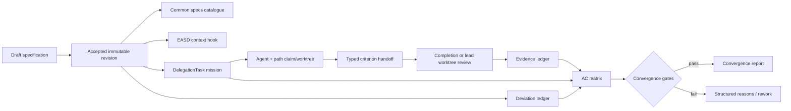

# Evo Agent Specs architecture

**Evo Agent Specs** is the product surface for EASD, a durable domain layer over
EvoFlux's existing Coding harness. It does not replace teams, Workflows, Goal,
Plan mode, ChangeSets, Git worktrees, or CompletionContract verification.

## Repository setup boundary

Before run creation, `/api/easd/setup` resolves the authorized repository set
from the current workspace or Coding Project, closes the database read scope,
and only then inspects or writes repository files in a worker thread. This keeps
filesystem I/O outside database transactions.

Setup writes bounded, repository-contained configuration, specification, and
portable project-skill artifacts:

```text
.evoflux/easd/config.json
.evoflux/easd/RULES.md
.evoflux/easd/.local/                 # ignored, rebuildable
<data_directory>/README.md            # taxonomy + authority
<data_directory>/index.yaml
<data_directory>/specs/               # published accepted Specs
<data_directory>/features/
<data_directory>/architecture/decisions/
<data_directory>/reference/
<data_directory>/{guides,development,records,images}/
<data_directory>/templates/           # YAML + Markdown shapes
<data_directory>/runs/<slug>--<uuid>/
.evoflux/skills/easd-{specify,plan,implement,review,verify}/SKILL.md
.evoflux/skills/easd-*/.evoflux.json
```

Setup records the safe repository-relative data directory, core rules, current
templates, and exact skill names in one unversioned current-layout contract.
Each sidecar scopes its Skill to Coding mode. The existing skill harness
discovers `.evoflux/skills` at project precedence, so the bundle is absent from
global/built-in catalogs and becomes eligible only when that authorized
repository is in the active workspace/project.

The service rejects symlink/path escapes, invalid Skill frontmatter or scope,
oversized files and malformed manifests. A legacy or incomplete setup reports
`upgrade_required`; upgrade writes missing skeleton artifacts and preserves
existing valid edited Skills and project documentation at their original paths.
Setup never migrates or mirrors an existing docs tree. Invalid setup requires an
explicit overwrite repair. Project readiness is computed across all live
project repositories; run creation fails closed until every member is ready.
Skills are procedural context only: service/tool/hook validation remains the
authority for state, repository access, approval, evidence, and convergence.
Chat handoff prompts select one exact phase Skill through the existing
`$skill-name` activation contract: `easd-specify` for authoring, `easd-plan` for
the first accepted-run kickoff, `easd-implement` for active resume,
`easd-review` for an independent review mission, and `easd-verify` for verifying
resume. Full Skill bodies therefore remain progressively disclosed and are
re-read from the repository, including valid user edits.

The Skill bodies do not introduce another state store. Each begins by reading
the repository manifest, core rules, current run documents, accepted hash, and
relevant mission/snapshot.
Their outputs align with existing typed boundaries: Plan names mission ownership
and evidence, Implement/Review populate `team_handoff.criteria_results`, and
Verify reports current matrix/command/review/deviation gaps for the convergence
service. A stale hash or changed review snapshot fails back to the owning phase.

## Specification generation boundary

`POST /api/easd/generate` is a read-only authoring boundary, not a run lifecycle
operation. The route validates the Coding session and workspace/project
membership in a short database scope, then closes it before filesystem reads or
the provider call. It resolves every live project repository through the same
authorization path as setup/run creation.

The context collector does not follow symlinks and excludes `.git`, private
`.evoflux` state/worktrees, dependencies, build outputs and caches. It permits
only versioned `.evoflux/easd` and `.evoflux/trace` specification material. It
emits bounded repository maps plus selected `AGENTS.md`, documentation,
configuration, source and test excerpts with path, SHA-256 and truncation
provenance. Multi-repo minimum coverage is applied before global intent
relevance. Repository text is wrapped as untrusted model context and passes
through the existing outbound data/PII policy. The session's configured
provider/model and sandbox context are reused.

The structured provider result is validated and returned with an observable
intended-outcome draft, Scope/Proof, context/base fingerprints, confidence and
provenance. Title and problem are the minimum authoring Intent; a blank outcome
is a generation request, not a validation failure. Low-confidence behavior
choices fail into `needs_clarification`. No proposal is written to the
repository or product database; the frontend owns review state and requires
explicit per-section Apply. Outcome is applied with Scope, and a changed client
snapshot requires a second replacement confirmation.



## Persistence

The owning repository is the EASD source of truth:

| Repository document | Responsibility |
|---|---|
| `index.yaml` and section READMEs | knowledge taxonomy, navigation and authority boundaries |
| `specs/<slug>--<run-id>/index.yaml` | current accepted revision/hash for one published Run Spec |
| `specs/<slug>--<run-id>/revisions/NNNN.yaml` | immutable published accepted Spec content; hash-identical to the Run snapshot |
| `features/`, `architecture/`, `reference/` | adopted living current-state knowledge reconciled by applicable Runs |
| `records/` | non-normative analysis/research/plans/release evidence |
| `run.yaml` | lifecycle projection, driven flow, active revisions, common Spec index reference, and CAS generation/hash |
| `intent.yaml` | original human problem/outcome input |
| `specifications/NNNN.yaml` | immutable-content Spec revisions and authoring provenance |
| `plans/NNNN.yaml` | planned-flow revisions; absent for direct flow |
| `missions/*.yaml` | durable assignment/status snapshots |
| `reviews/`, `verifications/`, `evidence/` | revision-bound proof with provenance |
| `deviations/` | explicit scope/spec drift and resolution |
| `events/` | append-only lifecycle audit |
| `convergence.yaml` | final deterministic gate report |

Writes use repository-contained temporary files, atomic rename, local process
locks, and expected document hashes. Spec acceptance publishes the common
revision and CAS-updates its index after the database commit; an idempotent
accept retry repairs missing publication. A stale collaborator snapshot fails
with a reload/review conflict. Append-only artifact IDs make Git merges
inspectable.
Exactly one repository owns a multi-repo run; repository-qualified Scope may
still reference every authorized project member.

Application SQLite may materialize a rebuildable runtime projection for local
session binding and generic delegation execution. It is never normative: list
refresh reads repository YAML first, and another collaborator can continue from
Git without the original database or chat. `.evoflux/easd/.local/` contains
only ignored locks/index/session pointers.

## Specification normalization

`TraceSpecification` is provider-neutral Pydantic data with:

- title, problem, intended outcome;
- goals/non-goals and bounded source references;
- affected repository/file/module targets and typed constraints;
- planned verification commands;
- risk tier;
- a user-reviewable `direct` or `planned` delivery flow with rationale,
  confidence, and forcing conditions;
- unique stable AC IDs;
- per-AC allowed evidence kinds, machine requirement, and minimum passes.

Canonical sorted compact JSON produces the content hash. Accept verifies the
expected hash and freezes the payload. Later changes create another draft and
supersede the old accepted status only after explicit acceptance; prior payload
and hash remain unchanged.

`TracePlan` is a second provider-neutral immutable contract bound to the exact
accepted spec hash. It stores an acyclic graph of stable mission IDs with kind,
AC ownership, repository/path scope, dependencies, expected output, constraints,
safe verification commands, isolation, integration owner, and review policy.
Service validation rejects unknown/uncovered ACs, cycles, out-of-scope targets,
and high-risk plans without review. Only user plan acceptance selects
`active_plan_revision_id`.

## Session binding and prompt context

One non-terminal run may own a Coding session from authoring through Verify. The
database partial unique index covers draft/accepted/plan-review waiting states as
well as running phases, so another run cannot make the linked chat ambiguous.
Before acceptance,
`/runs/{id}/authoring/start` binds persisted Intent and the chat receives a
specification-only prompt. The lead-only `easd_submit_specification` team tool
validates the full provider-neutral contract and repository-qualified impact
targets, persists a draft revision, and moves the run to human review. An
agent retry with the same hash is idempotent; a different retry cannot overwrite
an existing review draft.

Spec acceptance moves only to `accepted`. For `planned`, `/planning/start` transitions to
`planning`; lead-only `easd_submit_plan` persists the validated graph and moves
to `plan_review`. Agent overwrite is idempotent only for the same hash. Explicit
user plan acceptance moves to `planned`; `/start` then establishes `active`.
For eligible `direct`, `/start` moves `accepted → active` without a Plan. The
pre-implementation hook blocks filesystem/shell/Python/worktree/
delegation actions through `planned`. Successful spec and plan submissions stop
their turns so the same agent loop cannot drift into the next phase.

During planning and later phases, `EasdContextHook` loads the accepted spec and,
once approved, the accepted plan once per turn. The bounded prompt includes
phase, spec/plan hashes, mission graph, problem/outcome, scope, constraints,
commands, AC policies, and typed delegation rules. During `reviewing`, mutation
tools remain blocked while safe inspection/verification and review delegation
stay available. `verifying` is also mutation-blocked; it can run safe commands
and verification delegations but cannot repair implementation inside the final
gate.

Plan validation requires implementation/integration ownership for every
required AC, a Review mission for every run, and a verification mission for
every accepted Proof command. The plan's `review_required` flag makes that
Review independent for cross-layer/critical work; it never removes Review.

An ordinary Coding turn with no active EASD run remains unchanged. If the local
contract store errors while loading, the hook injects a fail-closed warning and
CompletionVerification refuses to certify any resulting file changes until the
accepted contract can be loaded again.

Every UI phase action is server-backed. Planned runs use `accepted → planning →
plan_review → planned → active`; direct runs use `accepted → active`. Both then
use `reviewing → verifying → converged`. Start endpoints validate
chat scope/idleness before changing state; agent prose never advances the UI.
Navigation handoff survives route changes, and a running chat receives a
reviewable prompt rather than a duplicate queued phase start.

Run detail projects an additive `action_rail` from the same persisted Run,
Spec/Plan, mission, evidence, deviation, and verification-command state used by
the lifecycle services. Each action has a stable ID, `available|blocked` state,
and structured human-readable blockers. The client uses this projection to
disable Review, Verify, or Converge before mutation, but the mutation endpoint
still revalidates every gate to close the stale-render race. Spec approval, Plan
approval, and Converge remain explicit human confirmations in the UI.

User-controlled retry is limited to mutable review boundaries:
`draft → authoring` and `plan_review → planning`; retry while already authoring
or planning is idempotent. The prior draft remains durable until a successful
new tool submission creates the replacement revision. Successful Spec/Plan tool
results create a one-shot client request that opens the EASD workbench and exact
Run; the action trusts the typed tool success contract, not agent prose.

## Mission binding

`AgentTeam.create_delegation_tasks` validates EASD identity inside the same
short database scope used to create the durable tasks. It rejects:

- an unaccepted Spec, a required-but-unaccepted Plan, or wrong lifecycle phase;
- a stale spec or plan hash;
- an unknown plan mission or a mission kind used in the wrong phase;
- an empty/unknown criterion set;
- for planned flow, criteria/repositories/paths that differ from the Plan mission;
- for direct flow, any invented Plan identity or scope outside the Spec;
- a target repository outside the accepted impact repositories;
- a target path broader than or outside the accepted impact paths;
- scope/session mismatches already enforced at run creation.

`trace_run_id` is then stored on each local runtime task; its readable spec
retains `trace_spec_hash` and, only for planned flow, `trace_plan_hash` and
`plan_mission_id`. A version-controlled mission snapshot is written to the
owner repository. Existing exclusive path claims,
dependencies, worktree allocation, deadlines, attempts, rejection, review, and
merge behavior are unchanged.

## Handoff and evidence

Final EASD handoffs must contain one `CriterionResult` per assigned AC. When a
runtime-generated passing CompletionContract exists, its outer artifact hash
must match and its changed paths must stay inside the mission/accepted impact
paths for the evidence kind to be `machine`; otherwise the handoff can only
create lower-trust `manual` evidence.
Each evidence item is bound to:

- run and accepted spec hash;
- one criterion;
- mission/attempt and producer;
- result/summary;
- optional Git revision and artifact hash;
- structured verification payload;
- stable source key for idempotency.

The Coding verification hook runs accepted planned verification commands as
argv without a shell, alongside changed-file checks. The allowlist rejects
composition, redirection, network/destructive programs, unbounded package
scripts, and unsupported actions. It fingerprints the accepted command set into
the completion snapshot and records every planned command separately. Git
baseline comparison also catches final repository changes made through process
tools rather than edit/write/patch tools. Out-of-scope changes block handoff;
the evidence importer independently downgrades bypassed results and creates a
blocking deviation. Completion snapshots store repository-qualified scope
targets, and automatic changed-file checks execute in each affected authorized
repository rather than assuming every path belongs to the owning repository.

For non-isolated work, evidence creation occurs in the mission completion
transaction. An isolated handoff first enters `review`; evidence is admitted in
the transaction that marks the reviewed worktree merged/completed. Rejected or
discarded worktree snapshots therefore cannot satisfy convergence merely because
their local checks passed. Handoff deviations become blocking mission deviation
rows in the same evidence-admission transaction.

## AC matrix

The matrix is a deterministic projection, not stored mutable status. It joins
the accepted criterion with current-spec evidence and missions. Waiver wins,
then policy-satisfying passing evidence, then failure, in-progress, and
uncovered. Old-spec evidence stays visible in the ledger but never satisfies the
new active revision.

## Deviation and convergence

Deviation rows store their originating spec hash. Resolving a normative change
requires the current accepted hash to differ; a same-revision resolution is
allowed only when explicitly marked non-normative.

`active → reviewing` requires terminal implementation missions. Runtime-identified
`easd_submit_review` creates per-AC review evidence and computes independence;
the delegated task must match the approved review mission, while the public
evidence API strips reserved reviewer-identity fields.
`reviewing → verifying` requires terminal review missions, passing review, and
independent runtime evidence when the accepted plan requires it. In the
read-only Verify phase, CompletionVerification still runs accepted commands and
creates a machine contract bound to the current repository revision even when
the verifier changed no product file.

Convergence performs no model call and accepts only `verifying`. It evaluates
the AC matrix, mission states, blocking deviations, applicable Plan review policy,
and passing coverage for every planned verification command. Git revision
resolution occurs before the write transaction. Successful reports bind both
the Spec hash and optional Plan hash and remain idempotent.

## API and frontend

`/api/easd` owns repository setup, read-only Scope/Proof generation, run
list/create/detail, spec/plan revision create/accept, planning/implementation/
review/verification phase starts, Spec/Plan authoring retry, evidence,
deviations, and convergence. HTTP errors distinguish validation
(`422`), missing records (`404`), stale/conflicting state (`409`), and structured
convergence reasons (`409 easd_not_converged`). `/api/trace` is a hidden legacy
alias over the same router and state.

`/runs/{id}/trace` closes the database session before reading repository event
files, then builds a versioned read projection from the already-authorized Run
detail and bounded append-only events. Stable nodes and typed edges connect
Spec/Plan hashes, AC ownership, mission attempts, evidence, deviations, and
convergence. Malformed event siblings yield diagnostics while valid events and
the artifact graph remain available. The projection is not a second source of
truth and grants no new filesystem scope.

The React panel uses TanStack Query as the only durable setup/run truth. Active
runs poll every 2.5 seconds so mission/handoff work performed by agents appears
without duplicating state in Zustand. Board/Table/List selection is client-only
preference state stored through `STORAGE_KEYS`; it never becomes run truth.
Trace has its own lazily enabled query and remains read-only. AC filtering and
entity selection are local presentation state over the server projection.

## Observability

Structured logs include bounded run/spec/risk/count fields. Prometheus counter
`EVOFLUX_trace_operations_total` records lifecycle operation, outcome, and risk
tier without run IDs or other high-cardinality labels.

## Trust boundary

- EASD never widens Coding workspace/project authorization.
- Spec source references are labels, not filesystem grants.
- Agent prose cannot fabricate machine command IDs/artifact hashes.
- Manual/review/waiver evidence remains distinguishable.
- Critical/cross-layer runs cannot converge without independent review.
- Spec drift is represented as durable deviation rather than hidden prompt
  context.
