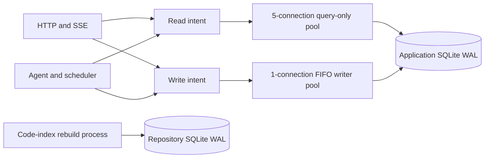

# SQLite Concurrency Architecture

EvoFlux treats SQLite as an embedded state machine, not as a general-purpose
concurrent job runner. API latency stays predictable by separating database
intent, CPU workloads, and transcript delivery.

## Access lanes

- Read intent uses an independent `query_only` pool capped at five
  connections. More aiosqlite threads amplify GIL, disk, and JSON contention;
  they do not make one local database faster.
- Write intent uses exactly one FIFO connection. SQLite has one writer, so
  extra pooled writers only move contention from the application queue to the
  file lock.
- Connection admission times out after five seconds and becomes a retryable
  HTTP `503 database_busy`, never an unexplained 30-second freeze.
- POST does not imply write intent. Long-running code-context POST handlers
  load project metadata through a short read-factory scope, close it, and only
  then start repository work.

## Transaction invariant

A transaction may contain database work only. Filesystem scans, Git, model
calls, process startup, attachment conversion, and SSE waits happen before or
after it. In particular:

1. chat ingress reads persisted routing through the read lane;
2. metadata changes, queue cleanup, and queued-message insertion each use a
   short explicit writer scope;
3. workspace snapshotting happens before message persistence opens its writer
   session;
4. checkpointer history loads and scheduler lookups use the read lane, while
   their mutations use the writer lane.

The SQLAlchemy FIFO pool is the single-writer coordinator. Pool acquisition is
instrumented inside `_do_get()`, which includes the time hidden before normal
checkout events.

## CPU and cache isolation

Repository rebuilds run in one spawned worker process. Cold spatial-graph
snapshots use a separate spawned process lane, so a graph request can still
read the last committed target while a rebuild is active. This prevents parser,
tree-sitter orchestration, hashing, reconciliation, and Python graph resolution
from sharing the API process GIL with asyncio and aiosqlite. Both process lanes
are serial, single-flight where applicable, and shut down as soon as their
queues empty; no parser heap is retained while idle. Lightweight committed-index
queries remain in a bounded thread executor. Repository cache databases use
WAL, so queries can read the last committed graph while a worker reconciles a
new target.

Graph snapshots use a four-entry LRU keyed by repository identity, committed
version, and node/edge limits. Concurrent cache misses for the same key share
one build. Stats are cached against the main database and WAL signatures, and
large graph payloads are materialized/encoded outside the event loop. A version
change invalidates both stats and graph snapshots without an explicit purge.

Project code-context routes release the application read session before either
kind of repository operation. Repository symbols and relations never enter the
application database.

## Transcript delivery

History pages are globally cursor ordered and bounded by both rows and
estimated JSON weight:

- at most 160 initial rows;
- a 192 KiB target payload;
- at least 24 rows before the byte boundary may close;
- automatic extension to the preceding user/summary boundary so a page never
  splits a user → assistant → tool cycle.

Large turns may exceed the byte target to preserve correctness. Older pages use
the existing `(created_at, id)` cursor. The misleading
`(session_id, is_summary)` index is intentionally absent because SQLite chose
it for team timelines; the canonical `(session_id, created_at, id)` index also
serves latest-summary lookup in reverse order.

## Required telemetry

- `EVOFLUX_db_pool_wait_seconds{lane,route}` includes queue time.
- `EVOFLUX_db_pool_timeouts_total{lane,route}` records rejected admission.
- Slow SQL logs contain lane, route, method, normalized-statement fingerprint,
  and a parameter-free statement preview.
- `EVOFLUX_team_resolution_duration_seconds{mode,result}` distinguishes cached,
  cold, and missing team resolution.
- Cursor execution and transaction duration remain separate metrics; neither
  is a substitute for pool-wait measurement.

The acceptance benchmark is concurrent history/health traffic during a full
repository rebuild. API tail latency must remain bounded and writer pool wait
must not grow with index duration.
