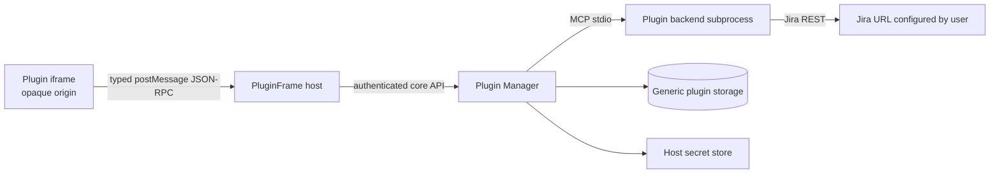

# EvoFlux Plugin Platform - Jira Reference Plugin Plan

> Status: PROPOSED v1
> Date: 2026-07-29
> Scope: nền tảng plugin có thể cài đặt cho EvoFlux, gồm Plugin Center, package format, runtime, UI bridge, SDK, skeleton và Jira Task Management làm reference plugin đầu tiên.
> Companion: [Jira Task Management functional spec](task-management-jira-feature-plan.md)

---

## 1. Executive summary

EvoFlux cần một nút **Plugins** cố định trong sidebar, ngay dưới **Scheduler** tại vị trí người dùng chỉ định. Nút này mở **Plugin Center**, nơi người dùng có thể xem, cài, bật/tắt, cấu hình, cập nhật và gỡ plugin.

Một plugin không chỉ là Python hook hay MCP server. Plugin chuẩn phải có thể đóng góp:

- UI hoàn chỉnh trong Workbench;
- trang cấu hình;
- backend logic chạy độc lập;
- connection schema và secret;
- command palette actions;
- agent tools có kiểm soát;
- metadata, permission và lifecycle nhất quán.

Jira Task Management sẽ là plugin mẫu `com.evoflux.jira`. Nó phải được build, đóng gói và cài bằng đúng pipeline dành cho contributor bên ngoài. Core không được import component Jira, không có route Jira, không có model Jira và không có nhánh `if plugin_id == "jira"`.

### Design maxim

**Core chỉ biết plugin contract; Jira chỉ biết Plugin SDK.**

Nếu một contributor clone skeleton, thay metadata và triển khai đúng contract, bundle tạo ra phải cài được vào EvoFlux mà không sửa source core.

---

## 2. Product decisions

1. **Plugins là global product surface.** Nút Plugins có mặt trong Forge, Coding và AIM.
2. **Sidebar chỉ có một nút Plugins do core sở hữu.** Plugin bên thứ ba không được tự thêm row vào primary sidebar trong v1 để tránh navigation bị lộn xộn.
3. **Plugin Center quản lý lifecycle; Workbench chạy plugin UI.** Installed plugin có thể đóng góp các tool/panel riêng vào Workbench launcher.
4. **Không dynamic-import JavaScript bên thứ ba vào React app.** UI plugin chạy trong iframe sandbox với opaque origin.
5. **Không import Python plugin vào FastAPI process.** Backend plugin chạy subprocess riêng và giao tiếp bằng MCP stdio cộng với control contract của EvoFlux.
6. **Process boundary là crash isolation, chưa phải OS sandbox.** Plugin có backend code vẫn là trusted desktop code; install flow phải nói rõ điều này.
7. **Bundle chuẩn là `.evoplugin`.** Đây là ZIP deterministic với manifest, checksums, UI, backend và signature tùy source.
8. **Local unsigned package được phép với cảnh báo.** Plugin từ registry phải có chữ ký hợp lệ.
9. **Plugin không được thêm FastAPI route, Alembic migration hoặc SQLModel vào core.** Dữ liệu dùng generic plugin storage/connection/secret APIs.
10. **Jira là reference implementation, không phải special case.** Rally sau này là một plugin khác tuân cùng SDK.
11. **Không biến provider plugin/agent hook hiện tại thành nền tảng mới.** Các loader `.py` in-process được coi là legacy/unmanaged và không xuất hiện như package đã sandbox trong Plugin Center.
12. **Plugin API có version độc lập với app version.** Compatibility được quyết định bằng SemVer trước khi install/start.

---

## 3. Evidence from the current codebase

| Existing mechanism | Reuse | Không reuse trực tiếp |
|---|---|---|
| Workbench tabs và launcher | Reuse dock, tab lifecycle, maximize, mounted-state behavior. | Static `WorkbenchTool` union phải được tổng quát hóa để nhận dynamic contribution IDs. |
| Sidebar shell | Reuse `SidebarItem`, collapsed rail, mobile drawer và shared shell primitives. | Scheduler/primary actions đang lặp ở nhiều sidebar; cần shared global-actions component. |
| MCP manager | Reuse stdio transport, async lifecycle, tool/resource protocol và error isolation. | Plugin-owned runtimes không được ghi vào user `mcp.json` hoặc tự động expose toàn bộ tool cho agent. |
| MCP App iframe bridge | Reuse JSON-RPC parsing, source-window validation, theme/context concepts. | Không reuse `allow-same-origin`, broad CSP hoặc `unsafe-eval` cho third-party plugin UI. |
| Provider/agent hook plugins | Có thể học contract validation và broken-plugin isolation. | Không reuse in-process `importlib` execution vì plugin sẽ có toàn quyền trên backend/secrets. |
| Settings/provider credentials | Reuse managed `.env` writer và response masking. | Plugin không được tự đọc mọi env var; host chỉ cấp secret thuộc plugin đó. |
| Desktop sidecar bundle | Reuse bundled relocatable Python 3.12 để chạy Python plugin trên packaged app. | Contributor không được giả định `uv`, system Python, Node hoặc shell command tồn tại trên máy user. |
| Seed tarball installer | Học staged installation và preserve-existing behavior. | Phải viết archive validator riêng; không gọi `extractall` trên package không tin cậy. |

Verified anchors:

- Sidebar row hiện tại: [`web/src/components/Sidebar.tsx`](../../web/src/components/Sidebar.tsx)
- Shared sidebar chrome: [`web/src/components/shell/SidebarShell.tsx`](../../web/src/components/shell/SidebarShell.tsx)
- Workbench catalog và tabs: [`web/src/components/workbench/tools.ts`](../../web/src/components/workbench/tools.ts), [`web/src/components/workbench/WorkbenchDock.tsx`](../../web/src/components/workbench/WorkbenchDock.tsx)
- Static workbench state: [`web/src/stores/useUIStore.ts`](../../web/src/stores/useUIStore.ts)
- Existing iframe bridge: [`web/src/components/MCPAppResult.tsx`](../../web/src/components/MCPAppResult.tsx)
- MCP process lifecycle: [`app/agent/mcp/manager.py`](../../app/agent/mcp/manager.py)
- In-process provider loader to avoid: [`app/agent/providers/plugin_registry.py`](../../app/agent/providers/plugin_registry.py)
- Bundled Python runtime: [`scripts/build_sidecar.py`](../../scripts/build_sidecar.py)
- Secret merge/remove helper: [`app/cli/seed.py`](../../app/cli/seed.py)

---

## 4. User experience

### 4.1 Sidebar entry

Add a **Plugins** row with Lucide `Blocks` or `Plug` icon:

```text
New Chat       Ctrl+N
Scheduler      Ctrl+S
Plugins
--------------------
Recent
```

Exact behavior:

- Forge and Coding expanded sidebar: Plugins sits immediately below Scheduler.
- Forge and Coding collapsed rail: Plugins is an icon item in the same global-action group.
- Mobile drawer: Plugins is present below Scheduler and closes the drawer after opening.
- AIM: Plugins appears in the global action area below search and above project navigation, even though AIM currently does not expose Scheduler in that area.
- No default shortcut in v1. Add one only after shortcut collision audit.

Implementation should introduce a shared `SidebarGlobalActions` or `SidebarPluginsAction` primitive so expanded, collapsed and mobile variants do not drift across three sidebars.

Clicking Plugins calls `openWorkbenchTool('plugins')` and opens the built-in Plugin Center tab. It does not navigate away from the current mode/session.

### 4.2 Plugin Center

Plugin Center is an operational tool, not a marketplace landing page. Initial views:

1. **Installed**: enabled/disabled/error/update status, version and publisher.
2. **Available**: first-party bundles shipped with EvoFlux, starting with Jira.
3. **Install from file**: select a local `.evoplugin` package.
4. **Developer**: visible only when developer mode is enabled; install/link an unpacked plugin.

Plugin detail contains:

- name, publisher, version, description and compatibility;
- source and signature status;
- requested/granted permissions;
- contributed panels, commands, settings and agent tools;
- runtime health and sanitized recent stderr;
- Enable/Disable, Open, Settings, Update and Uninstall actions.

Do not use nested cards. Use a dense list-detail layout that works inside the existing 360-1080 px Workbench width and maximized mode.

### 4.3 Install flow

```text
Pick package
  -> validate archive/checksums/manifest
  -> show publisher + compatibility + permissions
  -> explicit Install approval
  -> stage files
  -> register plugin
  -> start backend and health check
  -> activate contributions
  -> success or atomic rollback
```

The permission review must separate:

- **UI isolation**: sandboxed, no direct host DOM/storage/network;
- **host-mediated capabilities**: storage, credentials, external links, notifications, workspace access;
- **backend trust warning**: subprocess code can access resources allowed by the OS and is not a complete security sandbox.

### 4.4 Opening an installed plugin

An installed plugin can be opened from:

- its **Open** action in Plugin Center;
- its contribution row in Workbench launcher;
- a declared command palette action.

Jira contributes **Task Management** to the Workbench launcher. Opening it creates a tab with dynamic ID:

```text
plugin:com.evoflux.jira/tasks
```

Core renders every such tab through one generic `PluginWorkbenchSurface`; it never imports `JiraPanel.tsx`.

---

## 5. Extension points v1

### 5.1 Supported contributions

| Contribution | Host surface | Contract |
|---|---|---|
| `workbench` | Workbench launcher/tab | Sandboxed plugin UI entry + initial view/context. |
| `settings` | Plugin detail/Settings | Sandboxed UI view or native connection/config schema. |
| `commands` | Command palette | Host-owned label/icon; invokes open-view or backend operation. |
| `connectionTypes` | Plugin settings | Native connection form with public and secret fields. |
| `agentTools` | Agent tool registry | Explicit subset of backend MCP tools, namespaced and opt-in. |

### 5.2 Deferred contributions

Not in v1:

- arbitrary primary-sidebar rows;
- arbitrary FastAPI routes;
- React components injected into core DOM;
- core database migrations;
- menu-bar/native Tauri commands;
- background daemons unrelated to the plugin runtime;
- plugin-to-plugin dependency resolution;
- plugin-to-plugin RPC;
- custom scheduler trigger types;
- arbitrary CSS/theme injection into the host page.

### 5.3 Contribution IDs

- Plugin IDs use reverse-DNS lowercase form: `com.example.plugin-name`.
- Contribution IDs use `[a-z][a-z0-9-]{0,63}`.
- Fully qualified contribution ID is `<plugin_id>/<contribution_id>`.
- Agent tool names are generated by core:

```text
plugin_<sanitized_plugin_id>_<tool_name>
```

Core rejects duplicate IDs at install time. A plugin cannot shadow a built-in tool or another plugin.

---

## 6. Package format

### 6.1 `.evoplugin` layout

`.evoplugin` is a ZIP archive with deterministic ordering and normalized timestamps:

```text
com.evoflux.jira-1.0.0.evoplugin
├── manifest.json
├── checksums.json
├── signature.ed25519          # required for registry, optional for local
├── LICENSE
├── README.md
├── ui/
│   └── index.html             # self-contained single-file build in v1
└── backend/
    ├── main.py
    └── vendor/                # optional vendored Python dependencies
```

Rules:

- `manifest.json`, `checksums.json`, `LICENSE`, `README.md`, `ui/index.html` and `backend/main.py` are UTF-8 regular files.
- No symlink, hardlink, device, FIFO, absolute path, `..`, empty segment or backslash path.
- Reject duplicate paths and case-fold collisions for Windows/macOS portability.
- Reject files not listed in `checksums.json` and checksum entries without files.
- Suggested limits: 50 MB compressed, 200 MB uncompressed, 2,000 files, 20 MB per file and compression ratio guard.
- `ui/index.html` is self-contained. External scripts, styles and fonts are not allowed in v1.
- Native extensions in `backend/vendor` are rejected in portable bundles unless a future platform-specific artifact format explicitly declares target triples.

### 6.2 Manifest v1

Reference Jira manifest:

```json
{
  "schemaVersion": 1,
  "id": "com.evoflux.jira",
  "name": "Jira Task Management",
  "version": "1.0.0",
  "publisher": {
    "id": "evoflux",
    "name": "EvoFlux",
    "publicKeyId": "evoflux-release-1"
  },
  "description": "Browse and update work in Jira Data Center.",
  "license": "Apache-2.0",
  "homepage": "https://github.com/evoflux/plugins/tree/main/jira",
  "engines": {
    "evoflux": ">=0.1.0 <0.2.0",
    "pluginApi": "^1.0"
  },
  "icon": {
    "kind": "host",
    "name": "list-todo"
  },
  "runtime": {
    "type": "python-mcp-stdio",
    "entrypoint": "backend/main.py",
    "startupTimeoutMs": 10000,
    "requestTimeoutMs": 30000
  },
  "ui": {
    "entrypoint": "ui/index.html",
    "bridgeApi": "1.0"
  },
  "permissions": [
    {
      "id": "storage.plugin-data",
      "reason": "Store Jira connection metadata and UI preferences."
    },
    {
      "id": "credentials.use",
      "scopes": ["jira-connection"],
      "reason": "Authenticate requests to configured Jira servers."
    },
    {
      "id": "network.configured-origins",
      "connectionType": "jira",
      "reason": "Call only Jira URLs configured by the user."
    },
    {
      "id": "host.open-external",
      "reason": "Open an issue in Jira."
    }
  ],
  "contributes": {
    "workbench": [
      {
        "id": "tasks",
        "title": "Task Management",
        "description": "Browse and update Jira work items",
        "icon": "list-todo",
        "view": "tasks",
        "modes": ["forge", "coding", "aim"],
        "singleInstance": true
      }
    ],
    "settings": [
      {
        "id": "settings",
        "title": "Jira",
        "view": "settings"
      }
    ],
    "commands": [
      {
        "id": "open-tasks",
        "title": "Jira: Open Task Management",
        "action": {
          "type": "openWorkbench",
          "contribution": "tasks"
        }
      }
    ],
    "connectionTypes": [
      {
        "id": "jira",
        "title": "Jira Data Center",
        "credentialScope": "jira-connection",
        "testOperation": "connection_test",
        "fields": [
          {
            "id": "name",
            "label": "Connection name",
            "type": "string",
            "required": true
          },
          {
            "id": "base_url",
            "label": "Jira URL",
            "type": "url",
            "required": true
          },
          {
            "id": "api_key",
            "label": "API key / PAT",
            "type": "secret",
            "required": true,
            "writeOnly": true
          },
          {
            "id": "verify_ssl",
            "label": "Verify TLS",
            "type": "boolean",
            "default": true
          }
        ]
      }
    ],
    "agentTools": [
      {
        "operation": "issue_search",
        "name": "jira_issue_search",
        "effect": "read",
        "defaultEnabled": false
      },
      {
        "operation": "issue_get",
        "name": "jira_issue_get",
        "effect": "read",
        "defaultEnabled": false
      }
    ]
  }
}
```

### 6.3 Manifest validation

- Pydantic model uses `extra="forbid"` at every level.
- JSON Schema is published with the SDK and used by editor tooling.
- SemVer and range syntax are validated before extraction to final location.
- Every contribution references an existing UI view or backend operation.
- Every permission used by a contribution must appear in top-level permissions.
- Host icons come from a small allowlist. Arbitrary SVG is never injected into host DOM.
- Manifest cannot override install paths, process command, Python executable or host API URL.

---

## 7. Runtime architecture



### 7.1 Core components

```text
app/plugin_runtime/
├── models.py              # strict manifest/package/runtime models
├── archive.py             # safe ZIP validation and staged extraction
├── signatures.py          # checksums and Ed25519 verification
├── registry.py            # installed plugin records and contributions
├── manager.py             # enable/disable/start/stop/update/rollback
├── process.py             # MCP subprocess lifecycle
├── bootstrap.py           # bundled-Python plugin bootstrap
├── permissions.py         # grants and capability checks
├── storage.py             # namespaced KV/connections/secrets
└── protocol.py            # bridge/control API versions

app/api/routes/plugins.py
app/api/schemas/plugins.py
app/models/plugins.py
```

Frontend:

```text
web/src/components/plugins/
├── PluginCenterPanel.tsx
├── PluginList.tsx
├── PluginDetail.tsx
├── PluginInstallDialog.tsx
├── PluginPermissionReview.tsx
├── PluginConnectionForm.tsx
├── PluginFrame.tsx
└── PluginWorkbenchSurfaces.tsx

web/src/api/client/plugins.ts
web/src/queries/usePluginsQuery.ts
web/src/lib/plugin-bridge/
```

### 7.2 Installed paths

Keep the new platform separate from legacy `{CONFIG_DIR}/plugins/*.py` loaders:

```text
{DATA_DIR}/plugins/installed/<plugin-id>/<version>/
{DATA_DIR}/plugins/data/<plugin-id>/
{CACHE_DIR}/plugins/<plugin-id>/
{CONFIG_DIR}/.env                          # managed secret backend in v1
```

The database stores registry/config metadata, never bundle bytes or raw secrets.

### 7.3 Generic persistence

Migration `00000038_create_plugin_platform.py` is the current proposed next revision. Bump if another migration lands first.

Tables:

```text
installed_plugins
  id                    UUID PK
  plugin_id             string unique
  version               string
  install_path          string
  source_type           bundled | local | registry | dev
  source_ref            string nullable
  manifest_json         JSON
  manifest_hash         string
  package_hash          string
  signature_status      bundled | verified | unsigned | invalid
  enabled               bool
  runtime_status        stopped | starting | ready | error | disabled
  last_error            string nullable
  installed_at/updated_at

plugin_permission_grants
  plugin_id             string
  package_hash          string
  permission_id         string
  scope_json            JSON
  granted_at

plugin_kv
  plugin_id             string
  namespace             string
  key                   string
  value_json            JSON
  updated_at
  unique(plugin_id, namespace, key)

plugin_connections
  id                    UUID PK
  plugin_id             string
  connection_type       string
  name                  string
  public_config_json    JSON
  secret_refs_json      JSON       # env/keychain references only
  verified_identity_json JSON nullable
  last_verified_at      datetime nullable
  created_at/updated_at
```

Plugins cannot issue SQL. All access goes through namespaced storage methods enforced by plugin ID.

---

## 8. UI sandbox and bridge

### 8.1 Iframe policy

Plugin UI uses `srcdoc` and:

```html
<iframe sandbox="allow-scripts" />
```

Deliberately absent:

- `allow-same-origin`;
- `allow-popups`;
- `allow-top-navigation`;
- `allow-downloads`;
- direct Tauri APIs;
- direct access to EvoFlux auth token.

Default CSP inside the iframe:

```text
default-src 'none';
script-src 'unsafe-inline';
style-src 'unsafe-inline';
img-src data: blob:;
font-src data:;
connect-src 'none';
frame-src 'none';
object-src 'none';
base-uri 'none';
form-action 'none'
```

`unsafe-eval` is forbidden. The skeleton build must emit a self-contained bundle that does not require it.

### 8.2 Bridge handshake

Every iframe instance gets an unguessable in-memory nonce. Messages require:

```json
{
  "jsonrpc": "2.0",
  "id": "request-id",
  "method": "host.context.get",
  "params": {},
  "evoflux": {
    "apiVersion": "1.0",
    "instanceId": "...",
    "nonce": "..."
  }
}
```

Host validates:

- `event.source === iframe.contentWindow`;
- opaque-origin expectation (`event.origin === "null"`);
- nonce, instance ID and plugin binding;
- JSON-RPC schema;
- method allowlist and granted permission;
- payload depth/size and per-frame rate limit.

### 8.3 UI bridge v1 methods

| Method | Permission | Notes |
|---|---|---|
| `host.context.get` | baseline | Theme, locale, mode, viewport and contribution view. No desktop token. |
| `host.theme.subscribe` | baseline | Host forwards theme changes. |
| `plugin.backend.call` | baseline | Calls only this plugin's non-reserved backend operation. |
| `plugin.storage.get/set/delete/list` | `storage.plugin-data` | Namespaced and quota-limited. |
| `plugin.connections.list/get/create/update/delete/test` | declared connection type | Secret fields are write-only. |
| `host.openExternal` | `host.open-external` | `https` only, user-visible destination validation. |
| `host.confirm` | baseline | Host-native confirmation dialog. |
| `host.notify` | `host.notifications` | Optional, rate-limited. |
| `host.clipboard.write` | `host.clipboard-write` | Optional; no clipboard read in v1. |

No generic `fetch`, filesystem, shell, DOM or raw `/api/*` method is exposed.

### 8.4 UI lifecycle

Host sends:

```text
initialize -> ready -> context/theme events -> dispose
```

When plugin is disabled/uninstalled:

1. stop new bridge calls;
2. notify existing frames with `dispose`;
3. close dynamic Workbench tabs owned by the plugin;
4. unmount frames;
5. stop backend process.

Broken UI displays a host-owned recovery screen with Reload, Disable and View diagnostics actions.

---

## 9. Backend plugin runtime

### 9.1 Protocol

Backend runtime is MCP over stdio because EvoFlux already owns a stable MCP client and subprocess lifecycle. Plugin SDK adds a reserved control layer for:

- initialize with plugin identity, data directory, granted permissions and resolved own-secret values;
- health check;
- config/connection refresh;
- graceful shutdown;
- sanitized logging.

Reserved control operations are never visible to plugin UI or agents.

Normal backend operations are MCP tools/resources with audience metadata:

```text
audience: ui | agent | both
effect: read | write | external | destructive
```

Core exposes only manifest-declared `agentTools` to agents. UI calls are bound to the owning plugin and cannot call another plugin's backend.

### 9.2 Launch command

Production uses the Python interpreter already bundled with the desktop sidecar. Development/server installs use the current EvoFlux interpreter.

Conceptual launch:

```text
<evoflux-python> -I <core>/plugin_runtime/bootstrap.py \
  --plugin-root <installed-version-dir> \
  --entrypoint backend/main.py
```

The bootstrap adds only:

- Plugin SDK/runtime packages shipped by EvoFlux;
- the plugin's backend root;
- the plugin's validated `backend/vendor` directory.

It must not add user site-packages or arbitrary `PYTHONPATH` values.

### 9.3 Process controls

- Spawn with argument arrays, never `shell=True`.
- Minimal explicit environment; do not inherit provider/API keys from the parent process.
- Dedicated plugin data directory as cwd.
- Stdout reserved for protocol. Stderr is capped, sanitized and available in diagnostics.
- Startup and request timeout from validated manifest within host limits.
- Response size, nesting depth and concurrent-call limits.
- Restart with bounded backoff; repeated crash moves runtime to `error` until user retries.
- Stop on disable, uninstall and EvoFlux shutdown.
- A plugin crash cannot terminate FastAPI or another plugin.

### 9.4 Honest trust boundary

Subprocess isolation protects host memory and lifecycle, but Python code can still use OS APIs directly. In v1:

- capability checks protect host bridge APIs;
- minimal env prevents accidental secret inheritance;
- namespaced paths prevent accidental data mixing in SDK APIs;
- install approval treats backend code as trusted desktop code.

Strong filesystem/network sandboxing is a future platform track using OS sandbox profiles or WASM. The UI must not claim the backend is fully sandboxed.

---

## 10. Secrets, connections and storage

### 10.1 Host-owned secret store

Plugins refer to secrets; they never choose physical env-var names or read the full EvoFlux `.env`.

Interface:

```python
class PluginSecretStore(Protocol):
    def set(plugin_id: str, scope: str, record_id: str, field: str, value: str) -> SecretRef: ...
    def has(ref: SecretRef) -> bool: ...
    def resolve_for_runtime(plugin_id: str, refs: list[SecretRef]) -> dict[str, str]: ...
    def delete(ref: SecretRef) -> None: ...
```

V1 backend uses managed entries in `{CONFIG_DIR}/.env` through the existing atomic writer. Generated keys use a core-owned prefix derived from plugin/record IDs. API responses expose only `has_value`.

The interface allows a later OS keychain backend without changing plugin code.

### 10.2 Connection forms

`connectionTypes` lets core render consistent native forms and handle secrets safely. Plugin provides:

- field schema;
- validation constraints;
- backend `testOperation`;
- display metadata.

On test/save:

1. host validates field shape and URL basics;
2. secret is staged in memory;
3. backend receives only this connection's resolved values;
4. backend returns sanitized identity/capabilities;
5. host atomically persists public config + secret refs;
6. raw secret is discarded from React state after completion.

### 10.3 Quotas

Suggested defaults per plugin:

- KV: 5 MB;
- connection public metadata: 1 MB total;
- cached runtime output: 10 MB;
- logs: rotating capped buffer;
- no raw binary/blob storage in DB.

Large plugin artifacts belong in the plugin data directory through a future mediated file API, not v1 KV.

---

## 11. Installation, update and uninstall

### 11.1 Install sources

V1:

- bundled first-party catalog;
- local `.evoplugin` file;
- developer linked directory behind developer mode;
- CLI local path.

Later:

- signed registry index;
- HTTPS package URL backed by registry metadata;
- update channels.

Do not implement arbitrary URL install before signature and download-limit behavior is complete.

### 11.2 Atomic install

1. Stream upload/download into cache with compressed-size limit and SHA-256.
2. Inspect central directory and reject unsafe members before extraction.
3. Extract into a random staging directory using per-entry canonical-path checks.
4. Validate manifest, checksums, signature and engine compatibility.
5. Validate contribution references and package contract tests.
6. Show permission review; no final installation before user approval.
7. Atomically rename staging directory to versioned install path.
8. Insert registry/grant records in one database transaction.
9. Start runtime and call health operation.
10. Activate contributions only after health succeeds.
11. On failure, stop process, remove registry rows and delete staged/final files owned by this attempt.

### 11.3 Update

- Install the new version side-by-side.
- Compare permission set. New or broadened permissions require approval.
- Start and health-check new runtime before switching active version.
- Keep previous version until new version is confirmed ready.
- Atomically switch registry pointer and contributions.
- Roll back automatically on startup/health failure.
- Plugin data is forward-compatible responsibility of the plugin; SDK provides versioned data migrations within plugin-owned storage, never core migrations.

### 11.4 Disable and uninstall

Disable preserves package, data, connections and secrets but stops runtime and removes contributions.

Uninstall dialog offers:

- **Remove plugin only**: preserve plugin data/secrets for reinstall.
- **Remove plugin and data**: delete owned package versions, KV, connections, managed secrets, cache and data directory.

Deletion only touches paths and secret refs owned by the plugin registry. It never deletes user-supplied env variables or paths from manifest input.

---

## 12. SDK and contributor skeleton

### 12.1 Repository layout

Proposed source layout inside EvoFlux:

```text
plugin-sdk/
├── manifest.schema.json
├── web/                    # @evoflux/plugin-sdk
├── python/                 # evoflux-plugin-sdk
├── cli/                    # init/validate/dev/pack
└── templates/
    ├── ui-only/
    └── fullstack/

plugins/
├── jira/                   # first-party reference plugin
└── hello-world/            # minimal contract fixture
```

The tiny `hello-world` plugin proves the generic host without Jira complexity. Jira proves real connections, secrets, network, dynamic forms and write operations.

### 12.2 Generated fullstack skeleton

Command:

```bash
evoflux plugin init com.example.my-plugin --template fullstack
```

Output:

```text
my-plugin/
├── manifest.json
├── README.md
├── LICENSE
├── ui/
│   ├── package.json
│   ├── tsconfig.json
│   ├── vite.config.ts
│   ├── src/
│   │   ├── main.tsx
│   │   ├── App.tsx
│   │   ├── views/MainView.tsx
│   │   └── plugin.ts
│   └── tests/
├── backend/
│   ├── pyproject.toml
│   ├── src/my_plugin/
│   │   ├── __main__.py
│   │   ├── plugin.py
│   │   └── operations.py
│   └── tests/
├── tests/
│   ├── manifest.test.json
│   └── contract/
└── Makefile
```

### 12.3 SDK APIs

TypeScript:

```typescript
const plugin = await connectPlugin({ apiVersion: '1.0' })
const context = await plugin.host.getContext()
const result = await plugin.backend.call('items_list', { cursor: null })
await plugin.storage.set('preferences', 'view', 'compact')
await plugin.host.openExternal(result.webUrl)
```

Python:

```python
from evoflux_plugin_sdk import Plugin, operation

plugin = Plugin(id="com.example.my-plugin")

@operation(audience="ui", effect="read")
async def items_list(cursor: str | None = None) -> dict:
    return {"items": [], "next_cursor": None}

plugin.run()
```

The SDK handles MCP framing, reserved lifecycle operations, Pydantic validation, error envelopes and structured logging.

### 12.4 CLI workflow

```text
evoflux plugin init <id> [--template ui-only|fullstack]
evoflux plugin validate <dir-or-package>
evoflux plugin dev <dir>
evoflux plugin pack <dir>
evoflux plugin install <package>
evoflux plugin inspect <package>
```

`pack` must:

- build a single-file UI;
- run frontend/backend/contract tests;
- vendor allowed Python dependencies;
- normalize archive paths/timestamps;
- generate checksums;
- optionally sign using a key passed outside the repository;
- run the same validator used by the host installer.

### 12.5 Contributor contract

A contribution is acceptable when:

- manifest validates with no unknown fields;
- plugin passes current and previous supported Plugin API contract suites;
- UI works with network disabled inside opaque-origin iframe;
- backend writes only protocol data to stdout;
- all host capabilities are declared with reasons;
- no raw secret appears in responses/logs/tests;
- install, enable, disable, update, rollback and uninstall tests pass;
- package is reproducible from source and checksum inventory is complete.

---

## 13. Jira reference plugin

### 13.1 Source layout

```text
plugins/jira/
├── manifest.json
├── ui/
│   └── src/
│       ├── App.tsx
│       ├── views/TasksView.tsx
│       ├── views/SettingsView.tsx
│       ├── components/TaskList.tsx
│       ├── components/TaskDetail.tsx
│       ├── components/DynamicIssueForm.tsx
│       └── queries.ts
├── backend/
│   └── src/evoflux_jira/
│       ├── plugin.py
│       ├── client.py
│       ├── models.py
│       ├── fields.py
│       ├── mapper.py
│       └── errors.py
└── tests/
    ├── fixtures/
    ├── contract/
    └── security/
```

### 13.2 Jira functionality

The functional scope remains in [Jira Task Management functional spec](task-management-jira-feature-plan.md):

- Jira Data Center URL with context path;
- PAT Bearer authentication;
- server/user validation;
- visible projects and per-project permissions;
- paginated JQL search with bounded fields;
- issue detail and comments/history;
- metadata-driven create/edit forms;
- dynamic transitions;
- comment creation;
- stable sanitized error mapping.

### 13.3 What moves out of core

The old feature plan's Jira-specific core artifacts are superseded:

| Old proposal | Plugin-platform replacement |
|---|---|
| `TaskProviderConnection` core table | Generic `plugin_connections` plus host secret refs. |
| `/api/task-management/*` | Generic `/api/plugins/*` lifecycle/bridge; Jira operations remain in Jira subprocess. |
| `app/services/task_management/jira/` | `plugins/jira/backend/src/evoflux_jira/`. |
| `TaskManagementPanel` imported by TeamChatView | Generic `PluginFrame` rendering Jira's bundled UI. |
| Static `'task-management'` Workbench union item | Dynamic `plugin:com.evoflux.jira/tasks` contribution. |
| Jira settings route in core | Plugin contribution/native connection form. |

### 13.4 Jira backend operations

Private UI operations:

```text
connection_test
projects_list
project_permissions_get
issue_types_list
create_schema_get
issues_search
issue_get
edit_schema_get
issue_create
issue_update
transitions_list
issue_transition
comments_list
comment_add
```

Initial agent exposure is read-only and opt-in:

```text
issue_search
issue_get
```

Write agent tools come later and require host confirmation showing connection, issue/project and exact mutation.

### 13.5 Jira as acceptance test for the SDK

Jira must prove:

- multiple connections with separate secrets;
- dynamic URL origins including `/jira9` context paths;
- large paginated responses;
- 406-field metadata without host changes;
- dynamic forms entirely inside plugin UI;
- upstream permission/error handling;
- UI/back-end restart without losing host-managed connection metadata;
- install from bundled catalog and from a locally rebuilt identical package;
- disable/re-enable and update/rollback behavior.

No Jira field ID, endpoint or display text may appear in generic plugin runtime code.

### 13.6 Rally later

Rally becomes `com.evoflux.rally`, generated from the same fullstack skeleton. It can share an external `task-management-kit` UI/backend library with Jira, but core remains unaware of task-provider semantics.

If a unified Jira/Rally board is later required, build a separate Task Hub plugin after plugin-to-plugin RPC/dependencies are designed. Do not preemptively add a task-provider abstraction to core v1.

---

## 14. Host API surface

### 14.1 Plugin lifecycle

```text
GET    /api/plugins
GET    /api/plugins/catalog
GET    /api/plugins/{plugin_id}
POST   /api/plugins/install                 multipart .evoplugin
POST   /api/plugins/{plugin_id}/enable
POST   /api/plugins/{plugin_id}/disable
POST   /api/plugins/{plugin_id}/retry
POST   /api/plugins/{plugin_id}/update
DELETE /api/plugins/{plugin_id}?remove_data=false
GET    /api/plugins/{plugin_id}/diagnostics
```

### 14.2 Contributions and UI

```text
GET  /api/plugins/contributions
GET  /api/plugins/{plugin_id}/ui/{contribution_id}
POST /api/plugins/{plugin_id}/instances
POST /api/plugins/{plugin_id}/instances/{instance_id}/call
DELETE /api/plugins/{plugin_id}/instances/{instance_id}
```

Parent React code makes these authenticated calls. The iframe never calls `/api` directly.

### 14.3 Storage and connections

```text
GET    /api/plugins/{plugin_id}/connections
POST   /api/plugins/{plugin_id}/connections
PATCH  /api/plugins/{plugin_id}/connections/{connection_id}
DELETE /api/plugins/{plugin_id}/connections/{connection_id}
POST   /api/plugins/{plugin_id}/connections/test
POST   /api/plugins/{plugin_id}/connections/{connection_id}/test
```

Plugin iframe accesses them only through bridge methods. Public HTTP schemas never expose raw secret or physical secret reference.

### 14.4 Events

One host-owned SSE stream can emit:

```text
plugin.installed
plugin.enabled
plugin.disabled
plugin.updated
plugin.runtime_status
plugin.contributions_changed
plugin.connection_changed
```

Frontend invalidates TanStack Query keys from these events. Backend events intended for an iframe are forwarded only to instances owned by that plugin.

---

## 15. Workbench and frontend refactor

Current `WorkbenchTool` is a closed union. Plugin support requires:

```typescript
type BuiltinWorkbenchTool =
  | 'terminal'
  | 'browser'
  | 'files'
  | 'graph'
  | 'progress'
  | 'side-chat'
  | 'wiki'
  | 'scheduler'
  | 'source-control'
  | 'pull-requests'
  | 'plugins'

type WorkbenchToolId = BuiltinWorkbenchTool | `plugin:${string}/${string}`
```

Refactor rules:

- `WORKBENCH_TOOLS` remains the built-in catalog.
- `useWorkbenchToolCatalog()` merges enabled plugin contributions from the backend.
- `WorkbenchTab.tool` becomes `WorkbenchToolId` while preserving built-in behavior.
- Multi-instance policy comes from built-in metadata or plugin manifest.
- `WorkbenchLauncher` renders the merged catalog.
- `PluginWorkbenchSurfaces` generically renders all active plugin tabs.
- Closing/disabling a plugin removes only tabs owned by that plugin.
- Plugin contribution title/icon comes from validated host-safe metadata.

Plugin Center itself is a built-in tool and remains available even when every plugin is broken.

---

## 16. Security and trust model

### 16.1 Package security

- Safe per-entry ZIP extraction.
- SHA-256 inventory for every file.
- Ed25519 signatures for registry packages.
- Publisher key ID and revocation support in registry metadata.
- Local unsigned install requires explicit warning every new package hash.
- Compatibility and permission approval are checked before activation.
- Package update cannot silently broaden permissions.

### 16.2 UI security

- Opaque-origin iframe.
- Strict CSP and no network.
- No `allow-same-origin`, `unsafe-eval`, Tauri or host auth token.
- Source-window + nonce + instance binding.
- Typed message validation, quotas and rate limits.
- Host owns external navigation, dialogs, notifications and clipboard.

### 16.3 Backend security

- Separate process, minimal env and dedicated cwd.
- No in-process import, core route registration or direct core DB handle.
- Only own secrets delivered after permission checks.
- Timeouts, output caps, restart limits and deterministic shutdown.
- Explicit trusted-code warning because no full OS sandbox exists in v1.

### 16.4 Agent safety

- Agent tools are manifest allowlisted and disabled by default.
- Core namespaces tool names and applies existing permission policy.
- Tool effect is visible in approval UI.
- Writes require confirmation; destructive operations can be denied globally.
- A UI-only operation cannot be called by an agent.

---

## 17. Testing strategy

### 17.1 Contract fixtures

Maintain packages for:

- valid UI-only plugin;
- valid fullstack plugin;
- incompatible API/app version;
- duplicate contribution IDs;
- missing checksum;
- bad signature;
- ZIP slip path;
- absolute/backslash/case-collision paths;
- symlink/special file;
- compression bomb and oversized payload;
- backend timeout/crash/malformed protocol;
- UI malformed/forged/cross-frame bridge messages.

### 17.2 Backend tests

- install staging, transactionality and rollback;
- start/health/stop/restart state machine;
- enable/disable contribution reconciliation;
- update side-by-side and automatic rollback;
- plugin storage namespace isolation and quotas;
- connection secret write-only behavior;
- no inherited unrelated environment secrets;
- uninstall preserves/removes data according to choice;
- shutdown leaves no child process.

### 17.3 Frontend tests

- Plugins row in expanded/collapsed/mobile Forge and Coding sidebar, plus AIM global area;
- Plugin Center works with no plugins and broken plugins;
- local install permission review;
- merged Workbench catalog and dynamic tab lifecycle;
- iframe has exact sandbox/CSP attributes;
- forged message from wrong source/nonce is ignored;
- disable/uninstall closes owned tabs;
- compact, wide, maximized and mobile layouts;
- keyboard/focus/accessibility behavior across iframe boundary.

### 17.4 Jira tests

Reuse sanitized fixtures from `jira-docs`; CI never calls the real Jira instance. Cover URL context path, PAT masking, pagination, dynamic metadata, transitions, permissions and HTML/JSON errors as specified in the companion plan.

### 17.5 End-to-end acceptance

1. Build Jira from source using public SDK commands.
2. Install generated `.evoplugin` into a clean EvoFlux profile.
3. Grant permissions and configure URL/PAT.
4. Open Task Management through dynamic Workbench contribution.
5. Run read and controlled write journeys against a test Jira server.
6. Disable, re-enable, update with a test version and roll back a broken update.
7. Uninstall with and without data removal.
8. Assert no Jira-specific source change exists in core for those operations.

---

## 18. Delivery plan

### P0 - Contract freeze

- Freeze manifest v1, contribution IDs, permissions, bridge methods and backend audience/effect metadata.
- Create JSON Schema and invalid-package fixtures.
- Write threat model for archive, iframe, process, secrets and updates.
- Decide plugin API support window.

Exit: schema and protocol review approved; no Jira implementation yet.

### P1 - Registry and installer foundation

- Generic models/migration.
- Safe archive reader, checksums, staged install and local package API/CLI.
- Installed/enable/disable/uninstall state without backend or UI execution.
- Bundled catalog discovery.

Exit: Hello World package installs atomically and appears in API/Plugin Center list.

### P2 - Backend runtime

- Extract/reuse MCP stdio process primitives.
- Plugin bootstrap with bundled Python.
- Control handshake, health, timeouts, logs, restart and shutdown.
- Generic KV, connections and host secret store.

Exit: fullstack Hello World backend can be called through authenticated core API and cannot see unrelated env secrets.

### P3 - UI host and dynamic contributions

- Sidebar Plugins action in all responsive variants.
- Plugin Center built-in Workbench tool.
- Dynamic Workbench catalog/tab refactor.
- Opaque iframe, strict CSP, typed bridge and lifecycle.
- Settings/command/connection contributions.

Exit: Hello World UI runs without direct network/host DOM access and survives tab switches/maximize.

### P4 - SDK, skeleton and developer workflow

- TypeScript and Python SDKs.
- `plugin init/validate/dev/pack/install/inspect` commands.
- UI-only and fullstack templates.
- Contract test kit and contributor documentation.
- Reproducible package output.

Exit: a new plugin can be generated, modified, packed and installed without editing EvoFlux core.

### P5 - Jira reference plugin

- Move Jira architecture out of core into `plugins/jira`.
- Implement Jira connection, read flows and metadata-driven UI.
- Add create/edit/transition/comment writes.
- Add read-only opt-in agent tools.
- Ship as bundled available plugin through the normal installer.

Exit: all Jira functional acceptance criteria and generic platform E2E tests pass.

### P6 - Updates and ecosystem hardening

- Signed package verification and publisher keys.
- Side-by-side update, permission diff and rollback.
- Diagnostics/exportable support bundle with secret redaction.
- Registry index format and review automation, without enabling arbitrary URL install prematurely.

Exit: platform is ready for third-party distribution beyond local packages.

---

## 19. Acceptance criteria

### Platform

- [ ] Plugins button is visible at the specified sidebar location and works in expanded, collapsed and mobile layouts.
- [ ] Plugin Center remains usable when no plugin runtime is healthy.
- [ ] A `.evoplugin` built outside core can be validated, reviewed, installed, enabled, disabled and uninstalled.
- [ ] Plugin UI is never imported into the host React realm.
- [ ] Plugin backend is never imported into FastAPI.
- [ ] Dynamic Workbench contributions require no source change per plugin.
- [ ] UI bridge denies wrong source, nonce, plugin instance, method and permission.
- [ ] Plugin cannot read another plugin's KV, connection or host-managed secret through SDK APIs.
- [ ] Update cannot broaden permissions without approval and can roll back a broken version.
- [ ] Contributor skeleton and host use the same manifest schema/validator.
- [ ] Legacy `.py` provider/hooks are clearly distinguished from managed plugins.

### Jira reference

- [ ] Jira is installed from a real `.evoplugin` bundle through the generic installer.
- [ ] Core contains no Jira route, model, service, UI import or ID-specific branch.
- [ ] Jira URL/PAT connection is rendered from contribution schema and secrets remain write-only.
- [ ] Task Management appears as `plugin:com.evoflux.jira/tasks` in Workbench.
- [ ] Search/detail/create/edit/transition/comment flows work through plugin bridge/backend.
- [ ] Jira-specific 406-field metadata does not require a Plugin API change.
- [ ] Jira can be disabled/uninstalled without restarting EvoFlux or breaking Workbench.
- [ ] A rebuilt Jira package passes the same contract used for third-party contributors.

---

## 20. Recommended defaults and open product decisions

| Question | Recommended v1 default |
|---|---|
| Button opens marketplace or installed list? | Open Installed view; Available and Install from file are adjacent tabs. |
| Auto-install Jira? | Ship in bundled Available catalog; user explicitly installs/enables it. |
| Unsigned plugin? | Local file only, with strong trust warning; never from registry. |
| Plugin UI networking? | None. All remote calls go through plugin backend via bridge. |
| Backend language? | Guaranteed Python SDK in v1; protocol remains MCP so packaged executable runtimes can be added later. |
| Node/npm at user install time? | Not required and not allowed by standard package flow. UI is prebuilt. |
| Plugin dependencies? | No plugin-to-plugin dependencies in v1. Vendor backend dependencies in package. |
| Secret backend? | Existing managed `.env` implementation behind `PluginSecretStore`; keychain can replace it later. |
| First-party trust? | First-party bundle is signed/bundled but still uses normal validation, install and runtime paths. |
| Rally? | Separate plugin generated from the same skeleton after Jira/platform contracts stabilize. |
| Marketplace? | Defer public registry UI until signing, revocation, update rollback and review automation exist. |

---

## 21. Non-goals for v1

- Perfect sandbox for arbitrary backend native code.
- Public marketplace moderation/payment/rating.
- Remote arbitrary URL install.
- Automatic background updates.
- Plugin dependencies and shared dependency solver.
- In-process React or Python extension APIs.
- Third-party sidebar clutter.
- Native Tauri command registration.
- Plugin-owned core DB schema/routes.
- A universal task-management domain in core.

---

## 22. Definition of done

Plugin Platform v1 is done when a contributor can run one scaffold command, implement UI/backend against published SDKs, pack a deterministic `.evoplugin`, install it through the sidebar Plugin Center and receive declared Workbench/Settings/command/agent-tool contributions without modifying EvoFlux core.

Jira completes the definition only when it ships through that same path and satisfies the existing Task Management functional spec. Any implementation that hard-codes Jira into core may demonstrate the Jira UI, but does not complete this platform.