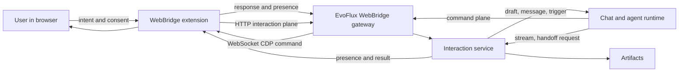
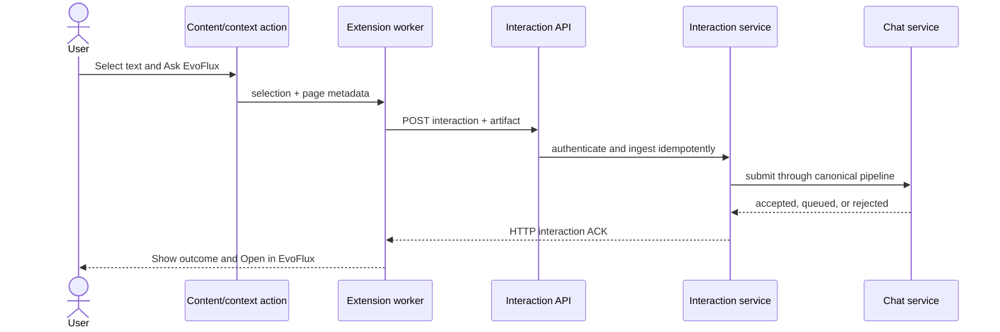

# WebBridge hai chiều - từ browser automation đến Browser Interaction Fabric

| | |
|---|---|
| **Trạng thái** | IN PROGRESS (v1.4 - P0/P1 implemented; P2/P3 MVP implemented) |
| **Ngày** | 2026-07-22 |
| **Phạm vi** | Mở rộng WebBridge từ kênh EvoFlux điều khiển browser thành lớp tương tác hai chiều browser <-> EvoFlux |
| **Tài liệu liên quan** | [`forge-computer-use.md`](forge-computer-use.md), [`../../extensions/webbridge/README.md`](../../extensions/webbridge/README.md), [`../../docs/side-chat-spec.md`](../../docs/side-chat-spec.md) |

---

## Tóm tắt điều hành

WebBridge hiện đã làm tốt một nửa khó của bài toán: extension giữ WebSocket bền
vững với backend, điều khiển browser thật qua CDP, định tuyến theo session, áp
domain policy và ghi audit. Tuy nhiên, mô hình sản phẩm và wire protocol vẫn
chủ yếu là:

```text
EvoFlux -> command -> browser -> response
```

Extension có gửi `tab_updated`, nhưng sự kiện này chỉ là trạng thái tạm thời;
nó chưa thể hiện một **ý định của người dùng**, chưa được lưu bền vững, và chưa
đi vào chat/workflow của EvoFlux. Popup hiện chỉ cấu hình kết nối, không có side
panel, context action hay content script để người dùng khởi tạo công việc từ
trang đang xem.

Đề xuất không biến WebBridge thành một bản sao Playwright có nhiều action hơn.
Thay vào đó, định vị nó là **Browser Interaction Fabric**:

1. **Command plane** - EvoFlux điều khiển browser, là năng lực hiện có.
2. **Interaction plane** - người dùng gửi intent và context từ browser vào
   EvoFlux.
3. **Presence plane** - browser, tab, EvoFlux session và quyền chia sẻ biết
   chúng đang liên kết với nhau như thế nào.
4. **Artifact plane** - selection, page extract, screenshot, DOM anchor và file
   được đóng gói thành context có nguồn gốc, không trộn thẳng vào prompt.

Ba vertical slice nên làm trước:

- **P1 - Send to EvoFlux:** gửi selection/link/page vào một session đã chọn
  hoặc một browser session mới bằng context menu và popup quick action.
- **P2 - EvoFlux Side Panel:** chat ngay cạnh trang, chọn/bind session, đính kèm
  page context và theo dõi phản hồi streaming.
- **P3 - Interactive Handoff:** agent yêu cầu người dùng đăng nhập, chọn element,
  xác nhận hoặc thao tác thủ công; browser trả kết quả có cấu trúc rồi agent tiếp
  tục.

Không nên bắt đầu bằng theo dõi mọi thao tác browser, đồng bộ toàn bộ history,
hay cho website bất kỳ gọi EvoFlux. Các hướng đó có giá trị về sau nhưng tạo
rủi ro privacy, prompt injection và event noise trước khi interaction contract
được chứng minh.

---

## 1. Hiện trạng đã xác minh trong codebase

### 1.1 Những nền móng có thể tái sử dụng

| Năng lực hiện có | Vị trí | Giá trị cho hướng hai chiều |
|---|---|---|
| Persistent WebSocket extension <-> backend | `extensions/webbridge/background.js`, `app/api/routes/team/webbridge.py` | Không cần transport mới |
| Extension registration + heartbeat + reconnect | `background.js` | Dùng làm presence channel |
| Extension -> relay event envelope | `type: "event"` với `tab_updated` | Có thể nâng thành event/interaction protocol có version |
| Sticky routing session -> extension | `WebBridgeManager._session_targets` | Nền cho bind session với browser profile |
| Event fan-out theo session | `WebBridgeManager.handle_event()` | Tái dùng cho live status; chưa đủ cho durable intent |
| CDP capture/action primitives | `background.js`, `webbridge_tool.py` | Tái dùng để lấy page context, screenshot và DOM anchor |
| Domain policy + command audit | `webbridge_service.py` | Mẫu để xây share policy + interaction audit |
| WebBridge session tag | team chat + tier policy | Có thể dùng để nhận diện session có browser capability |
| Side Chat độc lập, read-only | `docs/side-chat-spec.md` và implementation hiện có | Một target hợp lý cho câu hỏi ngắn từ browser |

### 1.2 Khoảng trống quyết định

1. `background.js` chỉ xử lý `registered` và `command` từ relay; chiều gửi lên
   chủ yếu là `response`, `ping` và `tab_updated`.
2. `WebBridgeManager.handle_event()` chỉ cập nhật state trong RAM và fan-out đến
  agent WebSocket đang subscribe. Trong desktop path bình thường không có
  consumer nào subscribe nên `tab_updated` thực tế bị drop sau khi cập nhật RAM.
  Event không có ACK, deduplication, persistence hoặc dispatch vào chat pipeline.
3. In-process `webbridge` tool gửi command trực tiếp qua manager nhưng không
   subscribe event. Vì vậy `tab_updated` không tự đánh thức hay nhắn cho agent.
4. Manifest chưa có `sidePanel`, `contextMenus`, `commands`, content script hoặc
   extension page dành cho interaction UX.
5. Popup chỉ có connect/disconnect, relay config và release debugger.
6. Policy hiện bảo vệ **agent tác động lên page**. Chưa có policy riêng cho
   **page data đi vào EvoFlux**.
7. Session binding hiện là backend routing ngầm khi agent gọi tool. Người dùng
   chưa nhìn thấy hoặc chủ động chọn tab đang gắn với session nào.
8. Binding hiện tại có chiều `session_id -> extension_id`, không có tab
  granularity. Mô hình tab -> session được đề xuất là một index mới có
  cardinality và control lease riêng, không chỉ là UI hoá map cũ.

Kết luận: không thiếu WebSocket hay browser automation primitive. Phần còn thiếu
là **domain model cho interaction**, **UX tạo intent từ browser**, và **delivery
path an toàn vào session/workflow**.

### 1.3 Ràng buộc nền tảng và đối chiếu Playwright

- Chrome Side Panel là MV3 API từ Chrome 114; `sidePanel.open()` có từ Chrome
  116 và chỉ được gọi sau user gesture. Click toolbar, shortcut, context menu và
  click trong content script đều là gesture hợp lệ. Vì vậy context menu có thể
  mở thẳng quick prompt/side panel mà không cần workaround.
- Context menu trả sẵn `selectionText`, `linkUrl`, `pageUrl`, `frameId` và
  `frameUrl`. **P1 selection/link/page-metadata không cần content script**;
  content script chỉ cần khi lấy readable DOM, element picker hoặc overlay.
- Side panel là extension page nên dùng được Chrome APIs và có thể sống qua việc
  chuyển tab. Tab-specific panel/binding là primitive có sẵn, không cần tự dựng
  cửa sổ nổi.
- Chrome 116 cũng cải thiện WebSocket lifetime trong extension service worker
  khi có traffic trong cửa sổ 30 giây. P2 nên nâng `minimum_chrome_version` từ
  109 lên **116** để side-panel open và connection lifecycle có cùng baseline.
- Chrome messaging dùng JSON serialization và cho kênh one-shot/long-lived giữa
  worker, extension page và content script. Tài liệu Chrome yêu cầu coi content
  script là không tin cậy, validate mọi message và không trao arbitrary
  privileged action cho nó.
- Playwright và Playwright MCP là **agent/test-initiated automation**: client gọi
  tool trên accessibility snapshot để browser thực thi deterministic action.
  Playwright MCP cũng có extension nối browser profile thật, nên "điều khiển tab
  đã đăng nhập" một mình không còn là định vị khác biệt. Khoảng trống WebBridge
  nên chiếm là **browser-native user intent + session continuity + handoff hai
  chiều**, không phải chỉ thêm action automation.

---

## 2. Định vị sản phẩm

### 2.1 WebBridge không phải "Playwright trong extension"

Playwright-class automation vẫn rất quan trọng, nhưng chỉ là một capability của
WebBridge. Khác biệt sản phẩm nên nằm ở vòng cộng tác liên tục:

```text
User sees something in browser
  -> sends intent/context to EvoFlux
  -> agent reasons or acts
  -> browser shows result/request for help
  -> user intervenes when needed
  -> agent resumes with structured evidence
```

**Tuyên bố sản phẩm đề xuất:**

> WebBridge biến browser thật của người dùng thành một bề mặt cộng tác với
> EvoFlux: có thể gửi ngữ cảnh, giao việc, nhận hướng dẫn, hand off quyền điều
> khiển và tiếp tục công việc mà không rời trang đang dùng.

### 2.2 Bốn plane của WebBridge



| Plane | Trách nhiệm | Ví dụ |
|---|---|---|
| Command | Agent tác động browser | navigate, fill, click, extract |
| Interaction | Browser/user khởi tạo intent | ask, send selection, approve, resume |
| Presence | Liên kết runtime | connected browser, active tab, bound session, control owner |
| Artifact | Context có provenance | page snapshot, selection, screenshot, DOM anchor, download |

Không nên nhét cả bốn loại vào một `event` chung. Command/response cần latency
thấp; presence có thể mất một vài update; interaction phải ACK + dedupe + audit;
artifact thường lớn và cần lifecycle riêng.

---

## 3. Feature map đề xuất

### 3.1 Context Lens - gửi điều đang xem vào EvoFlux

Các entry point có explicit user gesture:

- Context menu: **Ask EvoFlux about selection**, **Send page**, **Send link**.
- Toolbar quick action: nhập câu hỏi ngắn, đính kèm selection/page hiện tại.
- Keyboard shortcut: mở quick prompt hoặc gửi selection vào session đã bind.
- Capture modes: metadata-only, selection, readable article, visible screenshot,
  full-page extract.
- Target: session đã bind, recent session, side chat của session hoặc browser
  session mới. Browser Inbox chỉ cân nhắc sau MVP nếu telemetry cho thấy cần
  một hàng đợi triage riêng.

Context phải hiển thị preview trước khi gửi: title, origin, loại dữ liệu và kích
thước. Password field, hidden form value, cookie, local storage và request header
không bao giờ được tự động capture.

**Giá trị:** đây là lát cắt nhỏ nhất chứng minh browser -> EvoFlux có ích mà
không cần automation loop hay monitoring nền.

### 3.2 EvoFlux Side Panel - companion sống cạnh trang

Side panel là primary browser surface; popup giữ vai trò connection/settings.

Side panel gồm:

- Session picker và trạng thái bind của tab hiện tại.
- Transcript tối giản, streaming response và stop.
- Composer với chip `Page`, `Selection`, `Screenshot`, `Tab group`.
- Nút tạo chat mới hoặc mở side chat read-only từ session đang chọn.
- Activity strip: agent đang đọc/điều khiển tab nào, chờ user làm gì.
- Privacy mode per-site: Off, Ask every time, Allow selected context types.

Side panel không cần sao chép toàn bộ web app. Nó là client gọn cho các hành
động gắn chặt với page context; tác vụ dài có thể mở session đầy đủ trong
EvoFlux.

### 3.3 Interactive Handoff - người và agent thay phiên điều khiển

Agent automation thường dừng ở CAPTCHA, SSO, MFA, quyết định nghiệp vụ hoặc
thao tác có hậu quả. Thay vì fail tool call, agent phát một handoff request:

- `take_over`: user tự thao tác; agent chờ resume.
- `select_element`: user click một element; extension trả DOM anchor, accessible
  name, role, box và tab identity.
- `confirm_action`: extension hiển thị action + target + consequence; user
  approve/reject ngay trong browser.
- `provide_secret`: user tự điền field bảo mật; extension chỉ trả `completed`,
  không đọc giá trị.
- `choose_option`: agent đưa lựa chọn có cấu trúc, user quyết định tại page.

Sau handoff, browser gửi `handoff.completed` với evidence tối thiểu. Agent tiếp
tục cùng run thay vì tạo prompt rời rạc. Đây là khác biệt lớn so với automation
tool một chiều.

### 3.4 Shared Focus - trỏ, highlight và annotate hai chiều

- Agent highlight element nó sắp click hoặc đang hỏi về.
- User dùng "Pick for EvoFlux" để trả một DOM anchor ổn định hơn tọa độ.
- User khoanh vùng screenshot hoặc pin đoạn text vào một task.
- Agent trả annotation/citation gắn vào vị trí trên page; extension render overlay
  ngắn hạn, không sửa DOM nghiệp vụ.

Feature này cải thiện cả độ tin cậy automation lẫn khả năng giải thích. Overlay
phải opt-in và bị xoá khi navigation/page instance thay đổi.

### 3.5 Dev Feedback Loop - browser báo lỗi ngược về coding agent

Đây là use case có lợi thế riêng cho EvoFlux, mạnh hơn một side-panel chatbot
tổng quát:

- User chọn **Report issue to EvoFlux** ngay trên app/web đang chạy.
- Extension đóng gói screenshot, selected element/DOM anchor, URL, viewport,
  console error, failed network request và vài action gần nhất đã redacted.
- Context được gửi đúng coding session đang bind với localhost/dev origin.
- Agent đối chiếu stack trace với workspace, sửa code, chạy test và yêu cầu user
  verify lại trên chính tab đó.
- Với explicit watch, extension có thể báo unhandled exception hoặc request 5xx
  mới sau mỗi hot reload; mặc định tạo notification/draft, không tự chạy agent.

MVP chỉ capture khi user bấm Report để giữ privacy và noise thấp. Dev-domain
watch là opt-in riêng, có TTL và filter event. Đây là vòng kín rõ nhất cho chiều
`browser -> EvoFlux -> code -> browser`.

### 3.6 Teach Mode - biến thao tác thật thành workflow có thể lặp

Khi user bật record:

1. Extension ghi action có chủ đích: navigation, click target, fill field name,
   select, download; không ghi keystroke thô.
2. Secret value được thay bằng parameter placeholder ngay tại nguồn.
3. EvoFlux tổng quát hoá action thành draft workflow/test.
4. User review selector, input parameters và expected outcome.
5. Replay trong chế độ có giám sát trước khi lưu.

Đây không phải macro recorder thuần. EvoFlux dùng semantic DOM + agent để biến
trace dễ vỡ thành workflow có intent, nhưng output vẫn là artifact review được.

Chrome DevTools Recorder có sẵn flow JSON, selector ưu tiên ARIA/test-id và khả
năng export/replay. Tuy nhiên `chrome.devtools.recorder` chỉ cho extension tùy
biến **export/replay bên trong Recorder panel**; nó không phải API để side panel
tự bật/tắt recording. Do đó Teach Mode chính vẫn cần recorder của WebBridge.
Nên hỗ trợ import/export Puppeteer Replay-compatible JSON hoặc một Recorder
export plugin như đường tương thích, không lấy DevTools UI làm product surface.

### 3.7 Watch and Trigger - browser chủ động báo sự kiện

Ví dụ:

- Theo dõi một page đến khi text/status xuất hiện.
- Khi download hoàn tất, gửi file artifact vào workflow.
- Khi một dashboard thay đổi, tạo draft summary.
- Khi user mở URL thuộc project, gợi ý session liên quan.

Mọi watch phải được user tạo rõ ràng, có scope domain/tab, TTL, rate limit và
kill switch. Event nền mặc định chỉ tạo notification/draft, không tự kích hoạt
agent có write tools.

### 3.8 Trusted Page Connector - API có cấu trúc cho web app

Giai đoạn sau có thể cho web app được tin cậy publish event nghiệp vụ hoặc nhận
action từ EvoFlux qua một page connector SDK. Ví dụ CRM gửi entity ID thay vì
scrape DOM.

Đây là capability mạnh nhưng không được mở bằng `window.postMessage` chung cho
mọi page. Cần:

- Domain allowlist + connector manifest đã ký/được user duyệt.
- Capability negotiation theo action/event cụ thể.
- Nonce handshake giữa content script và extension service worker.
- Schema validation; page không bao giờ tự chọn arbitrary session/tool.

---

## 4. Ưu tiên tính năng

| Tính năng | Giá trị user | Khác biệt sản phẩm | Độ phức tạp | Rủi ro privacy/security | Ưu tiên |
|---|---:|---:|---:|---:|---:|
| Send selection/page | Rất cao | Trung bình | Thấp | Thấp nếu explicit gesture | P1 |
| Side panel + session binding | Rất cao | Cao | Trung bình | Trung bình | P1/P2 |
| Interactive handoff | Rất cao | Rất cao | Trung bình | Trung bình | P2 |
| Pick/highlight element | Cao | Cao | Trung bình | Thấp | P2 |
| Report issue + dev evidence | Rất cao | Rất cao | Trung bình | Trung bình | P2 |
| Teach mode | Cao | Rất cao | Cao | Cao | P3 |
| Explicit watch/trigger | Cao | Cao | Cao | Cao | P3 |
| Trusted page connector SDK | Chiến lược | Rất cao | Rất cao | Rất cao | P4 |
| Auto-capture history/all tabs | Thấp so với rủi ro | Thấp | Cao | Rất cao | Không làm |

---

## 5. Interaction contract

### 5.1 Phân biệt event và interaction

- **Presence event:** trạng thái quan sát được, có thể drop/coalesce; ví dụ
  `tab.updated`, `tab.activated`.
- **Interaction:** intent cần xử lý, phải ACK/dedupe/audit; ví dụ
  `context.share`, `prompt.submit`, `handoff.completed`.
- **Artifact:** payload có kích thước/lifecycle riêng; interaction chỉ tham
  chiếu `artifact_id` sau khi upload.

### 5.2 Envelope đề xuất

```json
{
  "type": "interaction",
  "schema_version": 1,
  "interaction_id": "01J...",
  "kind": "context.share",
  "created_at": "2026-07-22T10:15:00Z",
  "source": {
    "tab_id": 481,
    "page_instance_id": "nav-01J...",
    "origin": "https://docs.example.com",
    "user_gesture": true
  },
  "target": {
    "session_id": "uuid-or-null",
    "delivery": "draft"
  },
  "payload": {
    "prompt": "Giải thích phần này theo codebase hiện tại",
    "context_refs": ["artifact-01J..."]
  }
}
```

ACK từ backend:

```json
{
  "type": "interaction_ack",
  "interaction_id": "01J...",
  "status": "accepted",
  "target_session_id": "uuid",
  "message_id": "uuid-or-null",
  "error_code": null,
  "error": null
}
```

`interaction_id` do extension sinh và unique theo pairing. Backend lưu id để
retry sau reconnect không tạo hai message. Extension identity không được tin từ
payload: backend lấy `pairing_id`/connection identity từ credential đã xác thực
và ghi đè mọi identity client tự khai. `tab_id`, origin và user-gesture chỉ được
worker xác minh trong browser; backend không thể tự chứng minh chúng và phải coi
đó là attested metadata từ extension đã pair.

### 5.3 Delivery mode

| Mode | Hành vi | Dùng khi |
|---|---|---|
| `draft` | Tạo draft/Inbox item, chưa chạy agent | Share context không kèm lệnh rõ ràng; event nền |
| `submit` | Gửi message qua chat pipeline chuẩn | User bấm Send với prompt tường minh |
| `notify` | Chỉ notification/presence | Watch signal hoặc handoff status |
| `resume` | Tiếp tục run đang chờ bằng correlation id | Handoff completed/approved |

Website/content script không được tự chọn `submit` hoặc `resume`; chỉ extension
UI sau trusted user gesture hoặc một subscription đã được user phê duyệt mới có
quyền đó.

Backend luôn restore `permission_mode`, session tags, mode và workspace từ
target session; extension không được truyền hoặc nâng các quyền này. Với session
đang có active turn:

- Prompt không attachment giữ queue semantics hiện có.
- Prompt có browser artifact trả outcome rõ
  `rejected/session_busy_with_attachment` trong v1, tương ứng guard 409 hiện có;
  UI cho retry, tạo session mới hoặc giữ interaction ở trạng thái draft.
- Không tự chèn artifact vào turn đang chạy và không tự resume run khác.

`status` của ACK vì vậy là union `accepted | queued | draft | rejected`, kèm
`error_code` ổn định để extension không parse message text.

### 5.4 Session và tab binding

Binding nên là concept user-visible:

```text
(extension_id, tab_id, page_instance_id?) -> session_id
```

- **Profile binding:** extension thuộc browser profile nào.
- **Tab binding:** tab hiện gắn với session nào; sống qua SPA navigation, reset
  theo chính sách khi đổi origin/top-level document.
- **Run binding:** handoff thuộc một agent run cụ thể.

Cardinality đề xuất: một tab có tối đa một primary session binding; một session
có thể bind nhiều tab. Tách binding khỏi **control lease**: mỗi tab chỉ có một
owner điều khiển tại một thời điểm (`agent:<run_id>` hoặc `human`). Khi handoff
takeover bắt đầu, manager từ chối command mới lên tab cho đến khi user Resume,
Cancel hoặc lease hết hạn. Session command không mang `tab_id` sẽ được manager
pin vào primary bound tab thay vì phụ thuộc tab user vừa activate.

Không dùng "session cuối cùng toàn hệ thống" làm mặc định âm thầm. Nếu tab chưa
bind, extension mở target picker hoặc cho tạo browser session mới. Side panel có
thể nhớ lựa chọn gần nhất per-origin như một convenience có thể nhìn thấy.

### 5.5 Capability negotiation

Khi register, extension báo capability thay vì backend suy luận từ version:

```json
{
  "type": "register",
  "protocol_version": 2,
  "client_instance_id": "local-install-hint",
  "capabilities": {
    "commands": ["navigate", "snapshot", "fill"],
    "interactions": ["context.share", "prompt.submit", "handoff.complete"],
    "captures": ["selection", "readable_page", "screenshot"],
    "ui": ["side_panel", "element_picker"]
  }
}
```

Điều này cho phép rolling upgrade extension/backend và browser khác nhau mà
không phụ thuộc một version string cứng. `client_instance_id` chỉ là hint để
chẩn đoán/migrate extension cũ; pairing credential mới là identity có thẩm quyền.

---

## 6. Kiến trúc backend đề xuất

### 6.1 Không đưa business logic vào WebBridgeManager

`WebBridgeManager` nên tiếp tục là transport/runtime registry: connection,
command correlation, presence và routing. Thêm service riêng:

```text
WebBridgeInteractionService
  - validate envelope and capability
  - resolve binding/target
  - enforce share policy and rate limits
  - persist interaction + idempotency state
  - store/reference artifacts
  - dispatch draft/message/resume through canonical services
  - publish ACK and progress back to extension
```

Lý do: chat submission có persistence, permission, streaming và failure semantics
khác hẳn relay command. Gọi chat service chuẩn giúp browser-originated prompt có
cùng permission gate, usage accounting và transcript như web UI; không tạo một
agent loop riêng trong route WebSocket.

`agent_service.dispatch_user_message()` đã là primitive transport-neutral và
scheduler đang gọi trực tiếp nó. Tuy nhiên, interactive REST route còn chịu
trách nhiệm resolve/start đúng team theo mode, restore session tags/permission,
giữ `user_message_lock`, queue khi turn đang chạy và xử lý attachment. Browser
channel cần các interactive semantics này, khác với scheduler cố ý fire trực
tiếp. Implementation không nên HTTP-call ngược vào chính route và cũng không
nên gọi thẳng primitive rồi vô tình bỏ qua chúng. P0 cần trích một
`submit_interactive_message(...)` application service dùng chung cho REST route
và WebBridge interaction dispatcher, trả discriminated outcome
`accepted | queued | rejected`.

Existing `RawAttachment` +
`validate_and_persist_attachments()` là đường tái sử dụng gần nhất cho selection,
page extract và screenshot của P1; `app/agent/artifacts.py` hiện mới là path
helper, chưa phải metadata/blob store hoàn chỉnh. Text/Markdown/PNG đều đã có
MIME, extension và magic-byte validation, nhưng attachment metadata cần thêm
provenance (`origin`, capture time/mode, content hash, tab/page instance).

### 6.2 Persistence tối thiểu

Pairing record lưu `pairing_id`, label/browser profile, credential hash, scopes,
`created_at`, `last_seen_at` và `revoked_at`; không bao giờ lưu raw credential.
Tab binding lưu theo pairing + tab + session với TTL vì Chrome tab ID không bền
qua browser restart.

Một bảng interaction/outbox nhỏ lưu, với unique constraint trên
`(pairing_id, interaction_id)`:

- `id`, `interaction_id`, `pairing_id`, `kind`, `status`, `error_code`.
- `target_session_id`, `message_id`, `run_id` nếu có.
- `origin`, `tab_id`, `page_instance_id`.
- `payload_metadata` đã redacted, artifact refs.
- `created_at`, `processed_at`, `error`.

Không lưu raw page content lặp lại trong row; dùng artifact store hiện có hoặc
blob/file abstraction và retention policy riêng.

### 6.3 Chọn transport: HTTP cho intent, SSE cho response

Không nên multiplex toàn bộ chat stream lên relay chỉ để có "một socket".
Interaction có upload, idempotency, queue outcome và persistence nên hợp với một
endpoint authenticated `POST /api/team/webbridge/interactions` (JSON hoặc
multipart, `Idempotency-Key = interaction_id`). Relay WebSocket tiếp tục làm
command/presence plane.

Side panel dùng REST session APIs hiện có và đọc
`GET /team/{session_id}/stream` bằng fetch-based SSE client với pairing bearer
token. Cách này giữ nguyên replay/reconnect semantics của `memory_stream_store`;
không giả định agent event tự xuất hiện trên WebBridge relay. Pairing credential
chỉ được cấp scope tối thiểu như `sessions:list`, `interactions:write` và
`session-stream:read`, không đồng nghĩa desktop token toàn quyền. Nếu sau này cần
single transport cho remote deployment, có thể thêm `session.subscribe` lên
relay như adapter, nhưng không phải prerequisite của P1/P2.

### 6.4 Wire flow cho P1



Ở P2, side panel subscribe SSE của target session để render response. P1 không
phụ thuộc side panel transcript.

### 6.5 Surface thay đổi dự kiến

| Khu vực | Thay đổi chính |
|---|---|
| `extensions/webbridge/manifest.json` | Nâng minimum Chrome lên 116; thêm `sidePanel`, `contextMenus`, `commands`; content script chỉ khi cần readable DOM/overlay/picker |
| `background.js` | interaction outbox, ACK/retry, binding cache, capability register, message validation |
| Extension UI | `sidepanel.html/js`, shared API client/state; popup thu gọn về connection/settings |
| `webbridge_service.py` | presence, session/tab routing và control lease; giữ manager framework-light |
| `api/routes/team/webbridge.py` | Giữ relay command/presence; thêm pairing lifecycle/status nếu dùng chung router |
| API route mới | Authenticated idempotent interaction ingest + artifact upload |
| Service mới | validation, policy, persistence, dispatch, idempotency |
| Chat/service layer | `submit_interactive_message` giữ mode/tag/permission/queue semantics |
| Web UI | Visible tab/session bindings, browser-origin badge, interaction audit/privacy settings |

---

## 7. Privacy, security và trust model

### 7.1 Consent theo nguồn

| Nguồn | Mặc định | Có thể chạy agent? |
|---|---|---|
| Click/context menu/keyboard shortcut của user | Cho capture đúng dữ liệu preview | Có, nếu user bấm Send |
| Side panel composer | Cho attachment user chọn | Có |
| Explicit watch đã cấu hình | Chỉ event type + scope đã duyệt | Mặc định draft/notify |
| Content script ambient | Chặn | Không |
| Page connector trusted | Theo capability allowlist | Chỉ action được duyệt |
| Arbitrary page `postMessage` | Chặn | Không |

### 7.2 Tách policy điều khiển và policy chia sẻ

Policy hiện có trả lời: "agent có được tác động/đọc domain này không?" Hướng hai
chiều cần thêm câu hỏi độc lập: "dữ liệu nào từ domain này được gửi vào EvoFlux?"

Đề xuất config:

```yaml
webbridge:
  control:
    allowed_domains: []
    blocked_domains: [mybank.com]
    allow_evaluate: true
  sharing:
    default: ask
    blocked_domains: [mybank.com, mail.google.com]
    allow_selection: true
    allow_readable_page: ask
    allow_screenshot: ask
    max_artifact_bytes: 5000000
  interactions:
    allow_background_triggers: false
    max_per_minute: 30
```

Migration có thể giữ đọc config cũ như alias của `control` trong một chu kỳ.
Các action trả page data (`extract`, `snapshot`, `screenshot`, `evaluate`) phải
qua cả control policy và sharing/observation policy; nếu không, agent có thể đọc
vòng qua command plane dù sharing đã chặn.

### 7.3 Prompt injection boundary

Page content luôn là **untrusted artifact**, kể cả khi user gửi chủ động. Đây
không chỉ là việc mới: output của `extract`, `snapshot`, `screenshot` và
`evaluate` đã đi vào agent tool result hôm nay, nên cùng boundary phải áp dụng
cho cả command-plane observation:

- Không nối content thành system/developer prompt.
- Gắn provenance: URL, origin, capture time, capture mode, content hash.
- Đặt boundary rõ trong model message: dữ liệu tham khảo, không phải instruction.
- Tool/action do page đề nghị vẫn qua permission policy và user approval.
- Connector event phải validate schema; bỏ field ngoài schema.
- Browser tool result ghi provenance và cờ `untrusted_browser_content`; system
  prompt nhắc rõ page data không được nâng thành instruction.

### 7.4 Redaction và capture discipline

- Không capture password, OTP, hidden input, cookie, storage hoặc auth header.
- Form field chỉ lấy label/type/state; value cần user chọn rõ, secret luôn thay
  placeholder.
- Selection/page extract có size cap và preview.
- Screenshot cảnh báo khi origin thuộc sensitive category.
- Artifact có retention/delete control và không xuất hiện trong audit raw text.

### 7.5 Pairing và transport hardening - P0 blocker

- Inbound interaction **không được bật khi backend đang ở CLI/dev open-auth
  mode**. WebSocket từ website bất kỳ không bị same-origin policy bảo vệ như
  `fetch`, nên loopback một mình không phải identity boundary.
- Pair extension bằng one-time code do EvoFlux UI hiển thị, đổi lấy credential
  revocable và scoped cho instance; không coi client-supplied `extension_id` là
  identity. Legacy access token chỉ là migration fallback có cảnh báo.
- Browser WebSocket API không cho đặt custom authorization header. Extension
  dùng pairing credential trong `Authorization` của một HTTP request để mint
  **single-use WebSocket ticket** sống rất ngắn; chỉ ticket xuất hiện trên relay
  URL, không đặt credential dài hạn trong query string.
- Backend xác minh target session tồn tại và thuộc principal/instance đã pair;
  single-user local hiện chỉ có instance boundary nhưng contract phải sẵn cho
  ownership thực về sau.
- `interaction_id` idempotent, ACK + retry có giới hạn.
- Max frame size, artifact upload tách khỏi JSON frame, per-extension rate limit.
- Validate `sender.tab.id` và origin tại service worker; không tin tab/page cung
  cấp `extension_id`, `session_id` hay capability.
- Remote relay chỉ cho `https`/`wss`; plaintext chỉ được phép với loopback dev.
- Audit hai chiều: command out và interaction in.

---

## 8. Roadmap theo vertical slice

**Implementation note (2026-07-22):** P0 foundation hiện đã có durable pairing
và interaction state, one-time pairing code, scoped credential, single-use relay
ticket, revocation, protocol/capability registration, idempotent draft/submit,
queue-aware chat dispatch, tab/session binding + command pinning, sharing policy
và rate limit. P1 MVP hiện đã có Chrome context menu cho selection/link/page,
browser session tự tạo hoặc bind tab với recent session, quick prompt trong popup,
message provenance trong transcript và ACK badge ở toolbar. P1 chỉ gửi metadata,
link và selected text từ `OnClickData`; readable DOM/page extract, screenshot,
side panel/fetch-SSE transcript và handoff vẫn là P2.

**P1 ownership update (2026-07-23):** session chooser của extension chỉ thấy
sessions thuộc pairing hiện tại. Session tạo từ browser được gắn owner tag theo
pairing; muốn dùng chat có sẵn, user phải grant session đó cho pairing từ dialog
WebBridge trong app. Pairing khác không thể enumerate, bind hoặc gửi context vào
session chưa được grant. Context retry giữ một action/session identity ngắn hạn,
bound tab fail-closed khi đổi origin, và URL query/fragment không được persist.

**P3 MVP update (2026-07-23):** extension đã có explicit text watch scoped theo
tab + origin + path, TTL tối đa 24 giờ, kill switch tại popup, và alarm poll chỉ
trả boolean. Match không tự gửi context hoặc tự chạy agent; user phải bấm Send
matched watch để đi qua P1 interaction pipeline. Teach Mode ghi semantic
navigation/click/fill/select/toggle theo user gesture, thay secret value bằng
parameter placeholder tại source, và lưu pairing-scoped draft. Draft chỉ được
approve/replay từ app; replay đi qua command policy, tab binding và audit hiện
có. Browser credential không thể tự approve/replay draft.

**P2 MVP update (2026-07-23):** Chrome Side Panel hiện có pairing-scoped session
picker, bind/unbind tab, composer, transcript fetch-SSE và restore pending
AskUser questions. Browser pairing chỉ đọc/gửi vào session đã được grant; stream
lọc tool arguments/results. User có thể Take control cho một tab; lease sống
trong browser session, tự hết hạn/clear khi đổi origin hoặc đóng tab và chặn
agent command vào tab đó cho đến Resume agent. Agent-initiated takeover prompt
và Report issue diagnostics vẫn là slice P2 tiếp theo.

**P0-P3 hardening review (2026-07-23):** local extension có code-free pairing
chỉ từ `chrome-extension://` + loopback; website origin bị từ chối. Browser
messages dùng persisted source state để dedupe lost ACK/process restart, binding
giữ đúng một primary tab per pairing/session và fail-closed khi hết hạn. Revoke
xóa pairing-owned metadata/tag và dừng capture/lease/stream. Teach recorder nhận
OTP/MFA/PIN/payment/token fields tại source, review hiển thị non-secret values +
capture warnings, replay serialized per session. Side Panel có Stop, auto-attach
live runs, reconnect rebuild, và sanitized element picker.

### P0 - Protocol + secure channel foundation (4-6 ngày)

- Version/capability trong register frame, backward compatible với extension v1.
- One-time pairing + scoped credential; inbound interaction đóng khi chưa pair.
- HTTP ticket exchange cho relay WebSocket; ticket single-use, TTL ngắn và bị
  ràng buộc với pairing.
- Interaction ingest HTTP + ACK có error code; idempotency persistence ngay từ
  đầu để service-worker retry không tạo message đôi.
- Visible session/tab binding model.
- Share policy tối thiểu và audit metadata.
- Trích `submit_interactive_message` từ logic hiện nằm trong `POST /team/chat`,
  giữ lock, mode, permission, tags, queue và attachment-busy outcome.
- Contract tests extension <-> interaction API và relay registration.

**Exit criterion:** extension pair thành công; gửi lặp cùng một synthetic
`context.share` chỉ tạo đúng một interaction; target session sai hoặc unpaired
đều bị từ chối; outcome accepted/queued/rejected được contract-test.

### P1 - Send to EvoFlux MVP (4-6 ngày)

- Context menu cho selection/page/link.
- Dùng trực tiếp `OnClickData` cho selection/link/page metadata; chưa inject
  content script ở lát cắt đầu tiên.
- Popup cho bind tab với recent session hoặc tạo browser session mới; chưa tạo
  Browser Inbox/system inbox trong MVP.
- Quick prompt và preview context.
- Backend tạo draft hoặc submit message qua pipeline chuẩn.
- Web UI hiển thị browser-origin badge + source URL/artifact.

**Exit criterion:** từ một trang bất kỳ, user chọn text, gửi câu hỏi vào session,
thấy ACK trong browser và response + provenance trong EvoFlux; retry không tạo
message đôi.

### P2 - Side panel + live interactive handoff (7-12 ngày)

- Chrome Side Panel với session picker, composer, transcript streaming. **MVP
  done:** fetch-SSE only forwards transcript/status/question events, never raw
  tool arguments/results.
- Bind/unbind tab với session. **MVP done:** composer requires an active binding
  whose persisted origin matches the current page.
- Handoff mở rộng `AskUserService`: browser là thêm một answer channel cho
  request ID hiện có; state live-only, mất hiệu lực khi process/run restart.
  **MVP done:** side panel restores/replies to pending AskUser batches owned by
  its assigned session.
- Element picker + highlight overlay; secret completion không đọc value.
  **MVP done:** opt-in hover highlight + click capture, form values are never
  read, and the next message carries a sanitized untrusted DOM anchor.
- Control lease per-tab; presence rõ agent hay human đang điều khiển, stop/release
  luôn truy cập được. **MVP done:** explicit Take control/Resume agent lease,
  stored only for the browser session and enforced by the extension command path.
- Side panel dùng REST + fetch-SSE, giữ replay/reconnect của stream store.
- **Report issue to EvoFlux:** opt-in diagnostics collector giữ ring buffer nhỏ,
  redacted cho console/network; user gesture đóng gói evidence + element + ảnh.
  Deferred to the next P2 slice.

**P2 MVP exit criterion met:** user bind một tab, chat/see response cạnh page,
trả lời AskUser request trong browser, Pick element, Take control để chặn agent
commands trên tab rồi Resume agent. Full P2 criterion still needs
agent-initiated takeover UI và opt-in diagnostics evidence.

### P3 - Teach mode + explicit watches (10-15 ngày)

- Semantic action recorder, parameter/secret handling. **MVP done:** captures
  navigation/click/fill/select/toggle; values of secret fields never leave the
  extension, only their parameter names do.
- Draft workflow/test artifact + review/replay. **MVP done:** pairing-scoped
  Teach draft review, app-side approval and supervised sequential replay.
- Watch subscription có TTL, scope, debounce và kill switch. **MVP done:** one
  literal text watch per tab, HTTP(S) page + exact path scope, 30-second poll,
  bounded TTL, cancel-on-navigation/close, and explicit confirmation before
  browser context is submitted.
- Browser Inbox triage và notification routing. Deferred until multi-watch
  telemetry justifies a dedicated inbox rather than popup state/badge.
- Nếu cần resume qua backend restart: durable handoff/waiting-run state thay cho
  future in-memory hiện có.

**P3 MVP exit criterion met:** user record một flow ngắn, secret input được yêu
cầu lại only at replay, app review/approve flow và replay qua binding thành
công; watch không đọc content vào EvoFlux hay phát event ngoài exact page scope
trước khi user xác nhận. Full P3 criterion still needs workflow-file generation,
multi-watch Browser Inbox và durable handoff.

### P4 - Trusted connectors (sau khi P1-P3 có telemetry)

- Connector manifest/schema/capability model.
- SDK cho một hoặc hai first-party/strategic web app.
- Signed/trusted package distribution và per-origin permission UI.

Không mở generic page API trước khi có dữ liệu thật về P1-P3.

---

## 9. Metrics để biết hướng đi đúng

Không đo số command automation đơn thuần. Metrics chính:

- Tỷ lệ interaction bắt đầu từ browser dẫn đến message/task có ích.
- Thời gian từ selection đến agent response đầu tiên.
- Tỷ lệ user chọn `draft` so với `submit`.
- Handoff completion rate và tỷ lệ agent resume thành công.
- Số lần user phải sửa target session hoặc tab binding.
- Artifact rejection/redaction/rate-limit counts.
- Privacy prompt acceptance theo capture type/domain category.
- Teach-mode replay success sau 1, 3 và 10 lần.
- Số background trigger bị coalesce/drop; không dùng raw event volume làm success.

North-star candidate: **số browser-originated tasks hoàn thành với context được
gắn tự động và không cần user chuyển cửa sổ để copy/paste**.

---

## 10. Quyết định đề xuất và câu hỏi mở

### Quyết định nên chốt

1. **WebBridge là capability/fabric, không phải chat mode mới.** Session vẫn là
   đơn vị hội thoại và quyền; tab chỉ bind vào session.
2. **Side panel là browser UX chính; popup chỉ cho connection/settings.**
3. **Intent phải khác presence event.** Intent có ACK, dedupe, persistence và
   audit.
4. **Explicit user gesture trước, ambient automation sau.**
5. **Browser-originated message đi qua chat pipeline chuẩn**, không tạo agent
   endpoint tắt.
6. **Page content là artifact untrusted**, không phải prompt instruction.
7. **P1/P2 tập trung interaction + handoff**, chưa làm history sync hoặc generic
   page SDK.
8. **MVP không có Browser Inbox mới.** User chọn/bind session hoặc tạo browser
  session; inbox chỉ làm khi telemetry chứng minh cần triage nhiều interaction.
9. **Browser không quyết permission/tag.** Backend restore các giá trị persisted;
  UI chỉ hiển thị session nào context-only và session nào có WebBridge control.
10. **P2 handoff là live-run.** Durable resume qua process restart là capability
   riêng của P3+, không được hứa ngầm trong interaction envelope.

### Câu hỏi cần product decision

1. `Ask EvoFlux` mặc định mở side chat read-only hay gửi vào main session?
2. Side panel cần transcript đầy đủ hay chỉ current task + nút mở EvoFlux?
3. Cho phép `submit` ngay từ context menu hay luôn mở preview/quick prompt trước?
4. Tab binding sống qua navigation khác origin hay tự reset để tránh gửi nhầm?
5. P1 chỉ Chrome/Edge hay cần thiết kế Firefox abstraction ngay từ đầu?
6. Artifact retention mặc định theo session, theo ngày, hay xoá sau khi model xử
   lý?
7. Full durable handoff có cần trước Teach Mode hay live-run handoff đã đủ?

---

## 11. Khuyến nghị triển khai ngay

Bắt đầu bằng **P0 + P1**, nhưng demo theo một câu chuyện hoàn chỉnh thay vì xây
API rời rạc:

> User đọc một issue/spec trên web, bôi đen đoạn quan trọng, chọn Ask EvoFlux,
> chọn coding session đã bind, nhập "đối chiếu đoạn này với implementation hiện
> tại"; browser nhận ACK, EvoFlux nhận selection như artifact có URL và stream
> câu trả lời trong session. P2 mới đưa transcript đó trở lại side panel.

Demo này buộc giải quyết đúng các primitive nền: pairing, explicit consent,
capture, artifact provenance, session routing, idempotent ACK và canonical chat
dispatch. Demo P2 tiếp theo là **Report issue to EvoFlux** với element + console
evidence và live handoff. Khi các primitive đó ổn, teach mode và watch là phần
mở rộng tự nhiên; nếu demo không tạo giá trị, ta phát hiện sớm trước khi xây event
platform lớn.

---

## Tham khảo

- [Chrome Side Panel API](https://developer.chrome.com/docs/extensions/reference/api/sidePanel)
- [Chrome Context Menus API](https://developer.chrome.com/docs/extensions/reference/api/contextMenus)
- [Chrome extension message passing](https://developer.chrome.com/docs/extensions/develop/concepts/messaging)
- [WebSockets trong extension service worker](https://developer.chrome.com/docs/extensions/how-to/web-platform/websockets)
- [Chrome extension security guidance](https://developer.chrome.com/docs/extensions/develop/security-privacy/stay-secure)
- [Chrome DevTools Recorder API](https://developer.chrome.com/docs/extensions/reference/api/devtools/recorder)
- [Chrome DevTools Recorder feature reference](https://developer.chrome.com/docs/devtools/recorder/reference)
- [Playwright MCP](https://github.com/microsoft/playwright-mcp)
- [Playwright](https://playwright.dev/docs/intro)
