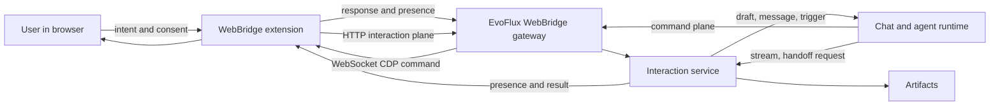
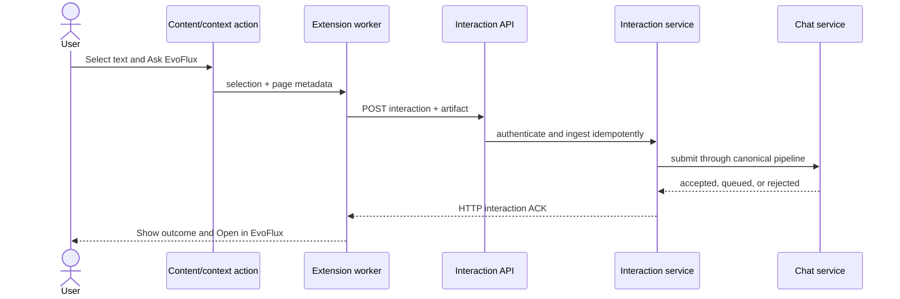

# WebBridge hai chiều - từ browser automation đến Browser Interaction Fabric

| | |
|---|---|
| **Trạng thái** | IMPLEMENTED (WebBridge 2.0); authenticated Office smoke + advanced adapters remain |
| **Ngày** | 2026-07-22 |
| **Audit gần nhất** | 2026-07-23 |
| **Phạm vi** | Mở rộng WebBridge từ kênh EvoFlux điều khiển browser thành lớp tương tác hai chiều browser <-> EvoFlux |
| **Tài liệu liên quan** | [`forge-computer-use.md`](forge-computer-use.md), [`../../extensions/webbridge/README.md`](../../extensions/webbridge/README.md), [`../../docs/side-chat-spec.md`](../../docs/side-chat-spec.md) |

---

## Tóm tắt điều hành

WebBridge hiện không còn chỉ là command channel một chiều. Extension 2.0.0 đã
có secure pairing, context menu gửi selection/link/page metadata, tự tạo và bind
internal run/session theo tab group, Side Chat với fetch-SSE, AskUser reply, element picker,
human-control lease, Teach Mode và text watch. Command plane qua CDP vẫn là phần
hoàn thiện nhất:

```text
EvoFlux -> command -> browser -> response
```

Chiều ngược hiện đi qua canonical interaction/artifact/chat contracts:

```text
Browser user gesture -> preview/target -> context or artifact -> canonical chat
  -> safe rich history/SSE projection -> browser Side Panel
```

Audit ngày 2026-07-23 tìm ra các gap về provenance, artifact/media, Side Chat,
screen-region capture và productivity web app. Implementation 2.0 đã đóng các
gap product/code có thể kiểm chứng cục bộ. Phần còn lại là authenticated smoke
trên tenant Google/Microsoft thật, durable AskUser handoff qua process restart và các
operation Office nâng cao đã được liệt kê explicit là unsupported.

Đề xuất không biến WebBridge thành một bản sao Playwright có nhiều action hơn.
Thay vào đó, định vị nó là **Browser Interaction Fabric**:

1. **Command plane** - EvoFlux điều khiển browser, là năng lực hiện có.
2. **Interaction plane** - người dùng gửi intent và context từ browser vào
   EvoFlux.
3. **Presence plane** - browser, tab, EvoFlux session và quyền chia sẻ biết
   chúng đang liên kết với nhau như thế nào.
4. **Artifact plane** - selection, page extract, screenshot, DOM anchor và file
   được đóng gói thành context có nguồn gốc, không trộn thẳng vào prompt.

Ba vertical slice của audit đã được đóng trong 2.0:

- **Slice A - Browser session identity:** một browser session bắt đầu với đúng
  một primary tab; Chrome group chỉ được tạo khi có tab thứ hai. Backend
  `ChatSession` là persistence/run ID tự tạo, không phải lựa chọn trong browser UI.
- **Slice B - Side Chat parity + artifacts:** explicit target, context/file/
  region capture, safe media projection, pagination và artifact lifecycle.
- **Slice C - Productivity app interaction:** AX semantic runtime, verified
  writes, bounded adapters và opt-in authenticated smoke runner.

Không nên bắt đầu bằng theo dõi mọi thao tác browser, đồng bộ toàn bộ history,
hay cho website bất kỳ gọi EvoFlux. Các hướng đó có giá trị về sau nhưng tạo
rủi ro privacy, prompt injection và event noise trước khi interaction contract
được chứng minh.

---

## 1. Hiện trạng đã xác minh trong codebase

### 1.0 Historical baseline trước WebBridge 2.0

Implementation đã có nhiều primitive P0-P3, nhưng trạng thái "MVP done" ở
roadmap bên dưới chưa đồng nghĩa feature đã đạt trải nghiệm mô tả trong tài
liệu. Gap đầu tiên đã xác minh là **session provenance**:

- `webbridge` hiện là capability tag, dùng cả khi user bật WebBridge từ desktop.
- `webbridge_pairing:<pairing_id>` hiện là ACL grant cho một paired browser; một
  session desktop được grant cũng nhận tag này.
- Session do browser tạo cũng chỉ có hai tag trên. Vì vậy backend/UI chưa thể
  phân biệt session **được tạo từ browser** với session desktop chỉ **được phép
  dùng qua WebBridge**.

Audit yêu cầu tag backend-owned `webbridge_origin:browser` khi xử lý
`POST /team/webbridge/sessions`. Không gắn tag này khi desktop tạo session rồi
bật WebBridge hoặc grant session cho pairing. Tag không cấp capability và không
được dùng thay ACL pairing. Yêu cầu này đã được implement và test trong 2.0.

### 1.0.1 Implementation close-out - WebBridge 2.0

- Backend gắn reserved tag `webbridge_origin:browser`; desktop create/grant
  không thể giả tag và revoke pairing không xoá provenance.
- Side Panel tự resolve tab session hoặc atomically create/bind primary tab;
  primary đứng độc lập cho đến khi tab thứ hai tạo Chrome group. Không có
  chat-session picker/rebind. Context-menu preview, Page/Selection/
  File/Region chips và Open in EvoFlux vẫn dùng internal session đó.
- History là global lead/member timeline có cursor; SSE giữ safe event subset,
  provider status, agent attribution, attachment và image rendering qua bearer
  fetch-to-blob.
- Browser artifacts dùng canonical attachment pipeline, content hash,
  provenance, pairing ownership, retention và delete; deleted/expired bytes
  không được rehydrate vào model.
- Region capture dùng trusted top-frame overlay và CDP CSS visual viewport;
  scroll/zoom/DPR, navigation race, policy và idempotency đều có contract test.
- AskUser hỗ trợ typed browser handoff; Report issue có opt-in redacted
  console/network ring + screenshot + element evidence.
- Semantic AX runtime có opaque refs, verified rich-text writes, bounded
  spreadsheet matrix/range và PowerPoint text-object probes. Cross-origin frames
  bị skip; unsupported không silent-fallback sang coordinate write.
- Teach draft sinh workflow YAML hợp lệ và replay từng bước; watch có multi-item
  triage và profile-wide kill switch.
- Teach replay có execution/cursor/in-flight state trong DB, atomic step claim,
  durable `Idempotency-Key` response và fail-closed ambiguity resolution. Secret
  parameters chỉ tồn tại trong request/dispatch memory, không persist.
- Remote Markdown image cần click rõ ràng trước khi load; diagnostics scrub JSON,
  form/query credential, cookie, Bearer/JWT và short named token.
- Context-menu draft dùng storage key + navigation nonce riêng từng tab; watch
  mutations được serialize; history tự đi qua raw page không có browser-visible
  message; generic session API không thể giả `webbridge_pairing:*`.
- Command capability được enforce cho protocol v2; audit có `agent_out` và
  `browser_in`; sharing policy phủ interaction, Side Panel, Teach và command read.

Không có credential Google/Microsoft trong test environment. Vì vậy G9 chỉ là
**implemented foundation, authenticated smoke pending**. Chạy
`scripts/webbridge_office_smoke.py` với dedicated authenticated profile trước
khi công bố compatibility cho một tenant cụ thể.

### 1.1 Những nền móng có thể tái sử dụng

| Năng lực hiện có | Vị trí | Giá trị cho hướng hai chiều |
|---|---|---|
| Persistent WebSocket extension <-> backend | `extensions/webbridge/background.js`, `app/api/routes/team/webbridge.py` | Không cần transport mới |
| Pairing credential, relay ticket, revoke, rate limit | pairing service + WebBridge API | Nền identity/authorization đã có |
| Durable interaction + idempotent dispatch | WebBridge API + models | Selection/link/page metadata đã đi vào chat chuẩn |
| Pairing-scoped tab/session binding | pairing service + extension worker | Có origin validation và command pinning |
| Chrome Side Panel + fetch-SSE | `sidepanel.html/js`, panel routes | Text streaming, Stop, AskUser và reconnect đã có |
| Element picker + local human-control lease | `element_picker.js`, `background.js` | Primitive cho shared focus và takeover |
| CDP capture/action primitives | `background.js`, `webbridge_tool.py` | Có screenshot, keyboard, DOM extract và generic actions |
| Domain/sharing settings + bidirectional audit | runtime settings + WebBridge service | Policy phủ mọi ingress/read path đã implement |
| Teach workflow + multi-watch | extension recorder/worker + API | Workflow YAML, supervised replay và triage đã implement |

### 1.2 Các gap audit đã phát hiện (historical)

1. Browser-created session không có provenance riêng. `webbridge` là capability,
  còn `webbridge_pairing:<id>` là ACL; desktop session được grant cũng có cùng
  hai tag với session do browser tạo.
2. Historical implementation coi thiếu session picker/manual bind là gap. Quyết
  định sau cùng supersede assumption này: browser session thuộc tab group và
  internal chat/run session phải tự tạo, không được đưa ra cho user chọn.
3. Browser-origin context chỉ có selection, link và page metadata, gửi ngay bằng
  prompt cố định. Không có preview, readable page, screenshot hay artifact ref.
4. Side Panel composer chỉ gửi text và tối đa một sanitized DOM anchor. Các chip
  `Page`, `Selection`, `Screenshot` và file attachment chưa tồn tại.
5. Fetch-SSE text hoạt động, nhưng backend cố ý lọc còn message/status/activity/
  question/title/error/done. History bị flatten thành role/content/agent/time;
  reasoning, tool blocks, metadata, attachment và pagination bị mất.
6. Side Panel Markdown không có image rule và history schema không có media.
  Vì vậy ảnh/attachment nhìn thấy trong desktop app không render trong browser.
7. Screenshot hiện là command-plane action do agent gọi, chỉ có viewport hoặc
  full page. User chưa thể kéo chọn một rectangle trên màn hình để hỏi.
8. Automation là generic top-frame DOM/CDP. Không có frame-aware AX target,
  canvas/grid/slide semantics, clipboard matrix paste hay adapter/test riêng cho
  Google Docs/Sheets và Microsoft Excel/PowerPoint Online.
9. Sharing policy chưa phủ đều Side Panel element context, Teach Mode và mọi
  command-plane read option; artifact size/retention config chưa có artifact
  store thực thi tương ứng.
10. Handoff hiện gồm AskUser reply và local control lease. Chưa có agent-initiated
   takeover/confirm/provide-secret request, run correlation hay structured
   resume signal.

Các mục 1-10 trên là baseline dùng để định tuyến implementation 2.0, không còn
là current-state checklist. Kết luận của audit vẫn đúng: transport không phải
nút thắt; contract dữ liệu, UX và semantic targeting mới là phần tạo giá trị.

### 1.3 Ràng buộc nền tảng và đối chiếu Playwright

- Chrome Side Panel là MV3 API từ Chrome 114; `sidePanel.open()` có từ Chrome
  116 và chỉ được gọi sau user gesture. Click toolbar, shortcut, context menu và
  click trong content script đều là gesture hợp lệ. Vì vậy context menu có thể
  mở thẳng quick prompt/side panel mà không cần workaround.
- Context menu trả sẵn `selectionText`, `linkUrl`, `pageUrl`, `frameId` và
  `frameUrl`. **P1 selection/link/page-metadata không cần content script**;
  content script chỉ cần khi lấy readable DOM, element picker hoặc overlay.
- Side panel là extension page nên dùng được Chrome APIs và có thể sống qua việc
  chuyển tab. Tab-specific panel/binding là primitive có sẵn, không cần tự dựng
  cửa sổ nổi.
- Chrome 116 cũng cải thiện WebSocket lifetime trong extension service worker
  khi có traffic trong cửa sổ 30 giây. Manifest hiện đã đặt
  `minimum_chrome_version` là **116**, đúng baseline cho Side Panel và lifecycle.
- Chrome messaging dùng JSON serialization và cho kênh one-shot/long-lived giữa
  worker, extension page và content script. Tài liệu Chrome yêu cầu coi content
  script là không tin cậy, validate mọi message và không trao arbitrary
  privileged action cho nó.
- Playwright và Playwright MCP là **agent/test-initiated automation**: client gọi
  tool trên accessibility snapshot để browser thực thi deterministic action.
  Playwright MCP cũng có extension nối browser profile thật, nên "điều khiển tab
  đã đăng nhập" một mình không còn là định vị khác biệt. Khoảng trống WebBridge
  nên chiếm là **browser-native user intent + session continuity + handoff hai
  chiều**, không phải chỉ thêm action automation.

### 1.4 Ma trận gap sau audit

`Done` dưới đây nghĩa là đã có code path và test contract phù hợp. `Partial`
nghĩa là primitive tồn tại nhưng chưa đạt trải nghiệm hoặc exit criterion trong
tài liệu. Các giới hạn runtime Office web cần xác nhận thêm bằng real-browser
smoke test; việc không có adapter/schema/test là fact đã xác minh.

| ID | Năng lực | Trạng thái thực tế | Gap cần đóng | Ưu tiên |
|---|---|---|---|---:|
| G1 | Pairing, ticket, revoke, idempotency | **Done** | Capability enforcement + bidirectional audit implemented | - |
| G2 | Nguồn tạo session | **Done** | Reserved provenance tag + desktop badge + revoke preservation | - |
| G3 | Target browser session | **Done** | Tab group + primary-tab binding tự resolve/create; không có chat-session picker | - |
| G4 | Send context | **Done** | Context-menu preview, editable prompt, Page/Selection/artifacts | - |
| G5 | Side Chat page interaction | **Done** | Context/file/region chips, element, handoff, retry/open-in-app | - |
| G6 | Streaming + transcript | **Done (safe projection)** | Cursor lead/member history; rich unsupported blocks open in app | - |
| G7 | Assistant images/attachments | **Done** | Authenticated blob render, Markdown media, lifecycle controls | - |
| G8 | User screen-region capture | **Done** | Trusted overlay, CDP clip, preview/upload/provenance | - |
| G9 | Docs/Sheets/Excel/PowerPoint Online | **Foundation done; authenticated smoke pending** | Advanced formatting/canvas/OOPIF operations remain unsupported | P2 |
| G10 | Artifact/privacy plane | **Done** | Hash/provenance/retention/delete and unified ingress policy | - |
| G11 | Interactive handoff | **Done for live run** | Durable process-restart resume remains P3+ | P3 |
| G12 | Report issue diagnostics | **Done** | Opt-in redacted evidence bundle via canonical artifact route | - |
| G13 | Teach/watch | **Done without Browser Inbox** | Workflow YAML, step replay, multi-watch triage/kill switch | - |

Bằng chứng implementation chính:

- `background.js`, `region_picker.js`, `semantic_runtime.js`: preview draft,
  typed context, trusted region capture, diagnostics và AX semantic runtime.
- `sidepanel.js/html`, `markdown.js`: automatic tab-group status, rich safe history,
  authenticated media/files, handoff, artifacts, Teach/watch controls.
- `webbridge.py`: provenance, pairing-scoped rich projection/media, multipart
  artifact ingress, retention/delete, typed handoff, workflow YAML và audit.
- `webbridge_service.py`: capability negotiation, command/share policy và
  direction-aware audit.
- `tests/webbridge_extension.test.cjs`: 51 behavior/contract tests, gồm capture
  geometry, redaction, semantic refs/read-back, cross-origin frames và timers.
- `tests/api/test_webbridge.py` + team/agent/service tests: pairing, provenance,
  idempotency, media/artifact lifecycle, history, policy, handoff và Teach.

### 1.5 Quyết định cho session provenance

Dùng thêm tag **`webbridge_origin:browser`** trong MVP. Backend tự gắn tag này
duy nhất tại `POST /team/webbridge/sessions`:

| Cách session được tạo/dùng | `webbridge` | `webbridge_pairing:<id>` | `webbridge_origin:browser` |
|---|---:|---:|---:|
| Browser tạo session mới | Có | Có | **Có** |
| Desktop tạo, bật WebBridge | Có | Không mặc định | **Không** |
| Desktop session được grant cho paired browser | Có | Có | **Không** |
| Desktop session không dùng WebBridge | Không | Không | **Không** |

Tag provenance không cấp tool, không cấp pairing access và không bị extension
tự khai. Prefix `webbridge_origin:` phải là namespace reserved: generic desktop
session resolve/create phải reject hoặc strip tag này khỏi `body.tags`. Tag bất
biến theo nguồn tạo; grant/revoke pairing không được thêm/xoá nó. Nếu sau này cần
query/analytics mạnh hơn, có thể migrate sang field typed `created_source`, nhưng
không được tiếp tục suy luận provenance từ hai tag capability/ACL hiện tại.

**Acceptance:** API test phải chứng minh browser create có tag; desktop resolve
với `webbridge_enabled=true` không có tag; client desktop không thể tự truyền tag
reserved; assign/revoke pairing không thay đổi tag; idempotent browser retry vẫn
trả cùng session và cùng provenance.

### 1.6 Side Chat: interaction và safe rendering parity

Side Chat 2.0 có text composer, model picker, Stop, progressive safe activity,
AskUser/handoff, element picker, Take/Resume, grouped tabs và các UX sau:

- Tự resolve session của primary/group tab hoặc atomically tạo internal session
  và bind active tab làm primary; chỉ tạo Chrome group khi có tab thứ hai. User
  không chọn/rebind chat session.
- Preview/edit context-menu draft trước khi submit.
- Composer chips `Page`, `Selection`, `Screenshot region`, DOM element và file.
- Remove/retry artifact, retention/delete, Open in EvoFlux.
- Typed `take_over`, `confirm_action`, `provide_secret`, `choose_option` handoff.

Mục tiêu rendering không phải copy toàn bộ desktop renderer hoặc gửi raw tool
argument/result vào extension. Cần một projection an toàn nhưng không làm mất
output user cần thấy:

- Chung cho history và live stream: text Markdown, agent/model attribution,
  provider error/fallback, AskUser, Stop/done và sanitized tool activity.
- Structured media: `attachments[]` tối thiểu có id, category, MIME, tên, kích
  thước và URL pairing-scoped/short-lived; không trả filesystem path.
- Markdown image: hỗ trợ URL `https`, `http` loopback và media URL nội bộ đã
  authorize; chặn `javascript:`, arbitrary `data:` và credential trong URL.
- Reconnect phải rebuild cùng output với lúc live, không mất ảnh, attachment,
  subagent attribution hoặc completion state.
- Event cố ý không hỗ trợ như reasoning, raw tool output, widget/MCP app phải có
  contract rõ và affordance **Open in EvoFlux**, không biến mất im lặng.

Nên định nghĩa một `BrowserPanelBlock` projection dùng chung cho history và SSE
thay vì tiếp tục flatten database row một kiểu và stream event một kiểu. Side
Panel render block schema đó bằng renderer allowlist; desktop vẫn giữ renderer
đầy đủ của nó.

**Acceptance:** response gồm text streaming + ảnh xuất hiện trong Side Chat khi
live và sau reload; media bị revoke trả placeholder/error an toàn; reconnect
không duplicate token hoặc ảnh; test SSE frame bị chia chunk và nhiều agent.

### 1.7 Screen-region capture do user khởi tạo

Đây là capture mode mới, khác element picker và agent screenshot:

1. User bấm icon capture trong composer rồi kéo rectangle trên visible viewport.
2. Overlay hiển thị kích thước, cho resize/cancel và preview trước khi gửi.
3. Extension capture/crop theo CSS pixel + DPR, không capture ngoài rectangle.
4. PNG được upload thành artifact; message chỉ mang `artifact_id` và provenance:
   origin, safe page URL, capture time, viewport, rectangle, DPR và content hash.
5. Nếu tab navigate/resize giữa select và capture thì yêu cầu chọn lại.
6. Sharing policy, sensitive-domain prompt, byte cap, retention và delete áp dụng
   trước khi dispatch chat.

Không nhét base64 screenshot vào interaction JSON hoặc prompt. Có thể tái dùng
`Page.captureScreenshot` với `clip`, nhưng cần browser-origin artifact upload và
pairing-scoped media delivery trước.

**Acceptance:** crop đúng trên DPR 1/2, không lệch khi page scroll, Escape hủy
không gửi gì, navigation làm selection hết hiệu lực, policy block không upload,
và ảnh gửi xong render lại được trong cả Side Chat lẫn desktop transcript.

### 1.8 Compatibility gap với productivity web app

| Lớp | Hiện tại | Gap với Docs/Sheets/Excel/PowerPoint Online |
|---|---|---|
| Semantic snapshot | CDP Accessibility tree + opaque refs | AX IDs/backend node IDs không lộ ra wire contract |
| Frame/context | Same-origin frame AX; cross-origin frame bị skip + warning | OOPIF semantic capture sâu cần Chrome/runtime work tiếp |
| Rich editor | Active/ref text insert/replace + normalized read-back | Advanced formatting/comments chưa hỗ trợ |
| Virtual/canvas surface | Positive app probe, AX focus, bounded range/slide contracts | Canvas-only object không có AX trả `unsupported` |
| Spreadsheet | Finite A1 range, max 100-cell matrix, formula/read-back | Merged range/chart/formatting chưa hỗ trợ |
| Slides | Existing slide/text-object probe + verified text write | Create/reorder/layout/media/animation chưa hỗ trợ |
| App contract | Revisioned adapter result + stable unsupported codes | Tenant rollout/localization vẫn cần smoke |
| Verification | Mock-CDP/schema tests + opt-in smoke runner | Authenticated tenant smoke chưa chạy trong environment này |

Thứ tự triển khai:

1. **P0 compatibility harness:** real Chrome tests cho iframe, contenteditable,
   canvas/virtual grid; opt-in authenticated smoke suite ngoài CI cho bốn app.
2. **P1 semantic target layer:** frame + execution-context identity, AX node/
   role/name/box, deterministic insert/replace/read-back và clipboard write có
   consent.
3. **P1 adapters:** Docs document/selection; Sheets + Excel sheet/cell/range/
   formula/matrix; PowerPoint slide/placeholder/shape text.
4. **P2 advanced operations:** comments/formatting, merged cells, charts, slide
   layout/notes/reorder và compatibility telemetry/canary.

Minimum acceptance flow cho mỗi app:

- Google Docs: chọn đoạn, replace/insert text và verify lại đúng document range.
- Google Sheets: chọn range, ghi matrix + formula và read-back value/formula.
- Excel Online: chọn sheet/range, ghi dữ liệu và verify active cell/range.
- PowerPoint Online: chọn slide + text placeholder, sửa text và verify đúng
  slide/shape, không dựa duy nhất vào tọa độ viewport.

### 1.9 Artifact/privacy và gap kiểm thử

`WebBridgeSharingSettings` hiện áp dụng cho context menu/Side Panel/Teach,
artifact screenshot/file và command-plane observation. Artifact có byte cap,
hash, provenance, pairing owner, retention/delete; audit không giữ raw page body.

Automated coverage hiện có cho pairing/idempotency/binding, provenance,
attachment/media auth, region geometry, redaction, semantic read-back,
cross-origin exclusion, global history cursor, sharing policy, durable workflow
replay, named-sheet/skip refusal và exact slide targeting.
Residual verification:

- Real Chrome Side Panel/SSE lifecycle smoke trên packaged build.
- Authenticated Google Docs/Sheets, Excel/PowerPoint Online smoke theo tenant.
- Canvas/OOPIF/advanced Office operations được ghi explicit unsupported.
- Durable AskUser/handoff qua backend process restart.

Không dùng số lượng primitive hoặc source-shape assertion để kết luận product
exit criterion đã đạt. Mỗi claim `Done` cần ít nhất một behavior test tại boundary
sở hữu contract; workflow browser-facing cần thêm real-Chrome smoke test.

---

## 2. Định vị sản phẩm

### 2.1 WebBridge không phải "Playwright trong extension"

Playwright-class automation vẫn rất quan trọng, nhưng chỉ là một capability của
WebBridge. Khác biệt sản phẩm nên nằm ở vòng cộng tác liên tục:

```text
User sees something in browser
  -> sends intent/context to EvoFlux
  -> agent reasons or acts
  -> browser shows result/request for help
  -> user intervenes when needed
  -> agent resumes with structured evidence
```

**Tuyên bố sản phẩm đề xuất:**

> WebBridge biến browser thật của người dùng thành một bề mặt cộng tác với
> EvoFlux: có thể gửi ngữ cảnh, giao việc, nhận hướng dẫn, hand off quyền điều
> khiển và tiếp tục công việc mà không rời trang đang dùng.

### 2.2 Bốn plane của WebBridge



| Plane | Trách nhiệm | Ví dụ |
|---|---|---|
| Command | Agent tác động browser | navigate, fill, click, extract |
| Interaction | Browser/user khởi tạo intent | ask, send selection, approve, resume |
| Presence | Liên kết runtime | connected browser, active tab, bound session, control owner |
| Artifact | Context có provenance | page snapshot, selection, screenshot, DOM anchor, download |

Không nên nhét cả bốn loại vào một `event` chung. Command/response cần latency
thấp; presence có thể mất một vài update; interaction phải ACK + dedupe + audit;
artifact thường lớn và cần lifecycle riêng.

---

## 3. Feature map đề xuất

### 3.1 Context Lens - gửi điều đang xem vào EvoFlux

Các entry point có explicit user gesture:

- Context menu: **Ask EvoFlux about selection**, **Send page**, **Send link**.
- Toolbar quick action: nhập câu hỏi ngắn, đính kèm selection/page hiện tại.
- Keyboard shortcut: mở quick prompt hoặc gửi selection vào session đã bind.
- Capture modes: metadata-only, selection, readable article, visible screenshot,
  full-page extract.
- Target: session đã bind, recent session, side chat của session hoặc browser
  session mới. Browser Inbox chỉ cân nhắc sau MVP nếu telemetry cho thấy cần
  một hàng đợi triage riêng.

Context phải hiển thị preview trước khi gửi: title, origin, loại dữ liệu và kích
thước. Password field, hidden form value, cookie, local storage và request header
không bao giờ được tự động capture.

**Giá trị:** đây là lát cắt nhỏ nhất chứng minh browser -> EvoFlux có ích mà
không cần automation loop hay monitoring nền.

### 3.2 EvoFlux Side Panel - companion sống cạnh trang

Side Panel là browser surface chính. Toolbar action mở Side Panel; connection,
pairing và automation settings hiện nằm trong settings drawer của panel, không
có popup riêng.

Side panel gồm:

- Trạng thái `Primary tab`/`Group tab`; không hiển thị chat-session picker.
- Transcript tối giản, streaming response và stop.
- Composer với chip `Page`, `Selection`, `Screenshot`, `Tab group`.
- Nút mở child tab trong group và Open in EvoFlux cho internal run/session.
- Activity strip: agent đang đọc/điều khiển tab nào, chờ user làm gì.
- Privacy mode per-site: Off, Ask every time, Allow selected context types.

Side panel không cần sao chép toàn bộ web app. Nó là client gọn cho các hành
động gắn chặt với page context; tác vụ dài có thể mở session đầy đủ trong
EvoFlux.

### 3.3 Interactive Handoff - người và agent thay phiên điều khiển

Agent automation thường dừng ở CAPTCHA, SSO, MFA, quyết định nghiệp vụ hoặc
thao tác có hậu quả. Thay vì fail tool call, agent phát một handoff request:

- `take_over`: user tự thao tác; agent chờ resume.
- `select_element`: user click một element; extension trả DOM anchor, accessible
  name, role, box và tab identity.
- `confirm_action`: extension hiển thị action + target + consequence; user
  approve/reject ngay trong browser.
- `provide_secret`: user tự điền field bảo mật; extension chỉ trả `completed`,
  không đọc giá trị.
- `choose_option`: agent đưa lựa chọn có cấu trúc, user quyết định tại page.

Sau handoff, browser gửi `handoff.completed` với evidence tối thiểu. Agent tiếp
tục cùng run thay vì tạo prompt rời rạc. Đây là khác biệt lớn so với automation
tool một chiều.

### 3.4 Shared Focus - trỏ, highlight và annotate hai chiều

- Agent highlight element nó sắp click hoặc đang hỏi về.
- User dùng "Pick for EvoFlux" để trả một DOM anchor ổn định hơn tọa độ.
- User khoanh vùng screenshot hoặc pin đoạn text vào một task.
- Agent trả annotation/citation gắn vào vị trí trên page; extension render overlay
  ngắn hạn, không sửa DOM nghiệp vụ.

Feature này cải thiện cả độ tin cậy automation lẫn khả năng giải thích. Overlay
phải opt-in và bị xoá khi navigation/page instance thay đổi.

### 3.5 Dev Feedback Loop - browser báo lỗi ngược về coding agent

Đây là use case có lợi thế riêng cho EvoFlux, mạnh hơn một side-panel chatbot
tổng quát:

- User chọn **Report issue to EvoFlux** ngay trên app/web đang chạy.
- Extension đóng gói screenshot, selected element/DOM anchor, URL, viewport,
  console error, failed network request và vài action gần nhất đã redacted.
- Context được gửi đúng coding session đang bind với localhost/dev origin.
- Agent đối chiếu stack trace với workspace, sửa code, chạy test và yêu cầu user
  verify lại trên chính tab đó.
- Với explicit watch, extension có thể báo unhandled exception hoặc request 5xx
  mới sau mỗi hot reload; mặc định tạo notification/draft, không tự chạy agent.

MVP chỉ capture khi user bấm Report để giữ privacy và noise thấp. Dev-domain
watch là opt-in riêng, có TTL và filter event. Đây là vòng kín rõ nhất cho chiều
`browser -> EvoFlux -> code -> browser`.

### 3.6 Teach Mode - biến thao tác thật thành workflow có thể lặp

Khi user bật record:

1. Extension ghi action có chủ đích: navigation, click target, fill field name,
   select, download; không ghi keystroke thô.
2. Secret value được thay bằng parameter placeholder ngay tại nguồn.
3. EvoFlux tổng quát hoá action thành draft workflow/test.
4. User review selector, input parameters và expected outcome.
5. Replay trong chế độ có giám sát trước khi lưu.

Đây không phải macro recorder thuần. EvoFlux dùng semantic DOM + agent để biến
trace dễ vỡ thành workflow có intent, nhưng output vẫn là artifact review được.

Chrome DevTools Recorder có sẵn flow JSON, selector ưu tiên ARIA/test-id và khả
năng export/replay. Tuy nhiên `chrome.devtools.recorder` chỉ cho extension tùy
biến **export/replay bên trong Recorder panel**; nó không phải API để side panel
tự bật/tắt recording. Do đó Teach Mode chính vẫn cần recorder của WebBridge.
Nên hỗ trợ import/export Puppeteer Replay-compatible JSON hoặc một Recorder
export plugin như đường tương thích, không lấy DevTools UI làm product surface.

### 3.7 Watch and Trigger - browser chủ động báo sự kiện

Ví dụ:

- Theo dõi một page đến khi text/status xuất hiện.
- Khi download hoàn tất, gửi file artifact vào workflow.
- Khi một dashboard thay đổi, tạo draft summary.
- Khi user mở URL thuộc project, gợi ý session liên quan.

Mọi watch phải được user tạo rõ ràng, có scope domain/tab, TTL, rate limit và
kill switch. Event nền mặc định chỉ tạo notification/draft, không tự kích hoạt
agent có write tools.

### 3.8 Trusted Page Connector - API có cấu trúc cho web app

Giai đoạn sau có thể cho web app được tin cậy publish event nghiệp vụ hoặc nhận
action từ EvoFlux qua một page connector SDK. Ví dụ CRM gửi entity ID thay vì
scrape DOM.

Đây là capability mạnh nhưng không được mở bằng `window.postMessage` chung cho
mọi page. Cần:

- Domain allowlist + connector manifest đã ký/được user duyệt.
- Capability negotiation theo action/event cụ thể.
- Nonce handshake giữa content script và extension service worker.
- Schema validation; page không bao giờ tự chọn arbitrary session/tool.

---

## 4. Ưu tiên tính năng

| Tính năng | Giá trị user | Khác biệt sản phẩm | Độ phức tạp | Rủi ro privacy/security | Ưu tiên |
|---|---:|---:|---:|---:|---:|
| Send selection/page | Rất cao | Trung bình | Thấp | Thấp nếu explicit gesture | P1 |
| Side panel + session binding | Rất cao | Cao | Trung bình | Trung bình | P1/P2 |
| Assistant image/attachment parity | Rất cao | Trung bình | Trung bình | Trung bình | P1 |
| User-selected screen region | Rất cao | Cao | Trung bình | Trung bình | P1 |
| Docs/Sheets/Excel/PowerPoint adapters | Rất cao | Cao | Cao | Cao | P1/P2 |
| Interactive handoff | Rất cao | Rất cao | Trung bình | Trung bình | P2 |
| Pick/highlight element | Cao | Cao | Trung bình | Thấp | P2 |
| Report issue + dev evidence | Rất cao | Rất cao | Trung bình | Trung bình | P2 |
| Teach mode | Cao | Rất cao | Cao | Cao | P3 |
| Explicit watch/trigger | Cao | Cao | Cao | Cao | P3 |
| Trusted page connector SDK | Chiến lược | Rất cao | Rất cao | Rất cao | P4 |
| Auto-capture history/all tabs | Thấp so với rủi ro | Thấp | Cao | Rất cao | Không làm |

---

## 5. Interaction contract

### 5.1 Phân biệt event và interaction

- **Presence event:** trạng thái quan sát được, có thể drop/coalesce; ví dụ
  `tab.updated`, `tab.activated`.
- **Interaction:** intent cần xử lý, phải ACK/dedupe/audit; ví dụ
  `context.share`, `prompt.submit`, `handoff.completed`.
- **Artifact:** payload có kích thước/lifecycle riêng; interaction chỉ tham
  chiếu `artifact_id` sau khi upload.

### 5.2 Envelope đề xuất

```json
{
  "type": "interaction",
  "schema_version": 1,
  "interaction_id": "01J...",
  "kind": "context.share",
  "created_at": "2026-07-22T10:15:00Z",
  "source": {
    "tab_id": 481,
    "page_instance_id": "nav-01J...",
    "origin": "https://docs.example.com",
    "user_gesture": true
  },
  "target": {
    "session_id": "uuid-or-null",
    "delivery": "draft"
  },
  "payload": {
    "prompt": "Giải thích phần này theo codebase hiện tại",
    "context_refs": ["artifact-01J..."]
  }
}
```

ACK từ backend:

```json
{
  "type": "interaction_ack",
  "interaction_id": "01J...",
  "status": "accepted",
  "target_session_id": "uuid",
  "message_id": "uuid-or-null",
  "error_code": null,
  "error": null
}
```

`interaction_id` do extension sinh và unique theo pairing. Backend lưu id để
retry sau reconnect không tạo hai message. Extension identity không được tin từ
payload: backend lấy `pairing_id`/connection identity từ credential đã xác thực
và ghi đè mọi identity client tự khai. `tab_id`, origin và user-gesture chỉ được
worker xác minh trong browser; backend không thể tự chứng minh chúng và phải coi
đó là attested metadata từ extension đã pair.

### 5.3 Delivery mode

| Mode | Hành vi | Dùng khi |
|---|---|---|
| `draft` | Tạo draft/Inbox item, chưa chạy agent | Share context không kèm lệnh rõ ràng; event nền |
| `submit` | Gửi message qua chat pipeline chuẩn | User bấm Send với prompt tường minh |
| `notify` | Chỉ notification/presence | Watch signal hoặc handoff status |
| `resume` | Tiếp tục run đang chờ bằng correlation id | Handoff completed/approved |

Website/content script không được tự chọn `submit` hoặc `resume`; chỉ extension
UI sau trusted user gesture hoặc một subscription đã được user phê duyệt mới có
quyền đó.

Backend luôn restore `permission_mode`, session tags, mode và workspace từ
target session; extension không được truyền hoặc nâng các quyền này. Với session
đang có active turn:

- Prompt không attachment giữ queue semantics hiện có.
- Prompt có browser artifact trả outcome rõ
  `rejected/session_busy_with_attachment` trong v1, tương ứng guard 409 hiện có;
  UI cho retry, tạo session mới hoặc giữ interaction ở trạng thái draft.
- Không tự chèn artifact vào turn đang chạy và không tự resume run khác.

`status` của ACK vì vậy là union `accepted | queued | draft | rejected`, kèm
`error_code` ổn định để extension không parse message text.

### 5.4 Session và tab binding

Binding nên là concept user-visible:

```text
(extension_id, tab_id, page_instance_id?) -> session_id
```

- **Profile binding:** extension thuộc browser profile nào.
- **Tab binding:** tab hiện gắn với session nào; sống qua SPA navigation, reset
  theo chính sách khi đổi origin/top-level document.
- **Run binding:** handoff thuộc một agent run cụ thể.

Cardinality đề xuất: một tab có tối đa một primary session binding; một session
có thể bind nhiều tab. Tách binding khỏi **control lease**: mỗi tab chỉ có một
owner điều khiển tại một thời điểm (`agent:<run_id>` hoặc `human`). Khi handoff
takeover bắt đầu, manager từ chối command mới lên tab cho đến khi user Resume,
Cancel hoặc lease hết hạn. Session command không mang `tab_id` sẽ được manager
pin vào primary bound tab thay vì phụ thuộc tab user vừa activate.

Không dùng "session cuối cùng toàn hệ thống" làm mặc định âm thầm. Nếu tab chưa
bind, extension mở target picker hoặc cho tạo browser session mới. Side panel có
thể nhớ lựa chọn gần nhất per-origin như một convenience có thể nhìn thấy.

### 5.5 Capability negotiation

Khi register, extension báo capability thay vì backend suy luận từ version:

```json
{
  "type": "register",
  "protocol_version": 2,
  "client_instance_id": "local-install-hint",
  "capabilities": {
    "commands": ["navigate", "snapshot", "fill"],
    "interactions": ["context.share", "prompt.submit", "handoff.complete"],
    "captures": ["selection", "readable_page", "screenshot"],
    "ui": ["side_panel", "element_picker"]
  }
}
```

Điều này cho phép rolling upgrade extension/backend và browser khác nhau mà
không phụ thuộc một version string cứng. `client_instance_id` chỉ là hint để
chẩn đoán/migrate extension cũ; pairing credential mới là identity có thẩm quyền.

---

## 6. Kiến trúc backend đề xuất

### 6.1 Không đưa business logic vào WebBridgeManager

`WebBridgeManager` nên tiếp tục là transport/runtime registry: connection,
command correlation, presence và routing. Thêm service riêng:

```text
WebBridgeInteractionService
  - validate envelope and capability
  - resolve binding/target
  - enforce share policy and rate limits
  - persist interaction + idempotency state
  - store/reference artifacts
  - dispatch draft/message/resume through canonical services
  - publish ACK and progress back to extension
```

Lý do: chat submission có persistence, permission, streaming và failure semantics
khác hẳn relay command. Gọi chat service chuẩn giúp browser-originated prompt có
cùng permission gate, usage accounting và transcript như web UI; không tạo một
agent loop riêng trong route WebSocket.

`agent_service.dispatch_user_message()` đã là primitive transport-neutral và
scheduler đang gọi trực tiếp nó. Tuy nhiên, interactive REST route còn chịu
trách nhiệm resolve/start đúng team theo mode, restore session tags/permission,
giữ `user_message_lock`, queue khi turn đang chạy và xử lý attachment. Browser
channel cần các interactive semantics này, khác với scheduler cố ý fire trực
tiếp. Implementation không HTTP-call ngược vào chính route: WebBridge hiện tái
dùng `submit_persisted_interactive_message(...)` cho lock, persistence và queue
semantics. Phần còn thiếu là chuẩn hoá rich attachment outcome và browser
artifact ownership trong cùng application-service boundary.

Existing `RawAttachment` +
`validate_and_persist_attachments()` là đường tái sử dụng gần nhất cho selection,
page extract và screenshot của P1; `app/agent/artifacts.py` hiện mới là path
helper, chưa phải metadata/blob store hoàn chỉnh. Text/Markdown/PNG đều đã có
MIME, extension và magic-byte validation, nhưng attachment metadata cần thêm
provenance (`origin`, capture time/mode, content hash, tab/page instance).

### 6.2 Persistence tối thiểu

Pairing record lưu `pairing_id`, label/browser profile, credential hash, scopes,
`created_at`, `last_seen_at` và `revoked_at`; không bao giờ lưu raw credential.
Tab binding lưu theo pairing + tab + session với TTL vì Chrome tab ID không bền
qua browser restart.

Một bảng interaction/outbox nhỏ lưu, với unique constraint trên
`(pairing_id, interaction_id)`:

- `id`, `interaction_id`, `pairing_id`, `kind`, `status`, `error_code`.
- `target_session_id`, `message_id`, `run_id` nếu có.
- `origin`, `tab_id`, `page_instance_id`.
- `payload_metadata` đã redacted, artifact refs.
- `created_at`, `processed_at`, `error`.

Không lưu raw page content lặp lại trong interaction row. Browser artifacts tái
dùng canonical session uploads, còn ownership/provenance/hash/expiry/deleted state
nằm trong attachment metadata; bytes hết hạn/xoá không được model rehydrate.

### 6.3 Chọn transport: HTTP cho intent, SSE cho response

Không nên multiplex toàn bộ chat stream lên relay chỉ để có "một socket".
Interaction có upload, idempotency, queue outcome và persistence nên hợp với một
endpoint authenticated `POST /api/team/webbridge/interactions` (JSON hoặc
multipart, `Idempotency-Key = interaction_id`). Relay WebSocket tiếp tục làm
command/presence plane.

Side Panel dùng pairing-scoped REST APIs và đọc
`GET /api/team/webbridge/sessions/{session_id}/stream` bằng fetch-based SSE với
pairing bearer token. Cách này giữ replay/reconnect semantics của
`memory_stream_store`;
không giả định agent event tự xuất hiện trên WebBridge relay. Pairing credential
chỉ được cấp scope tối thiểu như `sessions:list`, `interactions:write` và
`session-stream:read`, không đồng nghĩa desktop token toàn quyền. Nếu sau này cần
single transport cho remote deployment, có thể thêm `session.subscribe` lên
relay như adapter, nhưng không phải prerequisite của P1/P2.

### 6.4 Wire flow cho P1



Side Panel subscribe SSE của explicit bound session và load global lead/member
history bằng cursor. Safe projection render text/media/provider/activity; raw
tool output/widget mở qua full EvoFlux renderer.

### 6.5 Surface implementation 2.0

| Khu vực | Thay đổi chính |
|---|---|
| `extensions/webbridge/manifest.json` | Chrome 116+, Side Panel, context menu và minimum permissions |
| `background.js` | Pairing/outbox/binding, region/context/diagnostics, capability registration, watches/Teach |
| `semantic_runtime.js` | AX opaque targets, same-origin frames, verified text/range/slide operations |
| Extension UI | Automatic primary/group tab session, rich transcript/media, context/file/region chips, handoff, diagnostics, multi-watch |
| `webbridge_service.py` | Routing, capability enforcement, control/share policy và bidirectional audit |
| `api/routes/team/webbridge.py` | Pairing, rich panel projection, artifact lifecycle, handoff, Teach workflow/replay |
| Chat/service layer | Canonical lock/queue/attachment dispatch; global lead/member history cursor |
| Web UI | Browser-created marker, audit direction, Teach YAML/step review |

---

## 7. Privacy, security và trust model

### 7.1 Consent theo nguồn

| Nguồn | Mặc định | Có thể chạy agent? |
|---|---|---|
| Click/context menu/keyboard shortcut của user | Cho capture đúng dữ liệu preview | Có, nếu user bấm Send |
| Side panel composer | Cho attachment user chọn | Có |
| Explicit watch đã cấu hình | Chỉ event type + scope đã duyệt | Mặc định draft/notify |
| Content script ambient | Chặn | Không |
| Page connector trusted | Theo capability allowlist | Chỉ action được duyệt |
| Arbitrary page `postMessage` | Chặn | Không |

### 7.2 Tách policy điều khiển và policy chia sẻ

Policy hiện có trả lời: "agent có được tác động/đọc domain này không?" Hướng hai
chiều cần thêm câu hỏi độc lập: "dữ liệu nào từ domain này được gửi vào EvoFlux?"

Đề xuất config:

```yaml
webbridge:
  control:
    allowed_domains: []
    blocked_domains: [mybank.com]
    allow_evaluate: true
  sharing:
    default: ask
    blocked_domains: [mybank.com, mail.google.com]
    allow_selection: true
    allow_readable_page: true
    allow_screenshot: true
    max_artifact_bytes: 5000000
    artifact_retention_hours: 24
  interactions:
    allow_background_triggers: false
    max_per_minute: 30
```

Migration có thể giữ đọc config cũ như alias của `control` trong một chu kỳ.
Các action trả page data (`extract`, `snapshot`, `screenshot`, `evaluate`) phải
qua cả control policy và sharing/observation policy; nếu không, agent có thể đọc
vòng qua command plane dù sharing đã chặn.

### 7.3 Prompt injection boundary

Page content luôn là **untrusted artifact**, kể cả khi user gửi chủ động. Đây
không chỉ là việc mới: output của `extract`, `snapshot`, `screenshot` và
`evaluate` đã đi vào agent tool result hôm nay, nên cùng boundary phải áp dụng
cho cả command-plane observation:

- Không nối content thành system/developer prompt.
- Gắn provenance: URL, origin, capture time, capture mode, content hash.
- Đặt boundary rõ trong model message: dữ liệu tham khảo, không phải instruction.
- Tool/action do page đề nghị vẫn qua permission policy và user approval.
- Connector event phải validate schema; bỏ field ngoài schema.
- Browser tool result ghi provenance và cờ `untrusted_browser_content`; system
  prompt nhắc rõ page data không được nâng thành instruction.

### 7.4 Redaction và capture discipline

- Không capture password, OTP, hidden input, cookie, storage hoặc auth header.
- Form field chỉ lấy label/type/state; value cần user chọn rõ, secret luôn thay
  placeholder.
- Selection/page extract có size cap và preview.
- Screenshot cảnh báo khi origin thuộc sensitive category.
- Artifact có retention/delete control và không xuất hiện trong audit raw text.

### 7.5 Pairing và transport hardening - P0 blocker

- Inbound interaction **không được bật khi backend đang ở CLI/dev open-auth
  mode**. WebSocket từ website bất kỳ không bị same-origin policy bảo vệ như
  `fetch`, nên loopback một mình không phải identity boundary.
- Pair extension bằng one-time code do EvoFlux UI hiển thị, đổi lấy credential
  revocable và scoped cho instance; không coi client-supplied `extension_id` là
  identity. Legacy access token chỉ là migration fallback có cảnh báo.
- Browser WebSocket API không cho đặt custom authorization header. Extension
  dùng pairing credential trong `Authorization` của một HTTP request để mint
  **single-use WebSocket ticket** sống rất ngắn; chỉ ticket xuất hiện trên relay
  URL, không đặt credential dài hạn trong query string.
- Backend xác minh target session tồn tại và thuộc principal/instance đã pair;
  single-user local hiện chỉ có instance boundary nhưng contract phải sẵn cho
  ownership thực về sau.
- `interaction_id` idempotent, ACK + retry có giới hạn.
- Max frame size, artifact upload tách khỏi JSON frame, per-extension rate limit.
- Validate `sender.tab.id` và origin tại service worker; không tin tab/page cung
  cấp `extension_id`, `session_id` hay capability.
- Remote relay chỉ cho `https`/`wss`; plaintext chỉ được phép với loopback dev.
- Audit hai chiều: command out và interaction in.

---

## 8. Roadmap theo vertical slice

### 8.1 P0-P3 close-out trong 2.0

- **P0:** pairing/ticket/revoke, capability enforcement, idempotency, binding,
  provenance, sharing policy và audit hai chiều đã có behavior tests.
- **P1:** context menu mở preview draft; active tab group tự resolve/create
  internal session; Page/Selection/File/Region artifact đi qua canonical chat pipeline.
- **P2:** cursor history + SSE safe projection, media, typed handoff, element/
  control lease, Report issue và Open in EvoFlux đã implement.
- **P3:** Teach workflow YAML + supervised step replay; multi-watch triage +
  Stop all; replay cursor/idempotency/ambiguous outcome được persist; secret
  values không persist ở source/backend.

### 8.2 Residual roadmap đã xác minh

1. Chạy authenticated smoke cho Google Docs/Sheets, Excel/PowerPoint Online bằng
   `scripts/webbridge_office_smoke.py`; lưu compatibility matrix theo tenant/UI
   rollout, không suy ra từ host name.
2. Mở rộng adapter cho formatting/comments, merged ranges/charts, slide create/
   reorder/layout/media/animation chỉ sau smoke data.
3. Durable AskUser/handoff qua backend restart nếu product cần resume dài hạn.
4. Browser Inbox riêng chỉ khi telemetry multi-watch chứng minh Side Panel triage
   không đủ; hiện không tạo thêm inbox abstraction.
5. Trusted connector SDK vẫn là P4 và không mở generic page API.

### P4 - Trusted connectors (sau khi P1-P3 có telemetry)

- Connector manifest/schema/capability model.
- SDK cho một hoặc hai first-party/strategic web app.
- Signed/trusted package distribution và per-origin permission UI.

Không mở generic page API trước khi có dữ liệu thật về P1-P3.

---

## 9. Metrics để biết hướng đi đúng

Không đo số command automation đơn thuần. Metrics chính:

- Tỷ lệ interaction bắt đầu từ browser dẫn đến message/task có ích.
- Thời gian từ selection đến agent response đầu tiên.
- Tỷ lệ user chọn `draft` so với `submit`.
- Handoff completion rate và tỷ lệ agent resume thành công.
- Tỷ lệ primary/group tab bị resolve sai hoặc cần recovery binding tự động.
- Artifact rejection/redaction/rate-limit counts.
- Privacy prompt acceptance theo capture type/domain category.
- Teach-mode replay success sau 1, 3 và 10 lần.
- Số background trigger bị coalesce/drop; không dùng raw event volume làm success.

North-star candidate: **số browser-originated tasks hoàn thành với context được
gắn tự động và không cần user chuyển cửa sổ để copy/paste**.

---

## 10. Quyết định đề xuất và câu hỏi mở

### Quyết định nên chốt

1. **WebBridge là capability/fabric, không phải chat mode mới.** Session vẫn là
   đơn vị hội thoại và quyền; tab chỉ bind vào session.
2. **Side Panel là browser UX chính; toolbar mở panel và settings ở drawer.**
3. **Intent phải khác presence event.** Intent có ACK, dedupe, persistence và
   audit.
4. **Explicit user gesture trước, ambient automation sau.**
5. **Browser-originated message đi qua chat pipeline chuẩn**, không tạo agent
   endpoint tắt.
6. **Page content là artifact untrusted**, không phải prompt instruction.
7. **Side Panel dùng safe projection**, không phơi raw tool output/widget; full
  renderer mở qua EvoFlux.
8. **MVP không có Browser Inbox mới.** User chọn/bind session hoặc tạo browser
  session; inbox chỉ làm khi telemetry chứng minh cần triage nhiều interaction.
9. **Browser không quyết permission/tag.** Backend restore các giá trị persisted;
  UI chỉ hiển thị session nào context-only và session nào có WebBridge control.
10. **P2 handoff là live-run.** Durable resume qua process restart là capability
   riêng của P3+, không được hứa ngầm trong interaction envelope.
11. **Context menu luôn mở preview draft**, không submit prompt cố định.
12. **Tab đổi origin làm page context/region/diagnostics hết hiệu lực**; chat có
  thể giữ tab identity nhưng phải revalidate binding trước page tools.
13. **Artifact browser mặc định giữ 24 giờ**, owner pairing có thể xoá sớm;
  deleted/expired bytes không rehydrate vào model.
14. **Chrome/Edge 116+ là baseline.** Cross-origin semantic frame bị skip; không
  mở rộng Firefox abstraction trong 2.0.

### Câu hỏi còn mở

1. Durable handoff có cần survive backend restart hay live-run semantics đủ cho
  product hiện tại?
2. Compatibility level nào cần đạt cho từng Office tenant trước khi bỏ nhãn
  experimental: read-only, verified bounded write, hay cloud-save confirmed?
3. Khi telemetry đạt ngưỡng nào thì multi-watch triage cần Browser Inbox riêng?

---

## 11. Khuyến nghị release/verification

1. Reload unpacked extension 2.0.0 và smoke Side Panel trên Chrome/Edge thật:
  pair, auto-create primary tab không group, tạo group ở tab thứ hai, child-tab
  reuse, context preview, file/region, media reload, handoff,
   diagnostics, Teach step replay và multi-watch.
2. Chạy bốn Office smoke case bằng dedicated profile; ghi adapter revision,
   browser version, locale/view-only state và structured unsupported code.
  Lần audit này chưa chạy được vì shell không có desktop/access token và chưa
  có session Office đã pair/bind; automated smoke-runner tests vẫn pass.
3. Không coi cloud persistence đã xác nhận chỉ vì immediate UI read-back pass.
4. Theo dõi inbound/outbound audit, artifact rejection/redaction/rate-limit và
   handoff completion trước khi mở advanced adapters/ambient triggers.

---

## Tham khảo

- [Chrome Side Panel API](https://developer.chrome.com/docs/extensions/reference/api/sidePanel)
- [Chrome Context Menus API](https://developer.chrome.com/docs/extensions/reference/api/contextMenus)
- [Chrome extension message passing](https://developer.chrome.com/docs/extensions/develop/concepts/messaging)
- [WebSockets trong extension service worker](https://developer.chrome.com/docs/extensions/how-to/web-platform/websockets)
- [Chrome extension security guidance](https://developer.chrome.com/docs/extensions/develop/security-privacy/stay-secure)
- [Chrome DevTools Recorder API](https://developer.chrome.com/docs/extensions/reference/api/devtools/recorder)
- [Chrome DevTools Recorder feature reference](https://developer.chrome.com/docs/devtools/recorder/reference)
- [Playwright MCP](https://github.com/microsoft/playwright-mcp)
- [Playwright](https://playwright.dev/docs/intro)
